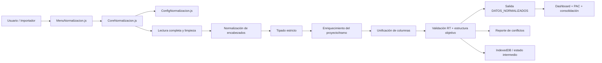

# ARCHITECTURE_V3 — Sprint 3: Módulo de Normalización y Cruce Colab

## 1. Objetivo del sprint

El Sprint 3 centra el esfuerzo en convertir la normalización de predios en un módulo operable y auditable, que reciba una matriz cruda del usuario y la convierta en una estructura estandarizada del sistema, lista para consolidación operativa y consumo por el tablero principal.

La estrategia prioriza una ejecución backend y un pipeline observable: las transformaciones pesadas se hacen en Apps Script V8, mientras que el cliente se limita a coordinar, mostrar avances y dar acceso a los reportes de calidad.

---

## 2. Especificación de producto (/office-hours)

### 2.1 Preguntas fundamentales del producto

1. ¿Cuál es el problema real que resuelve el módulo?
   - Una matriz de predios llega con columnas heterogéneas, nombres duplicados, fechas como texto, valores numéricos inconsistentes y semántica de negocio mezclada.
   - Si no se normaliza, la app no puede comparar, consolidar, alertar ni cruzar datos con fiabilidad.

2. ¿Quiénes son los usuarios principales?
   - Usuario operativo: carga la hoja fuente y ejecuta el pipeline.
   - Administrador: valida reglas y resuelve conflictos.
   - Sistema: consume el resultado normalizado para dashboard, PAC y seguimiento.

3. ¿Qué debe suceder al cargar una matriz?
   - Leer todas las filas sin perder registros.
   - Normalizar encabezados y tipos.
   - Corregir contexto faltante (proyecto/tramo).
   - Unificar columnas equivalentes y detectar conflictos.
   - Generar una salida estandarizada y un reporte de revisión.

4. ¿Cuál es el mínimo viable para producción?
   - Ejecutar el pipeline completo sobre una hoja origen.
   - Mostrar resumen: filas leídas, filas destino, columnas unificadas, conflictos detectados y RT problemáticos.
   - Generar salida final con estructura objetivo y acceso a reporte de validación.

5. ¿Qué riesgos debe evitar?
   - Pérdida de filas.
   - Ocultamiento de conflictos semánticos.
   - Ejecución intensa en el navegador.
   - Validación de reglas sin trazabilidad.

6. ¿Cuál es la meta de valor?
   - Convertir matrices heterogéneas en una estructura única, consistente y auditable que habilite la consolidación operacional del proyecto.

### 2.2 Caso de uso principal

Como usuario operativo, quiero cargar una matriz cruda desde Excel/CSV y ejecutarla en el módulo de normalización, para que el sistema procese los datos, unifique columnas, corrija tipos, complete contexto faltante y entregue una versión estandarizada del esquema del sistema, lista para consolidar información operativa y alimentar la matriz principal.

---

## 3. Revisión de ingeniería y grafo

La auditoría del grafo sobre “Normalizacion” confirmó el núcleo funcional ya existente:
- [normalizacion_script/CoreNormalizacion.js](normalizacion_script/CoreNormalizacion.js)
- [normalizacion_script/ConfigNormalizacion.js](normalizacion_script/ConfigNormalizacion.js)
- [normalizacion_script/MenuNormalizacion.js](normalizacion_script/MenuNormalizacion.js)

Funciones y rutas clave detectadas:
- `normalizarEncabezado()`
- `leerHojaCompleta()`
- `preprocesarTiposDatos()`
- `completarTramoDesdeProyecto()`
- `unificarColumnas()`
- `aplicarEstrategia()`
- `aplicarEstructuraObjetivo()`
- `validarRTs()`
- `analizarColumnas()`
- `ejecutarNormalizacionCompleta()`

### 3.1 Conclusión técnica del grafo

El motor de normalización ya está funcionando como un pipeline ETL local sobre Google Sheets. El punto importante es que la lógica de negocio está bien concentrada, pero el flujo necesita reforzarse en tres dimensiones:

1. Backend-first execution
2. intermedios persistidos
3. trazabilidad y validación antes del merge

---

## 4. Sprint 3: Módulo de Normalización y Cruce Colab

### 4.1 Objetivo arquitectónico

Diseñar la normalización como un subsistema de negocio operable, no como un script aislado de una sola ejecución. Debe incorporar:
- lectura completa de la matriz origen,
- estandarización de encabezados,
- tipado estricto,
- enriquecimiento contextual,
- unificación semántica,
- validación de calidad,
- materialización en output final,
- almacenamiento de resultados intermedios en IndexedDB.

### 4.2 Principio de diseño

- Las transformaciones pesadas se ejecutan en backend (Apps Script V8 / runtime server-side).
- La UI solo dispara el pipeline, muestra progreso y presenta resultados resumidos.
- Los estados intermedios se persisten en IndexedDB para permitir reintento, rehidratación y revisión.
- El resultado final se materializa con trazabilidad de origen y reporte de conflictos.

### 4.3 Flujo recomendado de datos

### 4.4 Capa backend

Funciones que deben seguir residiendo en backend:
- `leerHojaCompleta()`
- `preprocesarTiposDatos()`
- `completarTramoDesdeProyecto()`
- `unificarColumnas()`
- `aplicarEstrategia()`
- `aplicarEstructuraObjetivo()`
- `validarRTs()`
- `analizarColumnas()`
- `ejecutarNormalizacionCompleta()`

Estas operaciones son costosas y dependen del conjunto completo de la matriz; deben correr en el servidor para evitar bloqueos del navegador y errores de memoria.

### 4.5 Capa front-end

La capa cliente debe concentrarse en:
- selector de archivo/hoja de origen,
- progreso visual del pipeline,
- resumen de filas/columnas y conflictos,
- vista previa del resultado final,
- apertura de reportes de validación,
- aprobación de merge manual si el sistema lo requiere.

### 4.6 Resultado intermedio en IndexedDB

Para mejorar la experiencia de usuario y la robustez operacional, se recomienda guardar snapshots por usuario:
- origen sin procesar,
- columnas normalizadas,
- tipos estimados,
- unificación aplicada,
- conflictos detectados,
- resultado final parseado.

Esto permite reanudar trabajo y evitar correr de nuevo todo el proceso cuando el usuario vuelve al módulo.

### 4.7 Riesgos a mitigar en Sprint 3

1. Pérdida de filas
   - La validación final de conteo debe ser obligatoria antes de materializar.

2. Conflictos semánticos ocultos
   - Todo conflicto debe quedar en reporte explicativo, nunca en silencio.

3. Carga pesada en cliente
   - Ningún cálculo de matriz grande debe ejecutarse en UI.

4. Dependencia entre entrada y salida
   - El pipeline debe dejar trazabilidad del origen y del usuario ejecutor.

---

## 5. Fases del Sprint 3

### Fase A — Core Backend
- Reforzar la ejecución del pipeline con validaciones estrictas de conteo y calidad.
- Alinear reglas de configuración y schema objetivo en una sola fuente de verdad.
- Documentar estados del pipeline y reportes de ejecución.

### Fase B — UI de Mapeo
- Construir la capa de revisión visual: columnas, mapeos, conflictos y propuesta de unificación.
- Permitir ajustar manualmente columnas ambiguas antes del merge.
- Mostrar una previsualización del resultado final.

### Fase C — Validación y Merge
- Validar RT, columnas críticas y estructura final.
- Ejecutar el merge final hacia la matriz operativa.
- Preparar la integración con los módulos de pantalla principal y PAC.

---

## 6. Recomendación operacional

Para Sprint 3 se recomienda mantener la estructura actual del motor y reforzarla con una capa de orquestación del pipeline:
- `estado del proceso`
- `snapshots intermedios`
- `reportes de calidad`
- `resultados finales` con validación explícita de conteos

Esto fortalece la noción de normalización como proceso de negocio industrial, no como simple transformación puntual en una hoja de cálculo.

---

## 7. Conclusión

El módulo de normalización ya posee la semántica y el motor funcional necesario. Lo que falta es convertirlo en un pipeline operativo, controlado y auditable: backend-first, persistente a nivel intermedio y validado antes del merge. Esa es la base correcta para la consolidación operacional del Sprint 3.
