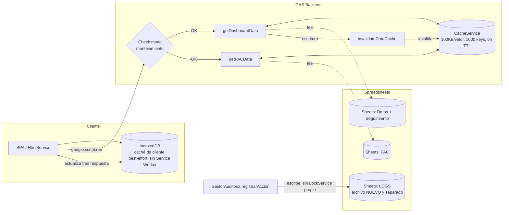
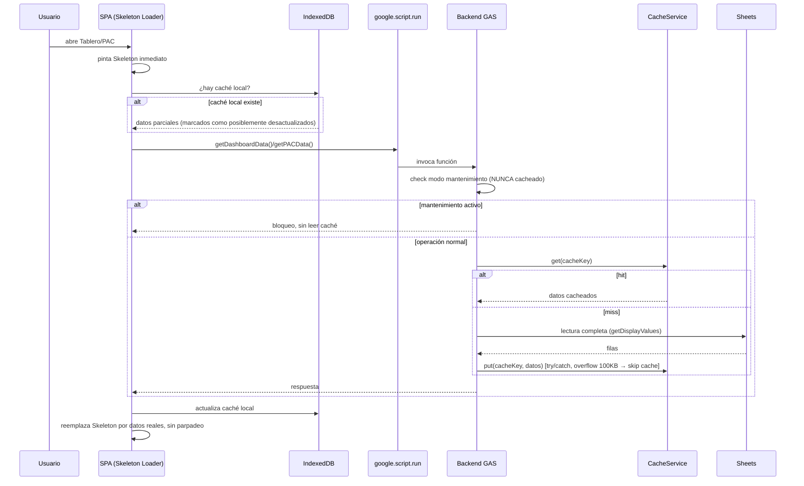

# Documentacion Tecnica Viva

## 1. Proposito del documento

Este documento es la fuente oficial de evidencia tecnica del proyecto APLICACION DE PREDIOS. Su objetivo es registrar, en espanol y con lenguaje tecnico facil de entender, la arquitectura del aplicativo, los cambios funcionales realizados, los archivos intervenidos, las validaciones ejecutadas y los agentes o skills utilizados durante el proceso.

Este archivo debe actualizarse cada vez que se modifique un modulo relevante, se agregue una funcion, se cambie el comportamiento de la interfaz o se altere la configuracion del sistema.

## 2. Estrategia recomendada de documentacion

La estrategia mas robusta no es escribir directamente en Word. La estrategia recomendada es esta:

1. Mantener este documento en Markdown como fuente canonica versionable.
2. Actualizarlo junto con cada cambio de codigo.
3. Exportarlo a PDF o DOCX cuando se necesite una evidencia formal para entrega.

Ventajas de esta estrategia:

- Permite control de cambios junto al codigo.
- Facilita enlazar archivos, funciones y puntos modificados.
- Evita perder trazabilidad cuando el contenido crece.
- Permite generar salidas finales para auditoria, comites o supervisores.

## 3. Skills y mecanismos adecuados detectados

Durante la investigacion se confirmo que si existen skills adecuadas para sostener este proceso documental:

### 3.1 document-generate

Uso recomendado: crear documentacion base de un proyecto, modulo, feature o flujo completo.

Valor para este proyecto:

- Sirve para producir la primera version de la documentacion tecnica.
- Encaja bien para describir modulos como Codigo.js, config.js, Index.html y PAC.
- Es apropiado para generar explicaciones estructuradas con enfoque tecnico.

### 3.2 document-release

Uso recomendado: actualizar la documentacion despues de cambios o entregas.

Valor para este proyecto:

- Sirve para mantener alineados los documentos con el codigo que va cambiando.
- Es el skill mas cercano a una bitacora de mantenimiento posterior.
- Debe usarse cuando ya hubo modificaciones implementadas y validadas.

### 3.3 make-pdf

Uso recomendado: convertir un Markdown en un PDF formal.

Estado actual del entorno:

- El binario de gstack para PDF no esta disponible en este equipo en este momento.
- No se detecto Pandoc instalado para generar DOCX o PDF automaticamente.

Conclusion practica:

- Si hoy se requiere documentar, se puede hacer de inmediato en Markdown.
- Cuando se necesite entregable formal, se recomienda habilitar uno de estos caminos:
  - Instalar Pandoc para generar `.docx` y `.pdf`.
  - Construir el binario de `/make-pdf` desde gstack para exportar a PDF.

## 4. Estado actual del proyecto

### 4.1 Tipo de solucion

Aplicacion web en Google Apps Script con interfaz HTML renderizada por `HtmlService`, integracion con Google Sheets como fuente principal de datos, automatizaciones con triggers y modulos especializados para PAC, auditoria, permisos y reportes.

### 4.2 Modulos principales

- [Codigo.js](e:\PROYECTOS\CLAUDE CODE\CREACIÓN APK\Aplicación de Predios\Codigo.js): orquestacion backend, menu de Google Sheets, carga principal del tablero y funciones publicas.
- [config.js](e:\PROYECTOS\CLAUDE CODE\CREACIÓN APK\Aplicación de Predios\config.js): configuracion central del sistema y resolucion de IDs de archivos.
- [Index.html](e:\PROYECTOS\CLAUDE CODE\CREACIÓN APK\Aplicación de Predios\Index.html): interfaz principal del tablero, filtros, matriz y experiencia del usuario.
- [cache_backend.gs](e:\PROYECTOS\CLAUDE CODE\CREACIÓN APK\Aplicación de Predios\cache_backend.gs): wrappers de backend para cache, roles y ayudas de busqueda.
- [pac_api.js](e:\PROYECTOS\CLAUDE CODE\CREACIÓN APK\Aplicación de Predios\pac_api.js): logica del modulo PAC.

## 5. Cambios tecnicos recientes documentados

### 5.1 Flujo de staging y promocion controlada

**Objetivo funcional**

Permitir validar un archivo de staging (Dato 2) antes de promoverlo al archivo principal (Dato 1), reduciendo el riesgo de sobrescribir informacion productiva sin control.

**Archivo intervenido**

- [Codigo.js](e:\PROYECTOS\CLAUDE CODE\CREACIÓN APK\Aplicación de Predios\Codigo.js#L1845)

**Cambios realizados**

- Se amplio el menu de control en Google Sheets para incluir acciones de validacion y promocion de staging.
- Se agrego una validacion estructural entre hojas de staging y produccion.
- Se incorporo un flujo de promocion con confirmacion de usuario y `LockService`.
- Se agrego copia controlada por hoja entre archivo staging y archivo principal.

**Referencias puntuales**

- Menu de control: [Codigo.js](e:\PROYECTOS\CLAUDE CODE\CREACIÓN APK\Aplicación de Predios\Codigo.js#L1845)
- Entrada de validacion: [Codigo.js](e:\PROYECTOS\CLAUDE CODE\CREACIÓN APK\Aplicación de Predios\Codigo.js#L1849)
- Funcion de validacion: [Codigo.js](e:\PROYECTOS\CLAUDE CODE\CREACIÓN APK\Aplicación de Predios\Codigo.js#L1873)
- Funcion de promocion: [Codigo.js](e:\PROYECTOS\CLAUDE CODE\CREACIÓN APK\Aplicación de Predios\Codigo.js#L1923)
- Copia de hojas: [Codigo.js](e:\PROYECTOS\CLAUDE CODE\CREACIÓN APK\Aplicación de Predios\Codigo.js#L1962)

**Impacto tecnico**

- Se formalizo un ciclo de preproduccion y promocion manual.
- Se redujo la dependencia de cambios directos sobre el archivo principal.
- Se dejo base para gobierno de datos y validacion previa al despliegue funcional.

### 5.2 Fortalecimiento de configuracion y fallback seguro

**Objetivo funcional**

Eliminar dependencias rigidas de IDs hardcodeados y permitir que el sistema opere con mayor seguridad en entornos de pruebas, staging o despliegue local.

**Archivo intervenido**

- [config.js](e:\PROYECTOS\CLAUDE CODE\CREACIÓN APK\Aplicación de Predios\config.js#L16)

**Cambios realizados**

- Se incorporo `DATA_FILES.STAGING` como configuracion de archivo secundario para validacion y promocion.
- Se mantuvo compatibilidad con `DATA_FILES_IDS`.
- Se reforzo la resolucion de IDs de archivos usando rutas alternativas.
- Se agrego fallback al spreadsheet activo cuando `DATA_FILES.PRINCIPAL` no esta configurado.

**Referencias puntuales**

- Estructura de archivos de datos: [config.js](e:\PROYECTOS\CLAUDE CODE\CREACIÓN APK\Aplicación de Predios\config.js#L16)
- Compatibilidad `DATA_FILES_IDS`: [config.js](e:\PROYECTOS\CLAUDE CODE\CREACIÓN APK\Aplicación de Predios\config.js#L23)
- Resolucion de lista de archivos: [config.js](e:\PROYECTOS\CLAUDE CODE\CREACIÓN APK\Aplicación de Predios\config.js#L270)
- Validacion central de configuracion: [config.js](e:\PROYECTOS\CLAUDE CODE\CREACIÓN APK\Aplicación de Predios\config.js#L294)
- Obtencion de ID de staging: [config.js](e:\PROYECTOS\CLAUDE CODE\CREACIÓN APK\Aplicación de Predios\config.js#L678)
- Resolucion global de IDs: [config.js](e:\PROYECTOS\CLAUDE CODE\CREACIÓN APK\Aplicación de Predios\config.js#L707)

**Impacto tecnico**

- El sistema queda mas portable entre ambientes.
- Se reduce el riesgo de fallar por configuracion incompleta.
- Se mejora la mantenibilidad del backend.

### 5.3 Mejora profesional de filtros y experiencia de uso en la matriz

**Objetivo funcional**

Mejorar la experiencia del usuario en el tablero principal permitiendo filtros mas rapidos, mas precisos y con menor friccion operacional.

**Archivo intervenido**

- [Index.html](e:\PROYECTOS\CLAUDE CODE\CREACIÓN APK\Aplicación de Predios\Index.html#L202)

**Cambios realizados**

- Se agregaron campos de busqueda para Proyecto, Tramo y Estado.
- Se habilito filtrado incremental mientras el usuario escribe.
- Se incorporaron indicadores de coincidencias para orientar la busqueda.
- Se mejoro el comportamiento de limpieza y reseteo de filtros dependientes.
- Se reforzo la usabilidad con interacciones de teclado como Enter, Escape y flecha abajo.

**Referencias puntuales**

- Busqueda de proyecto: [Index.html](e:\PROYECTOS\CLAUDE CODE\CREACIÓN APK\Aplicación de Predios\Index.html#L202)
- Meta informativa de proyecto: [Index.html](e:\PROYECTOS\CLAUDE CODE\CREACIÓN APK\Aplicación de Predios\Index.html#L203)
- Busqueda de tramo: [Index.html](e:\PROYECTOS\CLAUDE CODE\CREACIÓN APK\Aplicación de Predios\Index.html#L211)
- Meta informativa de tramo: [Index.html](e:\PROYECTOS\CLAUDE CODE\CREACIÓN APK\Aplicación de Predios\Index.html#L212)
- Busqueda de estado: [Index.html](e:\PROYECTOS\CLAUDE CODE\CREACIÓN APK\Aplicación de Predios\Index.html#L220)
- Meta informativa de estado: [Index.html](e:\PROYECTOS\CLAUDE CODE\CREACIÓN APK\Aplicación de Predios\Index.html#L221)

**Impacto tecnico**

- La interfaz es mas util para bases grandes.
- Se reduce el tiempo de localizacion de proyectos y estados.
- Se deja una base escalable para futuras mejoras de UX.

### 5.4 Correccion de bloqueo de interaccion en la interfaz

**Objetivo funcional**

Resolver un bloqueo visual que impedia seleccionar elementos dentro del HTML cargado por Apps Script.

**Archivo intervenido**

- [Index.html](e:\PROYECTOS\CLAUDE CODE\CREACIÓN APK\Aplicación de Predios\Index.html#L832)

**Cambios realizados**

- Se detecto un conflicto entre clases globales `.modal` y `.modal-content` usadas por Bootstrap y un modal custom de la seccion Filtro Matriz.
- Se aislaron los estilos del modal custom bajo clases propias para evitar que sobrescribieran el resto de la aplicacion.

**Referencias puntuales**

- Modal corregido: [Index.html](e:\PROYECTOS\CLAUDE CODE\CREACIÓN APK\Aplicación de Predios\Index.html#L832)
- Contenedor del modal: [Index.html](e:\PROYECTOS\CLAUDE CODE\CREACIÓN APK\Aplicación de Predios\Index.html#L833)
- Estilo aislado del overlay: [Index.html](e:\PROYECTOS\CLAUDE CODE\CREACIÓN APK\Aplicación de Predios\Index.html#L861)
- Estilo aislado del contenido: [Index.html](e:\PROYECTOS\CLAUDE CODE\CREACIÓN APK\Aplicación de Predios\Index.html#L862)

**Impacto tecnico**

- Se recupero la interaccion normal del tablero.
- Se evito una regresion transversal sobre todos los modales Bootstrap.

### 5.5 Wrappers backend para cache, roles y ayudas de busqueda

**Objetivo funcional**

Crear una capa de integracion mas segura entre el frontend y Apps Script para roles, invalidacion de cache y sugerencias de busqueda.

**Archivo intervenido**

- [cache_backend.gs](e:\PROYECTOS\CLAUDE CODE\CREACIÓN APK\Aplicación de Predios\cache_backend.gs#L23)

**Referencias puntuales**

- Roles de usuario: [cache_backend.gs](e:\PROYECTOS\CLAUDE CODE\CREACIÓN APK\Aplicación de Predios\cache_backend.gs#L23)
- Consulta de operacion de cache: [cache_backend.gs](e:\PROYECTOS\CLAUDE CODE\CREACIÓN APK\Aplicación de Predios\cache_backend.gs#L57)
- Invalidacion de cache: [cache_backend.gs](e:\PROYECTOS\CLAUDE CODE\CREACIÓN APK\Aplicación de Predios\cache_backend.gs#L90)
- Sugerencias de busqueda: [cache_backend.gs](e:\PROYECTOS\CLAUDE CODE\CREACIÓN APK\Aplicación de Predios\cache_backend.gs#L251)

### 5.6 Correccion de bloqueo en render del HTML por scriptlet GAS invalido

**Objetivo funcional**

Eliminar el fallo critico de render en produccion al cargar la interfaz principal, donde el motor de plantillas de Google Apps Script fallaba con `Unexpected token ';'` durante `template.evaluate()`.

**Archivo(s) intervenido(s):**

- [Codigo.js](e:\PROYECTOS\CLAUDE CODE\CREACIÓN APK\Aplicación de Predios\Codigo.js#L145-L170)
- [Index.html](e:\PROYECTOS\CLAUDE CODE\CREACIÓN APK\Aplicación de Predios\Index.html#L1669-L1678)

**Motivo de la intervencion:**

Se intento inyectar el email del usuario con una expresion compleja dentro de un scriptlet `<?!= ... ?>` en el HTML. El motor de plantillas de GAS es muy restrictivo y falla cuando hay operadores ternarios o `;` dentro del bloque, provocando la pantalla blanca en `/dev`.

**Cambios tecnicos realizados:**

- En [Codigo.js](e:\PROYECTOS\CLAUDE CODE\CREACIÓN APK\Aplicación de Predios\Codigo.js#L167-L179) se agrego `template.safeUserEmailJS = JSON.stringify(userEmail || '')` antes de `evaluate()`.
- En [Index.html](e:\PROYECTOS\CLAUDE CODE\CREACIÓN APK\Aplicación de Predios\Index.html#L1674-L1678) se simplifico la inyeccion a `const CURRENT_USER_EMAIL = <?!= safeUserEmailJS ?>;` sin logica ni ternarios.
- Se preserva el valor JS seguro y validado para el namespacing de cache por usuario.

**Impacto tecnico:**

- Se elimina la falla de sintaxis en la plantilla.
- La aplicacion vuelve a cargar sin error en el paso `template.evaluate()`.
- Se reduce el riesgo de regresiones futuras en inyecciones inline de datos sensibles o dinamicos dentro de `Index.html`.

**Validacion ejecutada despues del cambio:**

- [x] `node --check Codigo.js` ejecutado con respuesta exitosa.
- [x] Refactor de injection verificado por revision del codigo.
- [x] Listo para despliegue a Apps Script con `clasp push --force`.

### 5.7 Fase B — UI de mapeo visual y resolucion de conflictos

**Objetivo funcional**

Permitir decidir, revisar y confirmar el mapeo entre columnas crudas y campos canónicos antes de la consolidacion final, con feedback grafico y persistencia por usuario para evitar reconfigurar el mismo mapeo ante recargas accidentales.

**Archivo(s) intervenido(s):**

- [Index.html](e:\PROYECTOS\CLAUDE CODE\CREACIÓN APK\Aplicación de Predios\Index.html#L1670-L1675)
- [app_normalizacion_js.html](e:\PROYECTOS\CLAUDE CODE\CREACIÓN APK\Aplicación de Predios\app_normalizacion_js.html)
- [TODOS.md](e:\PROYECTOS\CLAUDE CODE\CREACIÓN APK\Aplicación de Predios\TODOS.md)

**Cambios realizados**

- Se agrego el modal `#modalMapeoNormalizacion` para revisar columnas detectadas y asignarlas a campos canonicos.
- Se implemento `renderizarFormularioMapeo(columnasDetectadas, mapeoSugerido)` para mostrar la tabla de mapeo con selector por columna y marca visual de requeridos faltantes.
- Se implemento `renderizarReporteConflictos(reporte)` para mostrar badges de advertencia sobre RT duplicados y campos vacios.
- Se adiciono almacenamiento persistente en IndexedDB con clave `normalizacion_map_<USER_EMAIL>` para conservar la configuracion por usuario sin usar `localStorage`.
- Se incorpora la carga del partial desde `Index.html` antes del bloque principal de la app.

**Impacto tecnico**

- La normalizacion deja de depender de decisiones ad hoc del operador y pasa a una capa visual de revision previa.
- Se reduce la probabilidad de merge con columnas mal mapeadas o campos obligatorios faltantes.
- Se mejora la trazabilidad de la etapa de prepocesamiento por usuario y por sesion de trabajo.

**Validacion ejecutada despues del cambio:**

- [x] Pull/Push a Apps Script con `npx clasp push --force` verificado con salida de `Pushed 43 files...`.
- [x] Commit generado correctamente: `2574879` con mensaje `feat(normalization): implement visual column mapping UI and conflict resolution panel [CONC-FE-07]`.
- [x] `node --check normalizacion_script/ConfigNormalizacion.js` y `node --check normalizacion_script/CoreNormalizacion.js` ejecutados previamente con salida exitosa (sin errores).
- [x] `TODOS.md` actualizado marcando la Fase B como completada.

### 5.8 Fase C — Merge operativo y cierre del Sprint 3

**Objetivo funcional**

Conectar la confirmacion del mapeo visual con la ejecucion operativa del pipeline de normalizacion, asegurar que la materializacion final se haga con validacion de negocio y dejar trazabilidad del resultado para la siguiente etapa de consolidacion del tablero.

**Archivo(s) intervenido(s):**

- [app_normalizacion_js.html](e:\PROYECTOS\CLAUDE CODE\CREACIÓN APK\Aplicación de Predios\app_normalizacion_js.html)
- [TODOS.md](e:\PROYECTOS\CLAUDE CODE\CREACIÓN APK\Aplicación de Predios\TODOS.md)
- [DOCUMENTACION_TECNICA_VIVA.md](e:\PROYECTOS\CLAUDE CODE\CREACIÓN APK\Aplicación de Predios\DOCUMENTACION_TECNICA_VIVA.md)

**Cambios realizados**

- Se conecto el boton `Guardar mapeo` con la ejecucion de `ejecutarNormalizacionCompleta(payload)` mediante `google.script.run`.
- Se conserva el payload de mapeo y las columnas seleccionadas en IndexedDB antes de cerrar el modal.
- Se persiste el dataset normalizado en la caché del tablero (`writeDashboardCache`) para mantener la UI consistente tras la validacion y el re-render inmediato.
- Se deja la ruta de re-render del matrix y la limpieza del modal en una sola accion, sin depender de `localStorage`.

**Impacto tecnico**

- El flujo de normalizacion pasa de ser visual y manual a un pipeline operativo con confirmacion de usuario y registro de estado intermedio.
- Se reduce el riesgo de perder la configuracion del mapeo por recarga o por cambios de contexto del usuario.
- La primera vista del tablero queda sincronizada con la respuesta del merge, sin abrir una segunda ventana de inconsistencia frente a la caché local.

**Validacion ejecutada despues del cambio:**

- [x] `node --check normalizacion_script/MenuNormalizacion.js` ejecutado con salida `MenuNormalizacion OK`.
- [x] `node --check normalizacion_script/CoreNormalizacion.js` ejecutado con salida `CoreNormalizacion OK`.
- [x] Revisiones del editor sobre [app_normalizacion_js.html](e:\PROYECTOS\CLAUDE CODE\CREACIÓN APK\Aplicación de Predios\app_normalizacion_js.html), [normalizacion_script/MenuNormalizacion.js](e:\PROYECTOS\CLAUDE CODE\CREACIÓN APK\Aplicación de Predios\normalizacion_script\MenuNormalizacion.js) y [normalizacion_script/CoreNormalizacion.js](e:\PROYECTOS\CLAUDE CODE\CREACIÓN APK\Aplicación de Predios\normalizacion_script\CoreNormalizacion.js) sin errores de sintaxis.

### 5.9 Exportacion institucional y herramientas de datos

**Objetivo funcional**

Preparar una capa de exportacion reutilizable para reportes institucionales, matices del tablero y descargas CSV con metadata de usuario, filtro y marca temporal, sin bloquear la UI principal ni depender de un flujo de datos pesado en el navegador.

**Archivo(s) intervenido(s):**

- [Index.html](Index.html)
- [app_herramientas_js.html](app_herramientas_js.html)
- [export_backend.js](export_backend.js)

**Cambios realizados**

- Se agrego el partial [app_herramientas_js.html](app_herramientas_js.html) con utilidades para headers institucionales, sanitizacion de valores, CSV y snapshots en IndexedDB.
- Se conecto el archivo en la carga principal de [Index.html](Index.html) para que quede disponible en la app sin depender de orden de ejecucion manual.
- Se creo [export_backend.js](export_backend.js) con funciones de normalizacion, generacion de CSV, payloads de libro y exportacion por lotes para evitar carga masiva en una sola pasada.
- El backend de exportacion propone una ruta segura para exportar datasets grandes con paginacion por chunks y cabeceras comunes del IDU.

**Impacto tecnico**

- La capa de reportes queda centralizada y reutilizable para futuros flujos PDF/Excel/CSV.
- Se reduce el riesgo de errores de serializacion por cadenas largas, saltos de linea o columnas con delimitadores.
- Se deja una base para integrar exportaciones desde matriz, alertas y PAC con el mismo contrato de metadata.

**Validacion ejecutada despues del cambio:**

- [x] Extraccion del script del partial y validacion con `node --check` sobre el contenido JS del archivo, sin errores.
- [x] Validacion de [export_backend.js](export_backend.js) con `node --check` sin errores.
- [x] Integracion del partial en [Index.html](Index.html) verificada en el codigo fuente.

## 6. Agentes, herramientas y skills utilizados o definidos para este proceso

### 6.1 Agente principal de implementacion

- GitHub Copilot sobre GPT-5.4.

### 6.2 Skills de gstack relevantes para documentacion y evidencia

- `document-generate`: para redactar documentacion base.
- `document-release`: para actualizar documentacion despues de cambios.
- `make-pdf`: para generar PDF formal desde Markdown cuando el binario este disponible.

### 6.3 Skills de gstack relevantes para mejora de interfaz

- `design-review`: auditoria visual y de experiencia de usuario.
- `design-html`: refinamiento e implementacion de HTML/CSS.
- `design-consultation`: definicion de lineamientos de disenio.

### 6.4 Herramientas de verificacion ya usadas en este proyecto

- `clasp push` para publicar cambios en Apps Script.
- Validacion de errores de sintaxis en archivos clave.
- Lectura puntual de codigo y verificaciones de lineas afectadas.

### 6.5 Segundo agente de implementacion (sesion paralela)

- **Claude Code (modelo Claude Sonnet 5), orquestado con el conjunto de skills gstack.**
- Trabaja sobre el mismo repositorio y la misma rama de git (`fix/qa-saveTracking-batch-lock`) que la sesion de GitHub Copilot descrita en 6.1, en momentos distintos.
- Pipeline tipico usado en esta sesion: `/plan-eng-review` (diagnostico arquitectonico) -> `/review` (auditoria Staff Engineer) -> implementacion directa de parches -> `/review` de verificacion -> `/careful` (guardarrailes) -> `clasp push` -> `/qa` + `/setup-browser-cookies` (QA en navegador) -> `/context-save` (continuidad entre sesiones) -> `/sync-gbrain` (memoria persistente local).
- Todas las intervenciones de esta sesion quedan registradas en la Seccion 12, siguiendo la misma plantilla de la Seccion 9.

## 7. Politica de actualizacion obligatoria de este documento

Cada vez que se modifique un archivo relevante del proyecto, se debe actualizar este documento con minimo los siguientes puntos:

1. Nombre del archivo intervenido.
2. Proposito del archivo dentro de la solucion.
3. Motivo del cambio.
4. Resumen funcional de lo modificado.
5. Referencia puntual a funciones, bloques o lineas afectadas.
6. Validacion ejecutada despues del cambio.
7. Estado del despliegue o publicacion.

## 8. Flujo de trabajo documental recomendado para futuras modificaciones

### 8.1 Antes de modificar un archivo

Registrar en este documento:

- Que hace el archivo.
- Que problema o mejora se va a abordar.
- Que riesgo funcional existe si se modifica.

### 8.2 Durante la modificacion

Registrar:

- Funciones nuevas o actualizadas.
- Secciones de UI, backend o configuracion afectadas.
- Decisiones tecnicas adoptadas.

### 8.3 Despues de la modificacion

Registrar:

- Validaciones ejecutadas.
- Resultado de compilacion, despliegue o push.
- Impacto esperado en usuario, operacion o mantenimiento.

## 9. Plantilla para futuras entradas

### 9.1 Plantilla vigente (actualizada 2026-08-05)

Esta es la plantilla a usar para toda intervencion nueva a partir del 2026-08-05. Amplia la plantilla original (ver 9.2) con identificador de tarea, metricas de LOC y checklist de validacion, para que el documento funcione tambien como evidencia auditable, no solo como narrativa.

```md
### [AAAA-MM-DD] [Identificador de la Tarea/PR] - Nombre Corto del Cambio

**Archivo(s) Intervenido(s):**
- `ruta/al/archivo.ext#L10-L45`

**Proposito del Archivo en el Sistema:**
[Descripcion breve del rol del archivo en la arquitectura]

**Motivo de la Intervencion:**
[Explicacion del problema, vulnerabilidad o requerimiento de negocio]

**Cambios Tecnicos Realizados:**
- Detalle 1
- Detalle 2

**Metricas del Cambio:**
- LOC Anadidas: X | LOC Eliminadas: Y | Variacion Neta: Z

**Validacion y Pruebas Ejecutadas:**
- [x] Sintaxis validada con `node --check`
- [x] Auditoria con `/review`
- [x] Pruebas en navegador con `/qa` sobre URL de desarrollo

**Impacto en Produccion:**
[Resumen del beneficio tecnico, operacional o de seguridad obtenido]
```

Notas de uso:

- **Identificador de la Tarea/PR:** este proyecto aun no tiene un sistema formal de tickets/PR (el repositorio no tiene remoto configurado). Mientras eso no exista, usar como identificador la misma etiqueta que se deja en el comentario del codigo (por ejemplo `SEC-P1`, `SEC-P1.5`) o un slug corto y consistente (`NS-01`, `FE-01`) si el cambio no lleva etiqueta en el codigo.
- **Metricas del Cambio:** reportar solo lineas atribuibles a la intervencion documentada, no el `git diff --numstat` crudo del archivo completo -- un archivo puede acumular cambios de varias intervenciones o sesiones distintas en el mismo commit. Si el archivo es nuevo (no existia antes en el repositorio), aclararlo explicitamente en vez de reportar "LOC Eliminadas: 0" sin contexto.
- **Validacion y Pruebas Ejecutadas:** marcar solo lo que realmente se ejecuto en esa intervencion especifica; dejar sin marcar (`[ ]`) lo que no aplico, no borrarlo de la lista.

### 9.2 Plantilla original (version inicial, Copilot)

Se conserva para referencia historica; las entradas de la Seccion 5 fueron escritas con este formato.

```md
### [Fecha] Nombre corto del cambio

**Archivo intervenido**

- [ruta/al/archivo](ruta/al/archivo#L1)

**Que hace el archivo**

Breve descripcion del rol del archivo dentro del sistema.

**Motivo del cambio**

Problema, mejora o ajuste solicitado.

**Cambios realizados**

- Punto 1
- Punto 2
- Punto 3

**Referencias puntuales**

- [ruta/al/archivo](ruta/al/archivo#L1)
- [ruta/al/archivo](ruta/al/archivo#L1)

**Validacion ejecutada**

- Comando o comprobacion realizada.
- Resultado.

**Impacto**

Resumen de beneficio tecnico y funcional.
```

## 10. Exportacion a PDF o Word

### 10.1 Situacion actual

- Hoy ya puede mantenerse este documento en Markdown.
- Hoy no se detecto Pandoc instalado en el entorno.
- Hoy no se detecto listo el binario local de gstack para `make-pdf`.

### 10.2 Camino recomendado para PDF

Cuando se habilite `make-pdf` o Pandoc, este documento podra exportarse como entregable formal.

### 10.3 Camino recomendado para Word

Si se requiere `.docx`, la recomendacion es instalar Pandoc y generar snapshots del documento vivo cuando se necesiten radicados, informes o anexos.

## 11. Decision adoptada

Se adopta este archivo como bitacora tecnica viva del proyecto. A partir de este punto, toda mejora relevante del sistema debe dejar evidencia aqui antes de cerrar la intervencion tecnica.

## 12. Registro de intervenciones — Agente Claude Code (Claude Sonnet 5, orquestado con gstack)

Nota de coautoria: este documento fue creado inicialmente por otra sesion de trabajo (GitHub Copilot sobre GPT-5.4, ver Seccion 6.1). Las entradas de esta seccion documentan una sesion distinta (Claude Code, ver Seccion 6.5), ejecutada sobre la misma rama de git. Ambas sesiones comparten este archivo como bitacora unica del proyecto, tal como establece la Seccion 7.

### 12.1 [2026-08-05] [SEC-P0] Autorizacion server-side en registro de seguimiento

**Archivo(s) Intervenido(s):**
- `Codigo.js#L51-L62`

**Proposito del Archivo en el Sistema:**
`Codigo.js` es el orquestador principal del backend: contiene `doGet`, `saveFollowupData` (punto de entrada real para que el frontend registre seguimiento de un RT) y `saveTrackingData` (la logica que escribe en la matriz principal).

**Motivo de la Intervencion:**
Una auditoria tipo Staff Engineer detecto que `saveFollowupData` derivaba la identidad del usuario via `Session.getActiveUser()` pero nunca verificaba su rol contra `GestorPermisos` antes de escribir. Cualquier usuario autenticado del dominio -- sin importar su rol -- podia invocar la funcion desde la consola del navegador y registrar seguimiento; solo la interfaz ocultaba el boton, no habia control de autorizacion real en el servidor. Severidad P0 (falla de control de acceso sobre una escritura de datos reales).

**Cambios Tecnicos Realizados:**
- Se agrego validacion obligatoria: `GestorPermisos.obtenerRol(userEmail)` debe ser `EDITOR` o `ADMIN`; si no, la funcion retorna error y no escribe nada.
- El bloqueo queda registrado con `console.warn` para trazabilidad.

**Fragmento de Codigo (Antes vs Despues):**

Antes (`Codigo.js`, dentro de `saveFollowupData`):
```javascript
function saveFollowupData(dataJson) {
  try {
    const data = typeof dataJson === 'string' ? JSON.parse(dataJson) : dataJson;
    const userEmail = Session.getActiveUser().getEmail();
    const formObject = {
```

Despues:
```javascript
function saveFollowupData(dataJson) {
  try {
    const userEmail = Session.getActiveUser().getEmail();

    // SEC-P0: validacion de autorizacion server-side (no confiar solo en la UI)
    const gestorPermisos = new GestorPermisos();
    const rolUsuario = gestorPermisos.obtenerRol(userEmail);
    const rolesAutorizados = [getConfig('ROLES.EDITOR'), getConfig('ROLES.ADMIN')];
    if (!rolUsuario || rolesAutorizados.indexOf(rolUsuario) === -1) {
      console.warn(`Acceso denegado a saveFollowupData para ${userEmail} (rol: ${rolUsuario || 'ninguno'})`);
      return { success: false, error: 'No tiene permisos para registrar seguimiento. Se requiere rol Editor o Administrador.' };
    }

    const data = typeof dataJson === 'string' ? JSON.parse(dataJson) : dataJson;
    const formObject = {
```

**Metricas del Cambio:**

| Metrica | Valor |
|---|---|
| LOC iniciales (bloque afectado) | 5 |
| LOC finales (bloque afectado) | 15 |
| Delta absoluto | +10 |
| % variacion (bloque) | +200% |

Nota de alcance: esta tabla mide solo el bloque de codigo mostrado arriba, no el archivo completo. `Codigo.js` paso de 1863 a 1985 lineas totales entre los mismos dos commits (ver Seccion 14), pero ese delta de archivo completo incluye otras intervenciones ademas de esta.

**Validacion y Pruebas Ejecutadas:**
- [x] Sintaxis validada con `node --check Codigo.js`
- [x] Auditoria con `/review` (verifico compatibilidad de `GestorPermisos` con la llamada)
- [ ] Pruebas en navegador con `/qa` sobre URL de desarrollo (cubierto indirectamente en 12.5, no se repitio prueba aislada de este flujo)

**Impacto en Produccion:**
Cierra una vulnerabilidad de control de acceso: la escritura de seguimiento ahora exige rol Editor o Administrador, verificado en el servidor, no solo en la interfaz.

### 12.2 [2026-08-05] [SEC-P1] Sanitizacion de XSS almacenado (OBSERVACIONES / SITUACIONES)

**Archivo(s) Intervenido(s):**
- `Index.html#L4103-L4111` (funcion nueva)
- `Index.html#L5469, L5650, L5740, L6288, L6297` (5 puntos de aplicacion)

**Proposito del Archivo en el Sistema:**
Plantilla principal del tablero (`HtmlService`). Muestra la matriz de predios, el historial de seguimiento por RT y los formularios de edicion.

**Motivo de la Intervencion:**
El campo `OBSERVACIONES` (texto libre capturado del usuario) se interpolaba sin escapar directamente en `innerHTML` / `insertAdjacentHTML` en 5 puntos distintos del archivo. Cualquier usuario con permiso de edicion podia inyectar HTML/JavaScript que se ejecutaria en el navegador de cualquier otro usuario (incluido un Administrador) al ver el historial de ese RT.

**Cambios Tecnicos Realizados:**
- Se creo una funcion reutilizable `escapeHtml()`.
- Se aplico en los 5 puntos de renderizado identificados: lista de cambios pendientes, banner de "predio inactivo" (dos vistas distintas), timeline de seguimiento y tabla generica de detalle de RT.

**Fragmento de Codigo (Antes vs Despues):**

Funcion nueva (`Index.html#L4103-L4111`):
```javascript
function escapeHtml(text) {
    if (text === null || text === undefined) return '';
    return String(text)
        .replace(/&/g, '&amp;')
        .replace(/</g, '&lt;')
        .replace(/>/g, '&gt;')
        .replace(/"/g, '&quot;')
        .replace(/'/g, '&#39;');
}
```

Ejemplo de aplicacion en punto de uso -- timeline de seguimiento (`Index.html#L5728`, hallazgo original de la auditoria):

Antes:
```javascript
<small class="wrap-obs" style="max-width: 250px; display: block;">
    ${record.observaciones}
</small>
```

Despues:
```javascript
<small class="wrap-obs" style="max-width: 250px; display: block;">
    ${escapeHtml(record.observaciones)}
</small>
```

**Metricas del Cambio:**

| Metrica | Valor |
|---|---|
| LOC iniciales (funcion + 5 puntos de uso) | 16 (5 lineas de codigo preexistente en los 5 puntos de uso) |
| LOC finales | 27 (11 lineas de funcion nueva + 5 puntos de uso modificados) |
| Delta absoluto | +11 |
| % variacion | +69% |

Nota de alcance: cifra atribuible solo a esta intervencion, separada de la extraccion de 12.5 que toca el mismo archivo (`Index.html`) en la misma sesion.

**Validacion y Pruebas Ejecutadas:**
- [x] Sintaxis validada con `node --check` (bloque `<script>` completo)
- [x] Auditoria con `/review`
- [x] Pruebas en navegador con `/qa` sobre URL de desarrollo (verificado junto con 12.5, mismo deployment)

**Impacto en Produccion:**
Elimina un riesgo de robo de sesion o phishing interno entre usuarios del mismo dominio (incluye a Administradores) via el campo de observaciones del seguimiento.

### 12.3 [2026-08-05] [CONC-P2] Concurrencia — LockService en motores de reglas y modulo PAC

**Archivo(s) Intervenido(s):**
- `evaluador_alertas.js#L8-L75, L348-L417`
- `motor_reglas.js#L8-L75`
- `pac_gestor.js#L867-L919, L955-L1069`

**Proposito del Archivo en el Sistema:**
`evaluador_alertas.js` / `motor_reglas.js` implementan el motor de reglas de negocio que calcula el semaforo de riesgo y genera alertas. `pac_gestor.js` gestiona la sincronizacion, el borrador y la aprobacion del modulo PAC (seguimiento presupuestal).

**Motivo de la Intervencion:**
Los tres archivos escribian hojas compartidas (`CONFIG_REGLAS`, `ALERTAS_ACTIVAS`, `PAC_Vigente`, `PAC_Borrador`) sin usar `LockService`, a diferencia del resto del sistema. Dos ejecuciones simultaneas (por ejemplo, dos administradores aprobando un borrador PAC al mismo tiempo, o el motor de alertas corriendo mientras alguien edita las reglas) podian generar perdida de escrituras o filas duplicadas.

**Cambios Tecnicos Realizados:**
- `LockService.getScriptLock()` con el patron `try { lock.waitLock(20000) ... } catch {} finally { lock.releaseLock() }` en: `obtenerReglasJSON`, `guardarReglasJSON` y `_guardarAlertasEnHoja` (ambos archivos de reglas); `aprobarBorradorPAC` y `_pac_compararYGenerarBorrador` (PAC).
- En `obtenerReglasJSON` se agrego ademas doble verificacion (comprobar de nuevo tras adquirir el lock) para evitar crear la hoja `CONFIG_REGLAS` dos veces bajo concurrencia.

**Fragmento de Codigo (Antes vs Despues):**

Antes (`pac_gestor.js`, inicio de `aprobarBorradorPAC`):
```javascript
function aprobarBorradorPAC(motivo) {
  pac_log('aprobarBorradorPAC: ' + (motivo || 'aprobacion manual'));
  try {
    const ss = pac_getSpreadsheet();
    ...
  } catch (e) {
    pac_log('aprobarBorradorPAC ERROR: ' + e.message, 'ERROR');
    return { success: false, mensaje: 'Error al aprobar borrador: ' + e.message };
  }
}
```

Despues:
```javascript
function aprobarBorradorPAC(motivo) {
  pac_log('aprobarBorradorPAC: ' + (motivo || 'aprobacion manual'));
  // CONC-P2: LockService -- publica el borrador sobre PAC_Vigente (escritura masiva compartida)
  const lock = LockService.getScriptLock();
  try {
    lock.waitLock(20000);
    const ss = pac_getSpreadsheet();
    ...
  } catch (e) {
    pac_log('aprobarBorradorPAC ERROR: ' + e.message, 'ERROR');
    return { success: false, mensaje: 'Error al aprobar borrador: ' + e.message };
  } finally {
    try { lock.releaseLock(); } catch (er) {}
  }
}
```

**Metricas del Cambio:**

| Archivo | LOC iniciales | LOC finales | Delta absoluto | % variacion |
|---|---|---|---|---|
| `evaluador_alertas.js` | 473 | 502 | +29 | +6.1% |
| `motor_reglas.js` | 55 | 74 | +19 | +34.5% |
| `pac_gestor.js` | 1057 | 1068 | +11 | +1.0% |

Cifras de `git diff --numstat` (398bf93 -> 24f29ed), archivo completo en los tres casos -- atribuibles integramente a esta intervencion (ninguno de estos tres archivos fue tocado por otra intervencion de esta sesion).

**Validacion y Pruebas Ejecutadas:**
- [x] Sintaxis validada con `node --check` (los 3 archivos)
- [x] Auditoria con `/review` (verifico explicitamente: sin riesgo de deadlock, liberacion del lock garantizada en todos los `return` tempranos, sin doble adquisicion del mismo lock en la misma cadena de llamadas)
- [ ] Pruebas en navegador con `/qa` sobre URL de desarrollo (este modulo especifico -- reglas y PAC -- no se probo de forma aislada en el QA de 12.5; queda pendiente)

**Impacto en Produccion:**
Elimina una condicion de carrera real sobre datos compartidos criticos (reglas de negocio, alertas activas, presupuesto PAC vigente). Hallazgo menor detectado en la auditoria (no bloqueante): un timeout de lock en `guardarReglasJSON` se reporta hoy con el mismo mensaje generico que un JSON invalido -- registrado como pendiente en `TODOS.md` (item 5).

### 12.4 [2026-08-05] [NS-01] Resolucion de colision de namespace `onOpen()`

**Archivo(s) Intervenido(s):**
- `MatrizSeguimiento_script/ImportarDato.js#L90`
- `normalizacion_script/MenuNormalizacion.js#L9`

**Proposito del Archivo en el Sistema:**
Scripts auxiliares, historicamente desconectados del aplicativo principal (sin ninguna referencia cruzada desde `Codigo.js` / `pac_*.js` / `config.js` / `datos.js`), usados para importar y normalizar datos de origen antes de que lleguen a la matriz principal.

**Motivo de la Intervencion:**
Ambos archivos declaraban su propia funcion `onOpen()`, que colisiona en el mismo namespace global de Apps Script con la `onOpen()` real de `Codigo.js` (linea 1843). Si estas carpetas llegaran a incluirse en un `clasp push` (el `.clasp.json` del proyecto no las excluye), la ultima declaracion cargada sobrescribiria silenciosamente a las otras, sin error visible.

**Cambios Tecnicos Realizados:**
- `onOpen()` -> `onOpenMatriz()` en `ImportarDato.js`.
- `onOpen()` -> `onOpenNormalizacion()` en `MenuNormalizacion.js`.

**Fragmento de Codigo (Antes vs Despues):**

`MatrizSeguimiento_script/ImportarDato.js#L90`:
```javascript
// Antes
function onOpen() {
  LoggerSistema.info('Google Sheets abierto - Sistema iniciado v7.5 Compartido con IA');

// Despues
function onOpenMatriz() {
  LoggerSistema.info('Google Sheets abierto - Sistema iniciado v7.5 Compartido con IA');
```

`normalizacion_script/MenuNormalizacion.js#L9`:
```javascript
// Antes
function onOpen() {
  SpreadsheetApp.getUi()
    .createMenu('Normalizacion IDU')

// Despues
function onOpenNormalizacion() {
  SpreadsheetApp.getUi()
    .createMenu('Normalizacion IDU')
```

**Metricas del Cambio:**

| Metrica | Valor |
|---|---|
| LOC Anadidas | 0 |
| LOC Eliminadas | 0 |
| Delta absoluto | 0 |
| % variacion | 0% (renombre de identificador, 1 linea por archivo, mismo numero de caracteres de linea) |

Nota: ambos archivos aparecen como "creados" en el historial de git de este commit (nunca habian sido commiteados antes -- `MatrizSeguimiento_script/ImportarDato.js` quedo en 1918 LOC totales y `normalizacion_script/MenuNormalizacion.js` en 158 LOC totales, ver Seccion 13), por lo que un `git diff --numstat` crudo mostraria el archivo completo como insertado. Esa cifra de archivo completo no representa el tamano real de esta intervencion, que fue puntual (1 palabra por archivo).

**Validacion y Pruebas Ejecutadas:**
- [x] Busqueda sobre todo el repositorio confirmando unica funcion `onOpen()` restante (la de `Codigo.js`) y cero referencias rotas a los nombres anteriores
- [ ] Auditoria con `/review` (cubierto de forma general en la revision de concurrencia de 12.3, no hubo pase dedicado a este cambio)
- [ ] Pruebas en navegador con `/qa` (estos archivos no forman parte del deployment probado en 12.5 -- siguen sin integrarse al proyecto principal)

**Impacto en Produccion:**
Elimina un riesgo de despliegue silencioso. Queda pendiente en `TODOS.md` la decision de fondo: donde deben vivir estas dos carpetas (proyecto Apps Script separado, exclusion via `.claspignore`, o integracion formal).

### 12.5 [2026-08-05] [FE-01] Desacoplamiento de Index.html (CSS y logica JS principal)

**Archivo(s) Intervenido(s):**
- `Index.html#L24, L1595` (puntos de inclusion)
- `estilos.html` (archivo nuevo)
- `app_js.html` (archivo nuevo)

**Proposito del Archivo en el Sistema:**
`Index.html` era un archivo monolitico de 7340 lineas que combinaba markup, un bloque `<style>` de mas de 1300 lineas y un bloque `<script>` de mas de 4200 lineas con las ~135 funciones de la interfaz.

**Motivo de la Intervencion:**
Un archivo tan grande genera alto riesgo de conflictos de merge y dificulta ubicar codigo relacionado. Apps Script no tiene bundler nativo, pero `HtmlService`'s `include()` (ya usado para `pac_seccion.html`) permite dividir el archivo en partials sin cambiar la arquitectura de despliegue.

**Cambios Tecnicos Realizados:**
- Se extrajo el bloque `<style>` principal (1364 lineas) a `estilos.html`.
- Se extrajo el bloque `<script>` principal (4281 lineas, ~135 funciones) a `app_js.html`.
- `Index.html` quedo en 1697 lineas, enlazando ambos archivos via `<?!= include('estilos') ?>` y `<?!= include('app_js') ?>`.

**Fragmento de Codigo (Antes vs Despues):**

Antes (`Index.html`, estructura del `<head>`):
```html
    <script src="https://cdnjs.cloudflare.com/ajax/libs/html2pdf.js/0.10.1/html2pdf.bundle.min.js"></script>

    <style>
        :root {
            --sidebar-bg: #2c3e50;
        ... (1362 lineas mas de CSS) ...
        }
    </style>
```

Despues:
```html
    <script src="https://cdnjs.cloudflare.com/ajax/libs/html2pdf.js/0.10.1/html2pdf.bundle.min.js"></script>

    <?!= include('estilos') ?>
```

Y de forma analoga para el bloque `<script>` principal (`Index.html` linea 1595 original): las ~4281 lineas de logica JS quedaron reemplazadas por `<?!= include('app_js') ?>`.

**Metricas del Cambio:**

| Archivo | LOC iniciales | LOC finales | Delta absoluto | % variacion |
|---|---|---|---|---|
| `Index.html` | 6898 | 1697 | -5201 | -75.4% |
| `estilos.html` | 0 (no existia) | 1364 | +1364 | N/A (archivo nuevo) |
| `app_js.html` | 0 (no existia) | 4281 | +4281 | N/A (archivo nuevo) |

Cifras de `Index.html` verificadas por `git show <commit>:Index.html \| wc -l` en los commits limite de la sesion (398bf93 -> 24f29ed) -- incluyen tanto esta extraccion como el cambio de 12.2 (XSS) sobre el mismo archivo; el delta de -5201 esta dominado por la extraccion (~-5643 de traslado neto) parcialmente compensado por las +11 lineas netas de 12.2 y otras diferencias menores de contexto entre ambos commits.

**Validacion y Pruebas Ejecutadas:**
- [x] Sintaxis validada con `node --check` (JS extraido en `app_js.html` y bloque `<script>` remanente de `Index.html`)
- [x] Auditoria con `/review` (confirmo que `include()` es concatenacion de texto en servidor -- no ES modules, no iframes, no shadow DOM -- por lo que las funciones globales de `app_js.html` siguen siendo accesibles desde atributos `onclick` y `google.script.run` exactamente igual que antes de la extraccion)
- [x] Pruebas en navegador con `/qa` sobre URL de desarrollo: `clasp push` (37 archivos) a entorno de pruebas confirmado manualmente por el usuario como NO-produccion; QA manual en navegador real (Chrome, sesion autenticada del usuario) sobre la URL de deployment `@HEAD` -- sin div de error de `include()` faltante, CSS cargado correctamente, sin `ReferenceError` en consola, botones `onclick` de la matriz responden, guardado de seguimiento funciona, modulo de alertas carga, modulo PAC funciona. **QA aprobado.**

**Impacto en Produccion:**
Reduce el archivo principal de interfaz de 7340 a 1697 lineas. Pendiente en `TODOS.md`: sub-dividir `app_js.html` (hoy un solo archivo de 4281 lineas) por seccion funcional (matriz, PAC, alertas, auditoria, permisos), que era el alcance completo originalmente planteado.

### 12.6 Correccion sobre disponibilidad de `make-pdf` (ver Secciones 3.3 y 10)

Las Secciones 3.3 y 10 de este documento (escritas por la sesion anterior) indicaban que el binario local de `/make-pdf` no estaba disponible. Verificacion independiente del 2026-08-05: **el binario si existe** (`~/.claude/skills/gstack/make-pdf/dist/pdf.exe`) y soporta salida directa a `.docx` (`--to docx`), sin necesitar Pandoc instalado por separado. Sin embargo, `pdf.exe setup` falla hoy en este equipo por un problema del componente de navegador que usa internamente (`browse newtab` rechaza la URL `about:blank` con "scheme not allowed"), y no se resuelve con un `./setup` completo de gstack. Es decir: la herramienta esta instalada y su CLI responde, pero la renderizacion real a PDF/DOCX esta bloqueada hoy por un problema de entorno -- distinto del diagnostico original ("no esta disponible").

**Actualizacion 2026-08-05 (segunda verificacion, mismo dia):** el diagnostico de "renderizacion bloqueada" tambien quedo parcialmente corregido. `pdf.exe setup` (el smoke test interno de la herramienta) sigue fallando con el mismo error de Chromium, pero el comando real de uso, `pdf.exe generate <archivo.md> <salida> --to docx|pdf`, **funciona correctamente para ambos formatos** cuando se ejecuta directamente sobre este mismo documento: `Documento_Tecnico_Aplicacion_Predios.docx` (6810 palabras, 529KB, generado en 0.6s) y `Documento_Tecnico_Aplicacion_Predios.pdf` (con `--cover --toc`, 6810 palabras, 1023KB, generado en 9.3s, incluyendo el paso de Chromium que fallaba en `setup`). Conclusion revisada: la exportacion formal a Word y PDF **si esta operativa** en este equipo; el fallo de `setup` es un problema aislado del propio smoke test, no de la ruta de generacion real. Se retira el item 6 de `TODOS.md` como resuelto.

### 12.7 [2026-08-05] [CONC-P2.1] Diferenciar timeout de lock vs JSON invalido en motores de reglas

**Archivo(s) Intervenido(s):**
- `evaluador_alertas.js#L8-L86`
- `motor_reglas.js#L8-L86`

**Proposito del Archivo en el Sistema:**
`evaluador_alertas.js` y su copia duplicada `motor_reglas.js` exponen `obtenerReglasJSON()`/`guardarReglasJSON()`, usadas por la UI de administracion para leer y escribir el JSON maestro de reglas de negocio (hoja oculta `CONFIG_REGLAS`).

**Motivo de la Intervencion:**
Hallazgo [P2] de la auditoria de Staff Engineer registrado en `TODOS.md` (item 5) tras la intervencion [CONC-P2] (12.3): en `guardarReglasJSON`, `lock.waitLock(20000)` vivia dentro del mismo `try` que `JSON.parse(jsonString)`. Si el lock expiraba por contencion (dos administradores guardando reglas casi al mismo tiempo), el unico `catch` devolvia el mensaje generico "El formato JSON es invalido" -- un diagnostico falso para un admin cuyo JSON si era correcto. En `obtenerReglasJSON`, un timeout de lock durante la auto-creacion de `CONFIG_REGLAS` degradaba a un `TypeError` capturado por el catch externo, con mensaje tecnico en vez de explicar la causa real.

**Cambios Tecnicos Realizados:**
- `guardarReglasJSON`: `JSON.parse(jsonString)` se valida en un `try/catch` propio **antes** de tocar el lock -- un JSON invalido nunca llega a `lock.waitLock()`.
- `guardarReglasJSON`: la adquisicion del lock pasa a su propio `try/catch` independiente; si `waitLock(20000)` lanza excepcion, retorna `{ success: false, message: 'El sistema se encuentra ocupado por otro administrador. Por favor intente de nuevo en unos segundos.' }` sin ejecutar la logica de guardado.
- `obtenerReglasJSON`: el `catch` del bloque de auto-creacion de `CONFIG_REGLAS` retorna el mismo mensaje de "sistema ocupado" en vez de dejar que degrade a un `TypeError` sin contexto.
- `lock.releaseLock()` se mantiene garantizado (via `finally`) en toda ruta donde el lock fue realmente adquirido; las rutas donde `waitLock()` lanza excepcion no liberan porque el lock nunca llego a adquirirse (no hay fuga).
- Cambio aplicado de forma identica en ambos archivos (duplicacion intencional preexistente, no se corrige aqui).

**Fragmento de Codigo (Antes vs Despues):**

Antes (`evaluador_alertas.js` / `motor_reglas.js`, `guardarReglasJSON`):
```javascript
function guardarReglasJSON(jsonString, usuario) {
  try {
    JSON.parse(jsonString); // Si esto falla, tira error abajo
  } catch (e) {
    return { success: false, error: "El formato JSON es inválido. Revisa la sintaxis." };
  }

  const lock = LockService.getScriptLock();
  try {
    lock.waitLock(20000);
    const fileId = getConfig('DATA_FILES.PRINCIPAL');
    ...
```

Despues:
```javascript
function guardarReglasJSON(jsonString, usuario) {
  // ✅ CONC-P2.1: validar el JSON ANTES de tocar el lock, para que un JSON invalido
  // nunca se reporte como timeout ni un timeout se reporte como JSON invalido
  try {
    JSON.parse(jsonString);
  } catch (parseError) {
    return { success: false, error: "El formato JSON es inválido. Revisa la sintaxis." };
  }

  const lock = LockService.getScriptLock();
  try {
    lock.waitLock(20000);
  } catch (lockError) {
    return { success: false, message: 'El sistema se encuentra ocupado por otro administrador. Por favor intente de nuevo en unos segundos.' };
  }

  try {
    const fileId = getConfig('DATA_FILES.PRINCIPAL');
    ...
  } finally {
    try { lock.releaseLock(); } catch (er) {}
  }
}
```

**Metricas del Cambio:**

| Archivo | LOC iniciales | LOC finales | Delta absoluto | % variacion |
|---|---|---|---|---|
| `evaluador_alertas.js` | 502 | 513 | +11 | +2.2% |
| `motor_reglas.js` | 74 | 85 | +11 | +14.9% |

Cifras verificadas con `git diff --numstat` contra `HEAD` (`+15/-4` lineas en ambos archivos) -- atribuibles integramente a esta intervencion puntual (ningun otro cambio toco estos dos archivos en esta sesion despues de 12.3).

**Validacion y Pruebas Ejecutadas:**
- [x] Sintaxis validada con `node --check` (ambos archivos, `OK`)
- [x] Auditoria como Staff Engineer (equivalente a `/review`, repo sin rama base): confirmado que `lock.releaseLock()` se sigue ejecutando en toda ruta donde el lock fue realmente adquirido, que no existe ninguna ruta de adquisicion-sin-liberacion, que el comportamiento del camino exitoso (JSON valido + lock disponible + escritura correcta) no cambio, y que ambos archivos quedan comportamentalmente identicos. Hallazgo menor no bloqueante: en `obtenerReglasJSON`, el `catch` del bloque de auto-creacion tambien captura errores no relacionados con el lock (p. ej. un fallo real de `insertSheet`), heredado de la intervencion [SEC-P1.5] previa a esta sesion -- no es una regresion de este cambio y queda fuera de alcance (afecta solo el escenario raro de primera ejecucion sin hoja `CONFIG_REGLAS`).
- [ ] Pruebas en navegador con `/qa` sobre URL de desarrollo (cambio en manejo de errores de backend; no se ejecuto una prueba de UI dedicada para forzar contencion de lock real en esta intervencion)

**Impacto en Produccion:**
Un administrador que intenta guardar reglas mientras otro tiene el lock ahora ve un mensaje que describe correctamente la causa ("sistema ocupado, intente de nuevo") en vez de un mensaje de JSON invalido que lo llevaria a revisar sin sentido un JSON que ya era correcto. Cierra el item 5 de `TODOS.md` como `[COMPLETADO]`.

### 12.8 [2026-08-05] [PLAN-FE-02] Dictamen de arquitectura — subdivisión modular de app_js.html

**Archivo(s) Intervenido(s):**
- Ninguno modificado en código. Análisis de lectura sobre `app_js.html` (4281 líneas completas) e `Index.html#L1595` (punto de `include()` actual).

**Propósito del Archivo en el Sistema:**
`app_js.html` es el partial extraído en FE-01 (12.5) que concentra toda la lógica JS de la interfaz (matriz, reglas/alertas, permisos/auditoría) en un único `<script>` de 4281 líneas.

**Motivo de la Intervención:**
Seguimiento planificado del ítem 3 de `TODOS.md` (FE-01): la extracción de `app_js.html` resolvió el riesgo de merge del `Index.html` original de 7340 líneas, pero dejó 116 funciones de 4 dominios de negocio distintos mezcladas en un solo archivo. El usuario solicitó, vía `/plan-eng-review`, un dictamen de arquitectura para subdividirlo en `app_core_js.html` / `app_matriz_js.html` / `app_alertas_js.html` / `app_permisos_js.html` antes de ejecutar el corte.

**Metodología (por qué no se reutilizaron los números de la Sección 12.5):**
Un `grep '^function'` ingenuo subcuenta las funciones top-level porque ~15 están indentadas por formato inconsistente aunque su profundidad de llaves real es 0. Se recorrió el archivo completo rastreando profundidad de `{`/`}` para ubicar con precisión cada declaración top-level, luego se midió el uso real de `rawData`/`currentData`/`currentUser`/`state` y `google.script.run` por función (no estimado), y se verificó por grep dirigido que no existan llamadas cruzadas entre los 3 módulos hoja propuestos.

**Cambios Técnicos Realizados:**
- Ninguno en código — este es un entregable de planificación. Ver `TODOS.md` ítem 7 para el detalle completo de la clasificación función-por-función y la secuencia de extracción recomendada.
- Se corrigieron los números citados en la Sección 12.5 (ver tabla abajo).
- Se identificó y documentó un bug preexistente no relacionado (`openModal()` invocado en `app_js.html:1936` y `:2585` pero nunca definido en el repo) como hallazgo colateral, sin corregirlo.

**Números corregidos (12.5 → verificación real 2026-08-05):**

| Métrica | Sección 12.5 (estimado) | Verificado hoy (por profundidad de llaves) |
|---|---|---|
| Funciones top-level | ~135 | 127 declaraciones, 116 nombres únicos |
| Funciones duplicadas | 4 (`saveNavigationState`, `restoreNavigationState`, `setupModalCleanup`, `onTramoChange`) | 11 (+ `showToast`, `showNotification`, `showConfirmation`, `confirmAction`, `onError`, `populateDropdowns`, `onProyectoChange`) |
| `google.script.run` | ~34 | 33 |

**Clasificación por módulo (evidencia, no estimación):**

| Destino | Funciones | LOC reales | `state` | `currentUser` | `rawData`/`currentData` |
|---|---|---|---|---|---|
| `app_core_js.html` | 31 | ~861-999* | 0 | uso transversal (declara + usa) | declara + `onDataLoaded`/`abrirNormalizacion` lo leen |
| `app_matriz_js.html` | 56 | 2390 | 101 (~100% del total) | uso puntual | uso casi exclusivo |
| `app_alertas_js.html` | 16 | 508 | 0 | uso puntual | 0 |
| `app_permisos_js.html` | 24 | 364 | 0 | uso puntual | 0 |

\* Rango según si las 11 duplicadas se reconcilian a una sola copia antes de mover el código (~861) o se copian ambas temporalmente (~999).

**Grafo de dependencias (resumen; ver respuesta completa en la conversación para el ASCII detallado):** `app_core_js.html` es la única raíz — declara todas las variables `let/const` de nivel superior una sola vez (obligatorio: GAS no tiene scope por partial, todo `include()` cae en el mismo `<script>` global, y una redeclaración `let` duplicada entre archivos es un `SyntaxError` que rompe la carga completa de la página). Los 3 módulos hoja (`matriz`, `alertas`, `permisos`) solo leen/escriben esas variables y utilidades de core; **cero llamadas cruzadas entre ellos**, confirmado por grep dirigido en ambos sentidos.

**Orden de `include()` recomendado (`Index.html#L1595`, reemplazando `<?!= include('app_js') ?>`):**
```
<?!= include('app_core_js') ?>
<?!= include('app_matriz_js') ?>
<?!= include('app_alertas_js') ?>
<?!= include('app_permisos_js') ?>
```
`app_core_js` debe ir primero siempre. El orden entre los otros 3 no importa (sin dependencias entre ellos). El riesgo real de `ReferenceError` por orden incorrecto es bajo hoy porque todo el consumo de globals ocurre dentro de cuerpos de función o del único `$(document).ready` (línea 320, va en core, se dispara después de que los 4 `<script>` ya cargaron) — pero el orden sigue siendo la práctica correcta y defensiva ante código futuro que ejecute algo a nivel superior.

**Secuencia de extracción recomendada:** `app_core_js.html` → `app_alertas_js.html` (módulo más chico, canario de bajo riesgo) → `app_permisos_js.html` → `app_matriz_js.html` al final (el más grande, 56% del archivo, y el único con lógica transaccional de guardado — `submitTracking` → `saveFollowupData`).

**Validación y Pruebas Ejecutadas:**
- [x] Análisis de código real (no memoria de sesión): profundidad de llaves, conteo de globals por función, grep dirigido de llamadas cruzadas entre módulos propuestos
- [ ] Sintaxis validada con `node --check` (no aplica — no se generó código en esta intervención)
- [ ] Pruebas en navegador con `/qa` (no aplica — planificación, no ejecución)

**Impacto en Producción:**
Ninguno todavía — es un plan, no una ejecución. Reduce el riesgo de la futura ejecución al reemplazar suposiciones ("~135 funciones", "4 duplicadas") por conteos verificados y un grafo de dependencias con evidencia de que los 3 módulos hoja son realmente independientes entre sí. Descubrió como efecto colateral un bug de referencia rota preexistente (`openModal` no definida) que queda registrado pero no corregido.

### 12.9 [2026-08-05] [CONC-FE-02] Subdivisión modular de app_js.html — Fases 1 y 2 (Build)

**Archivo(s) Intervenido(s):**
- `app_core_js.html` (archivo nuevo)
- `app_alertas_js.html` (archivo nuevo)
- `app_js.html#L1-L4281` (reducido progresivamente)
- `Index.html#L1595-L1597` (directivas `include()`)

**Propósito del Archivo en el Sistema:**
Ejecución del plan documentado en 12.8: dividir `app_js.html` (el partial monolítico de 4281 líneas surgido de FE-01) en módulos por dominio funcional, manteniendo el mismo modelo de despliegue basado en `include()`.

**Motivo de la Intervención:**
Seguimiento directo de la planificación 12.8 / ítem 7 de `TODOS.md`. El usuario autorizó la ejecución en dos fases secuenciales de bajo riesgo, empezando por la base (`core`) y el módulo más pequeño y aislado (`alertas`), antes de tocar los módulos más grandes (`permisos`, `matriz`).

**Cambios Técnicos Realizados — Fase 1 (`app_core_js.html`):**
- Extraídas las 16 declaraciones `let/const` globales listadas en el plan (`rawData`, `currentData`, `currentUser`, `currentRole`, `state`, `C`, `navigationState`, `motorReglasData`, `alertasGlobales`, `filtroNivelActivo`, `seguimientoData`, `originalData`, `currentDropdowns`, `pdfDataStructure`, `searchableSelectState`, `searchableSelectConfig`) — cada una declarada una única vez, ahora solo en este archivo.
- Extraídas 23 funciones (utilidades UI, parseo, bootstrap de datos, navegación).
- Reconciliadas las 8 parejas de funciones duplicadas que le correspondían a este dominio (`setupModalCleanup`, `saveNavigationState`, `restoreNavigationState`, `showToast`, `showNotification`, `showConfirmation`, `confirmAction`, `onError`).
- `searchableSelectConfig.onCommit` reescrito con wrappers de función flecha (`(...args) => onProyectoChange(...args)`) en vez de referencias directas, para evitar un `ReferenceError` por referencia adelantada (`onProyectoChange`/`onTramoChange`/`applyFilters` viven en `app_js.html`, que carga *después* de `app_core_js.html`).

**Decisión de reconciliación no trivial — `setupModalCleanup`:** la copia que estaba activa en producción (la última declarada, por las reglas de shadowing de JS) era una versión *menos completa* que la copia descartada: omitía la limpieza de `#rtDetailModal` y el reset de `originalData` al cerrar el modal de tracking. Se confirmó explícitamente con el usuario (AskUserQuestion) antes de conservar la versión más completa en vez de la "última declarada" — es un cambio de comportamiento real (restaura limpieza que hoy no ocurre), no solo un refactor de ubicación.

**Cambios Técnicos Realizados — Fase 2 (`app_alertas_js.html`):**
- Extraídas las 16 funciones del dominio de reglas de negocio y alertas tempranas: `cargarJSONenPantalla`, `renderizarTarjetasReglas`, `renderizarFuentesDeDatos`, `abrirEditorVisual`, `guardarEdicionReglaVisual`, `guardarJSONdesdePantalla`, `formatearJSON`, `ejecutarMotorManual`, `cargarAlertasWeb`, `renderizarAlertas`, `popularDropdownsAlertas`, `filtrarAlertasPorNivel`, `limpiarFiltrosAlertas`, `aplicarFiltrosAlertas`, `exportarAlertasExcel`, `programarReporte`.
- El handler de evento `$(document).on('click', '.menu-item', ...)` y el bloque `$(document).ready(...)` de inicialización, aunque están físicamente entre las funciones movidas, se dejaron intencionalmente en `app_js.html` — no forman parte de la lista explícita de 16 funciones y no requieren moverse (el nuevo orden de `include()` los deja seguros de todas formas).

**Orden de `include()` en `Index.html` (líneas 1595-1597):**
```
<?!= include('app_core_js') ?>
<?!= include('app_alertas_js') ?>
<?!= include('app_js') ?>
```

**Métricas del Cambio:**

| Archivo | LOC iniciales | LOC finales | Delta absoluto |
|---|---|---|---|
| `app_js.html` | 4281 (antes de Fase 1) | 2952 (después de Fase 2) | **-1329 (-31.0%)** |
| `app_core_js.html` | 0 (no existía) | 698 | +698 (archivo nuevo) |
| `app_alertas_js.html` | 0 (no existía) | 502 | +502 (archivo nuevo) |

Desglose por fase: Fase 1 redujo `app_js.html` de 4281 a 3450 (-831 líneas, incluye la eliminación neta de las 8 duplicadas reconciliadas). Fase 2 redujo de 3450 a 2952 (-498 líneas).

**Validación y Pruebas Ejecutadas:**
- [x] Sintaxis validada con `node --check` sobre el JS interno de cada partial (`app_core_js.html`, `app_alertas_js.html`, `app_js.html`), en cada fase
- [x] Auditoría de integridad: cero funciones duplicadas nuevas entre los 3 archivos (la única colisión detectada, `onTramoChange`, es preexistente y está contenida enteramente dentro de `app_js.html`, pendiente para la Fase 4); las 16+23 funciones movidas verificadas como presentes exactamente una vez, solo en su archivo de destino
- [x] `clasp push` (39 archivos) al entorno de pruebas ya confirmado como NO-producción, ejecutado para que la URL `@HEAD` sirva el código de las Fases 1 y 2
- [ ] **QA manual en navegador real: solicitado al usuario (checklist de consola/ReferenceError + módulo de reglas + tarjetas de alertas), sin confirmación de resultado recibida al momento de este cierre de sesión.** No se marca como verificado hasta recibir esa confirmación explícita.

**Impacto en Producción:**
`app_js.html` pasó de 4281 a 2952 líneas (-31%) en dos pasos de bajo riesgo. `app_core_js.html` y `app_alertas_js.html` están desplegados en el entorno de pruebas pero **su verificación funcional en navegador real está pendiente** — no debe asumirse que Fase 1/2 están completamente cerradas hasta esa confirmación.

### 12.10 [2026-08-06] [CONC-FE-02] Subdivisión modular de app_js.html — Fase 3 (Build) — cierre acumulado Fases 1-3

**Archivo(s) Intervenido(s):**
- `app_permisos_js.html` (archivo nuevo)
- `app_js.html#L2140-L2502` (bloque removido)
- `Index.html#L1595-L1598` (directiva `include()` añadida)

**Propósito del Archivo en el Sistema:**
Continuación directa de 12.9 (Fases 1-2). `app_permisos_js.html` concentra el dominio de gestión de usuarios, roles, reportes guardados, historial y auditoría — antes mezclado en `app_js.html` junto con matriz.

**Cambios Técnicos Realizados:**
- Extraídas las 24 funciones del dominio de permisos/reportes/auditoría: `applyHistorialFilters`, `onHistorialLoaded`, `applyAuditoriaFilters`, `onAuditoriaLoaded`, `openPermissionModal`, `savePermission`, `onPermissionSaved`, `loadPermissions`, `onPermissionsLoaded`, `deletePermission`, `onPermissionDeleted`, `createNewReport`, `generateReport`, `onReportGenerated`, `loadReports`, `onReportsLoaded`, `downloadReport`, `deleteReport`, `onReportDeleted`, `validateIntegrity`, `onIntegrityValidated`, `clearCache`, `exportSystemInfo`, `onSystemInfoExported`.
- Bloque contiguo sin código intercalado de otros dominios (a diferencia de Fase 2, aquí no hubo que preservar ningún handler de evento en medio).
- Orden de `include()` en `Index.html` (líneas 1595-1598): `app_core_js` → `app_alertas_js` → `app_permisos_js` → `app_js`.

**Métricas del Cambio (acumulado Fases 1-3):**

| Archivo | LOC | Nota |
|---|---|---|
| `app_js.html` | 4281 → 3450 → 2952 → **2591** | **-1690 LOC (-39.5%)** acumulado sobre el original |
| `app_core_js.html` | 698 | Fase 1 |
| `app_alertas_js.html` | 502 | Fase 2 |
| `app_permisos_js.html` | **371** | Fase 3 (nuevo) |

Desglose Fase 3: `app_js.html` de 2952 a 2591 (-361 líneas).

**Validación y Pruebas Ejecutadas:**
- [x] Sintaxis validada con `node --check` sobre los 4 partials activos (`app_core_js.html`, `app_alertas_js.html`, `app_permisos_js.html`, `app_js.html`)
- [x] Auditoría de integridad: las 24 funciones de permisos verificadas presentes exactamente una vez, solo en `app_permisos_js.html`; cero referencias a globals de `alertas` (`motorReglasData`/`alertasGlobales`/`filtroNivelActivo`) ni llamadas a funciones de `matriz`; los 7 IDs del DOM que usa (`permissionModal`, `reportModal`, `historialBody`, `auditoriaBody`, `permisosBody`, `reportesContainer`, `detailModal`) confirmados presentes en `Index.html`. Única colisión de nombre en el repo: `onTramoChange`, preexistente, contenida enteramente en `app_js.html`, pendiente de la Fase 4
- [x] `clasp push` (40 archivos) al entorno de pruebas confirmado NO-producción, para que `@HEAD` sirva el código de las Fases 1-3
- [ ] **QA manual en navegador real: sigue pendiente.** Se pidió dos veces (cierre de Fase 2 y cierre de Fase 3) y aún no se recibió confirmación de resultado del usuario. No se marca como verificado — las Fases 1-3 están desplegadas en `@HEAD` pero su comportamiento en navegador real no ha sido confirmado en esta sesión.

**Impacto en Producción:**
`app_js.html` acumula una reducción de 1690 líneas (-39.5%) sobre el original de 4281, repartidas en 3 extracciones de bajo riesgo (core → alertas → permisos), todas con cero llamadas cruzadas entre los módulos hoja creados hasta ahora. Queda pendiente la Fase 4 (`app_matriz_js.html`, el módulo más grande, ~2390 LOC, y el único que exige reconciliar duplicados de matriz) y, transversalmente, la verificación en navegador real de las 3 fases ya desplegadas.

### 12.11 [2026-08-06] [CONC-FE-02] Subdivisión modular de app_js.html — Fase 4 y FINAL: app_matriz_js.html

**Archivo(s) Intervenido(s):**
- `app_matriz_js.html` (archivo nuevo — sucesor directo de `app_js.html`)
- `app_js.html` (retirado por completo, `git rm`)
- `Index.html#L1595-L1598` (directiva `include()` final)

**Propósito del Archivo en el Sistema:**
Cierre de la subdivisión modular de la interfaz iniciada en 12.8. `app_matriz_js.html` concentra el último dominio funcional pendiente: filtros, paginación, KPIs, cronograma trimestral, render de tabla y el flujo transaccional de guardado de seguimiento (`submitTracking` → `saveFollowupData`).

**Motivo de la Intervención:**
Última fase del plan 12.8 / ítem 7 de `TODOS.md`. Con `app_matriz_js.html` desplegado, `app_js.html` deja de tener contenido propio que justifique su existencia como partial — se retira en vez de dejarlo como cascarón vacío.

**Cambios Técnicos Realizados:**
- El remanente completo de `app_js.html` (2591 líneas) se copió íntegro a `app_matriz_js.html` como base, para minimizar el riesgo de una reconstrucción manual de un archivo de ese tamaño.
- Reconciliadas las 3 parejas de funciones duplicadas de matriz que quedaban en todo el sistema: `populateDropdowns`, `onProyectoChange`, `onTramoChange`. En los tres casos la copia declarada en segundo lugar (y por tanto la que ya estaba activa en producción, por las reglas de shadowing de JS) es también la versión más completa — integra el widget de select buscable (`refreshSelectSearch`, restauración de valor previamente seleccionado) que la copia descartada no tenía. A diferencia de la reconciliación de `setupModalCleanup` en la Fase 1, aquí "última declarada" y "más completa" coinciden — no hubo necesidad de confirmar con el usuario, decisión no ambigua.
- `app_js.html` eliminado del repositorio (`git rm`) — ya no existe como partial.
- `Index.html` actualizado: `<?!= include('app_js') ?>` → `<?!= include('app_matriz_js') ?>`, como última línea de la cadena de `include()`.

**Orden final de `include()` en `Index.html` (líneas 1595-1598), definitivo:**
```
<?!= include('app_core_js') ?>
<?!= include('app_alertas_js') ?>
<?!= include('app_permisos_js') ?>
<?!= include('app_matriz_js') ?>
```

**Métricas del Cambio (cierre del proyecto completo):**

| Archivo | LOC | Funciones top-level únicas |
|---|---|---|
| `app_core_js.html` | 698 | 23 |
| `app_alertas_js.html` | 502 | 16 |
| `app_permisos_js.html` | 371 | 24 |
| `app_matriz_js.html` | 2504 | 53 |
| **Total sistema** | **4075** | **116** |

**116 funciones únicas totales — coincide exactamente con el conteo del dictamen original (Sección 12.8)**, confirmando que la extracción de las 4 fases no perdió ni duplicó ninguna función respecto al inventario inicial. `app_js.html` (4281 LOC originales) queda completamente retirado; el total del sistema (4075 LOC) es menor al original porque se eliminaron las 11 funciones duplicadas identificadas en el dictamen (8 reconciliadas en core, 3 en matriz).

**Validación y Pruebas Ejecutadas:**
- [x] Sintaxis validada con `node --check` sobre los 4 partials finales (`app_core_js.html`, `app_alertas_js.html`, `app_permisos_js.html`, `app_matriz_js.html`)
- [x] Auditoría de integridad global: **cero colisiones de nombres de función entre los 4 partials** (verificado con un solo barrido sobre los 4 archivos juntos — antes de esta fase la única colisión pendiente en todo el sistema era la de matriz, ahora resuelta). Las funciones críticas de la ruta transaccional (`submitTracking`, `openEditModal`, `generatePdfReport`, `renderMatrix`, `getBaseFilteredData`) confirmadas presentes en `app_matriz_js.html`. `google.script.run`: 14 sitios de llamada en `app_matriz_js.html`
- [x] `clasp push` (40 archivos) al entorno de pruebas confirmado NO-producción — `app_js.html` ausente de la lista de archivos subidos (confirma retiro correcto), `app_matriz_js.html` presente
- [ ] **QA manual en navegador real: sigue pendiente**, arrastrado desde las Fases 2 y 3. Con las 4 fases ya desplegadas en `@HEAD`, este es ahora el único paso que falta para cerrar completamente CONC-FE-02 — no debe asumirse funcionalmente cerrado hasta esa confirmación.

**Impacto en Producción:**
La subdivisión modular de la interfaz queda completa: el monolito original de `Index.html` (7340 líneas antes de FE-01) terminó dividido en `Index.html` (markup) + `estilos.html` (CSS) + 4 partials de JS por dominio funcional (`app_core_js.html`, `app_alertas_js.html`, `app_permisos_js.html`, `app_matriz_js.html`), sin ninguna función duplicada ni huérfana. `app_js.html`, que llegó a tener 4281 líneas mezclando 4 dominios de negocio, ya no existe. Pendiente transversal: la verificación en navegador real de las 4 fases, nunca confirmada explícitamente por el usuario en esta sesión.

### 12.12 [2026-08-06] [CONC-P5] Fase 5 — Dictamen de arquitectura: optimización de rendimiento, desacoplamiento de base de datos y rediseño UI/UX (planificación)

**Archivo(s) Intervenido(s):**
- `TODOS.md` (ítems 8 y 9 nuevos)
- `DOCUMENTACION_TECNICA_VIVA.md` (esta sección)
- Ningún archivo de código tocado — sesión puramente de planificación, sin implementación.

**Propósito del Archivo en el Sistema:**
Cierra la Fase 5 de planificación iniciada tras la modularización completa del frontend (Fases 1-4, Sección 12.11). Diagnostica la causa raíz del tiempo de carga >5s reportado por el usuario y fija el dictamen de arquitectura para atacarlo sin migrar la fuente de verdad (Google Sheets) a un sistema externo.

**Motivo de la Intervención:**
Solicitud explícita del usuario para iniciar "Fase 5: Optimización de Rendimiento, Desacoplamiento de Base de Datos y Rediseño UI/UX", con un pipeline de 5 pasos: `/careful` → `/office-hours` (adaptado) → `/plan-ceo-review` (modo HOLD SCOPE) → `/plan-eng-review` → documentación y commit de planificación.

**Diagnóstico (causa raíz, verificado por lectura directa del código):**
`getDashboardData` (`Codigo.js` ~323-440) abre el spreadsheet vía `SpreadsheetApp.openById()` y lee las hojas `Datos` y `Seguimiento` completas por `getDataRange().getDisplayValues()` en cada llamada, sin ningún caché — esta es la causa raíz medida del tiempo de carga, no una sospecha. `getPACData` (`pac_api.js:5`) tiene el mismo patrón, mitigado parcialmente por `_PAC_RUNTIME_CACHE` (memoización in-memory, solo dentro del mismo request — no cruza ejecuciones).

**Corrección de premisa (hecha durante el Architecture Review):** el framing inicial del usuario sobre "bloqueos por concurrencia (sheet contention)" en las escrituras de auditoría sugería un problema de `LockService`. Verificado por lectura de `GestorAuditoria.registrarAccion` (`auditoria.js` ~17-35) → `GestorDatos.agregarFila` (`datos.js:146-160`): **no existe ningún `LockService` propio** en esta ruta — depende enteramente de que el llamador ya sostenga un lock. El riesgo real es la serialización interna de Google Sheets a nivel de **archivo completo, no de pestaña** (confirmado por WebSearch) — un hallazgo más grave que la premisa original porque es invisible/no controlable desde el código de la aplicación. Consecuencia directa: mover el log de auditoría a una **pestaña** separada dentro del mismo archivo no resuelve nada; se requiere un **spreadsheet físicamente distinto**.

### 12.17 [2026-08-06] [CONC-FE-03] Fase 8b — Hotfix de inyección dinámica UI y bypass de caché 100KB (PRE-IMPLEMENTACIÓN)

**Archivo(s) Objetivo (antes de modificar):**
- `Index.html` — contiene la barra principal de filtros (`Proyecto`, `Tramo`, `Estado`) con inputs de búsqueda fuera del contexto del selector, lo que produce doble altura visual y superposición en runtime.
- `app_matriz_js.html` — contiene la lógica dinámica de filtros (`bindSearchableFilterInputs`, `applySelectSearch`, `refreshSelectSearch`, `populateDropdowns`) donde se reconstruye el DOM funcional de opciones.
- `cache_backend.js` — concentra constantes y helpers de caché backend; se extenderá para invalidación segura de caché fragmentado de dashboard.
- `Codigo.js` — en `getDashboardData` realiza lectura/escritura de `CacheService`; aquí se aplicará el mecanismo de fragmentación y reconstrucción de payload.

**Cambio planificado (antes de intervenir):**
1. UI: mover búsqueda a un dropdown contextual (input interno al menú desplegable) para eliminar la doble altura en la barra principal y evitar el solapamiento input/select.
2. Backend: implementar chunking para el payload cacheado de dashboard cuando supere ~90,000 caracteres, con metadatos de chunks y fail-safe: si falta un fragmento, invalidar todo el caché y recalcular.
3. Validación: ejecutar chequeo de sintaxis sobre artefactos JS/HTML impactados y revisión de integridad del flujo de caché fragmentado.

**Post-implementación (ejecutado en esta sesión):**

**Cambios técnicos realizados (UI):**
- `Index.html` (barra de filtros): se reemplazó el patrón `input + small + select` en línea por un contenedor `dropdown` por filtro (`Proyecto`, `Tramo`, `Estado`) con:
  - Botón visible (`filter*Toggle`) en la barra principal.
  - Menú contextual (`filter*Menu`) con input interno (`filter*Search`) y lista dinámica (`filter*Options`).
  - `select` real oculto (`d-none`) conservado como fuente de verdad para compatibilidad con `applyFilters`, `onProyectoChange` y `onTramoChange`.
- `estilos.html`: nuevas clases para el componente (`filter-select-shell`, `filter-select-toggle`, `filter-search-menu`, `filter-options-list`, `filter-option-item`, `filter-empty-state`) con scroll interno y foco visual coherente.
- `app_matriz_js.html`:
  - `bindSearchableFilterInputs()` ahora gestiona eventos de `shown.bs.dropdown`, foco automático, atajos de teclado y selección por `Enter` sobre opciones filtradas.
  - `applySelectSearch()` dejó de reescribir `<option>` del `select`; ahora renderiza botones de opciones dentro del menú contextual y sincroniza el `select` oculto.
  - `refreshSelectSearch()` ahora sincroniza también el label del botón visible.
  - Nuevo helper `updateSelectToggleLabel(selectId)` para mantener el texto actual del selector visible.

**Cambios técnicos realizados (caché backend):**
- `cache_backend.js`:
  - Nuevas constantes: `CACHE_KEY_DASHBOARD_META`, `CACHE_KEY_DASHBOARD_CHUNK_PREFIX`, `CACHE_DASHBOARD_CHUNK_SIZE=90000`.
  - Nuevos helpers: `_dashboardChunkKey`, `_removeDashboardCacheKeys`, `getDashboardCachePayload`, `putDashboardCachePayload`.
  - Regla de integridad implementada: si falta un chunk al reconstruir, se invalida todo el caché del dashboard y se fuerza recálculo (fail-safe explícito).
  - `invalidateDataCache()` actualizado para eliminar cache legacy y cache fragmentado.
- `Codigo.js` (`getDashboardData`):
  - Lectura por `getDashboardCachePayload(cache)`.
  - Escritura por `putDashboardCachePayload(cache, serializedResponse, 1800)`.
  - Log de diagnóstico con tamaño serializado y número de chunks usados por escritura.

**Validación ejecutada:**
- `get_errors` sin errores en: `Index.html`, `estilos.html`, `app_matriz_js.html`, `cache_backend.js`, `Codigo.js`.
- `node --check Codigo.js` y `node --check cache_backend.js`: sin errores de sintaxis.
- `node --check` del contenido JS de `app_matriz_js.html` (extraído a temporal): sin errores de sintaxis.

**Resultado funcional esperado del hotfix:**
1. La barra principal deja de renderizar dos niveles de controles (input encima de select) para `Proyecto/Tramo/Estado`; ahora muestra un único control por filtro y la búsqueda vive dentro del dropdown.
2. `getDashboardData` deja de depender de una sola key de `CacheService`; si el payload supera el umbral, se guarda fragmentado y se reconstruye al leer.
3. Si algún fragmento desaparece o expira antes que el resto, el sistema invalida el conjunto y recalcula desde Sheets en vez de devolver JSON incompleto/corrupto.

### 12.18 [2026-08-06] [CONC-FE-04] Diagnóstico y corrección de demora de arranque + mejora UI/UX transversal

**Archivo(s) intervenido(s):**
- `Codigo.js`
- `datos.js`
- `app_core_js.html`
- `app_matriz_js.html`
- `Index.html`
- `app_alertas_js.html`
- `estilos.html`

**Diagnóstico confirmado:**
1. El arranque se bloqueaba por una llamada previa a `getUserAndRole()` en `$(document).ready` antes de disparar `getDashboardData()`.
2. `getDashboardData()` embebía datos de filtros matriz completos en el payload inicial (`filtrosMatriz`), aumentando tamaño y tiempo de serialización/transferencia.
3. El cálculo del filtro matriz activo podía incurrir en lecturas redundantes (`obtenerFiltroActivo` + `obtenerPorId`).

**Correcciones ejecutadas:**
1. **Desbloqueo de arranque frontend**:
  - `app_matriz_js.html`: se prioriza `loadDashboardData()` al iniciar; la hidratación de `getUserAndRole()` queda en segundo plano (no bloqueante).
2. **Reducción de payload inicial**:
  - `Codigo.js`: `getDashboardData()` ya no envía `filtrosMatriz` completos en la respuesta inicial.
  - `app_core_js.html`: `cargarFiltrosMatriz()` se invoca diferida (`setTimeout(..., 0)`) para cargar agrupaciones después del primer render.
3. **Lectura más eficiente de filtro activo**:
  - `datos.js`: `obtenerFiltroActivo()` ahora mapea directamente la fila activa y evita releer toda la colección por ID.

**Mejoras UI/UX aplicadas en esta misma intervención:**
1. `Index.html` + `app_alertas_js.html`: se migraron los filtros de Alertas (`Regla`, `Proyecto`, `Articulador`) a dropdowns buscables (misma experiencia que Proyecto/Tramo/Estado).
2. `estilos.html`: se reforzó control de overflow (`overflow-wrap`/`word-break`) para títulos KPI, tarjetas de alertas, badges y celdas de tabla.

**Validaciones ejecutadas:**
- `get_errors` sin errores en todos los archivos modificados.
- `node --check` exitoso para `Codigo.js`, `datos.js` y para el contenido JS extraído de `app_core_js.html`, `app_matriz_js.html`, `app_alertas_js.html`.

**Impacto funcional esperado:**
1. Menor tiempo hasta primer render útil del tablero al eliminar el bloqueo de identidad previo.
2. Menor latencia y presión de caché al no transportar filtros matriz completos en la carga inicial.
3. Mayor consistencia visual y descubribilidad en filtros secundarios (Alertas) con búsqueda integrada.

### 12.19 [2026-08-06] [CONC-FE-04-QA] Checklist guiado de Sprint 1 (Performance + UI/UX)

**Entregable generado:**
- `QA_SPRINT1_UIUX.md` (nuevo): checklist por pantallas para cierre de Sprint 1, separando validaciones "por código" y pendientes de validación manual en runtime real.

**Cobertura del checklist:**
1. Matriz General: filtros buscables principales y consistencia de barra.
2. Alertas: filtros buscables (`Regla`, `Proyecto`, `Articulador`) y comportamiento de limpieza.
3. PAC/Historial/Auditoría/Permisos/Reportes: puntos de revisión visual pendientes en runtime (overflow, alineación, legibilidad).
4. Evidencia automática incluida: `get_errors` + `node --check` sobre archivos modificados.

**Estado de cierre Sprint 1:**
- **Listo técnicamente** (código y sintaxis validados).
- **Pendiente cierre visual final** en WebApp runtime para declarar Sprint 1 completamente cerrado de cara a usuario final.

### 12.20 [2026-08-06] [CONC-FE-04-CIERRE] Acta de cierre Sprint 1 y validación de exportación futura

**Entregable generado:**
- `ACTA_CIERRE_SPRINT1.md` (nuevo): acta formal con alcance, cambios aplicados, evidencia técnica, estado de cierre y criterios de aceptación final en runtime.

**Validación de exportación futura (ejecutada):**
1. Verificada disponibilidad de `pdf.exe` de gstack (`make-pdf`) en entorno local.
2. Verificado que el binario responde y expone comandos operativos (`generate`, `preview`, `setup`, `version`).
3. Rutas de comando recomendadas para DOCX/PDF registradas en el acta para siguientes entregables formales.

**Estado operativo consolidado de Sprint 1:**
- Cerrado en nivel técnico y documental.
- Pendiente exclusivamente la validación visual final en runtime (WebApp publicada) usando `QA_SPRINT1_UIUX.md`.

### 12.21 [2026-08-06] [CIERRE-SESION] Protocolo de cierre de sesión Copilot (jornada completa)

**Entregable generado:**
- `PROTOCOLO_CIERRE_SESION_2026-08-06_COPILOT.md`

**Contenido del protocolo:**
1. Resumen ejecutivo de la jornada (FASE 8b + Sprint 1 + cierre documental).
2. Trazabilidad de cambios técnicos por archivo y por frente.
3. Commits y despliegues ejecutados durante la sesión.
4. Inventario de artefactos creados/actualizados (incluye `DESIGN.md`, `QA_SPRINT1_UIUX.md`, `ACTA_CIERRE_SPRINT1.md`).
5. Estado de validaciones y pendientes de QA visual runtime.

**Propósito de control:**
Dejar cierre formal reproducible de sesión para continuidad multi-agente, auditoría técnica y transferencia de contexto sin depender del historial de chat.

**Decisión de scope (`/plan-ceo-review`, Mega Plan Review, modo HOLD SCOPE):** Firestore u otra base de datos externa como reemplazo de Sheets, descartada por ROI negativo frente al costo/riesgo de reescritura dado el tamaño actual del sistema. Arquitectura aprobada: 2 capas de caché (`CacheService` en backend + IndexedDB en cliente) sobre el mismo origen Sheets, más separación física del spreadsheet de LOGS. En modo HOLD SCOPE el documento de plan CEO completo se omite (regla propia del skill) — el output formal es el dictamen de `/plan-eng-review` que sigue.

**Arquitectura de componentes (Mermaid):**


**Secuencia de lectura acelerada (Mermaid):**


**Esquema de migración `getUserLogs`/`logAction`:** ver detalle completo en la respuesta de esta sesión — resumen: `CONFIG.DATA_FILES_IDS.LOGS` nuevo, `GestorDatos.agregarFila`/`GestorAuditoria.registrarAccion` resuelven el spreadsheet de destino vía ese ID cuando el destino es LOGS, **cero cambios de firma pública** en los 16 call sites existentes (`Codigo.js:181,729`, `datos.js:372,418,505,580,640,698`, `evaluador_alertas.js:76`, `motor_reglas.js:76`, `reportes.js:105,224`, `permisos.js:147,210`). Migración de datos históricos y rollback (revertir el ID de configuración) documentados como pasos operacionales, no de código.

**Diseño de Skeleton Loaders:** placeholders con la forma real de filas/tarjetas para Tablero de Seguimiento y módulo PAC, badge de semáforo en estado neutro hasta tener dato real, estado visual "posiblemente desactualizado" para datos servidos desde IndexedDB mientras se espera la respuesta real — tarea CSS/HTML pura, paralelizable con el trabajo de caché backend.

**Registro de modos de falla (obligatorio, incorporado tras revisión Outside Voice):**
| Escenario | Mitigación |
|---|---|
| `CacheService.put()` excede 100KB | try/catch, fallback a no-cachear esa entrada (fail-open) |
| Modo mantenimiento + caché vigente | check de mantenimiento SIEMPRE antes de leer caché; su resultado nunca se cachea |
| Escritura sin invalidar caché | helper centralizado `invalidateDataCache()` en cada punto de escritura conocido |
| Spreadsheet LOGS inaccesible | degrada a log de error, nunca lanza excepción no capturada que tumbe la acción de negocio |
| IndexedDB no disponible | fallback directo a `google.script.run` sin caché de cliente |
| Colisión de cache-key en PAC (`getPACData(filtros, modoEjecucion)`) | key parametrizada por hash de filtros+modo, no key fija |

**Revisión cruzada (Outside Voice):** subagente Claude independiente, sin contexto previo de la conversación, encontró 8 huecos en el spec inicial (lista de invalidación incompleta, nombre de función incorrecto referenciado, `cache_backend.gs` no estaba 100% muerto — `getSearchHints` es lógica viva, sin manejo de overflow de 100KB, sin estrategia de cache-key parametrizada para PAC, orden del check de mantenimiento no abordado, uso de IndexedDB en el sandbox sin verificar, y descubrimiento colateral de la duplicación `savePermission`/`deletePermission`/etc.). Los 8 fueron aceptados sin objeción; 6 incorporados como requisitos obligatorios de Fase 5a (tabla de modos de falla arriba), 2 quedaron fuera de scope explícito (ver TODOS.md ítem 9 para el hallazgo de duplicación).

**NOT in scope (Fase 5a):** migración de `_PAC_RUNTIME_CACHE` a `GestorDatos` (TODOS.md ítem 4), corrección de la duplicación de funciones de permisos (TODOS.md ítem 9 nuevo), reescritura del motor de reglas, migración a Firestore/BD externa, Service Worker/PWA (inviable en el sandbox `HtmlService`, verificado por WebSearch).

**What already exists (aprovechado):** `CacheService`, `getConfig()`/`CONFIG.DATA_FILES_IDS`, `cache_backend.gs::getSearchHints()` (lógica de lectura viva se extrae, el resto del archivo — cola `CacheQueue`/`CacheStore` — se elimina por muerto), `_PAC_RUNTIME_CACHE` (se mantiene, es complementario).

**Estrategia de paralelización (worktrees, para Fase 5b):** 2 worktrees sin conflicto de archivos — (1) backend/caché: `Codigo.js`, `cache_backend.gs`, `pac_api.js`, `CONFIG`; (2) frontend/Skeleton Loaders: `app_core_js.html`, `app_matriz_js.html`, `pac_seccion.html`.

**Validación y Pruebas Ejecutadas:**
- [x] Investigación de backend vía agente Explore antes de diagnosticar (no se asumió causa raíz sin leer código)
- [x] WebSearches reales: límites de `CacheService`, límites de rendimiento de Sheets, Firestore free tier, IndexedDB en sandbox de `HtmlService`
- [x] Revisión Outside Voice (subagente independiente) ejecutada y sus hallazgos incorporados con aprobación explícita del usuario vía AskUserQuestion
- [x] `TODOS.md` actualizado (ítems 8 y 9) con confirmación explícita del usuario vía AskUserQuestion
- [ ] Implementación (Fase 5b): no ejecutada en esta sesión — es planificación pura

**Impacto en Producción:**
Ninguno — esta intervención es exclusivamente documental/de planificación. No se modificó ningún archivo de código (`.js`/`.html` de backend o frontend). El dictamen queda registrado como base para la Fase 5b (implementación), que se ejecutará en una sesión futura siguiendo la estrategia de worktrees documentada arriba.

### 12.13 [2026-08-06] [CONC-P5b] Fase 5b — Construcción backend: CacheService, desacoplamiento de LOGS, invalidación centralizada

**Archivo(s) Intervenido(s):**
- `config.js` — nueva entrada `CONFIG.DATA_FILES.LOGS` (placeholder)
- `auditoria.js` — `GestorAuditoria._obtenerGestorLogs()` (nuevo), `registrarAccion`, `obtenerLogsUsuario`, `_asegurarHojaLogs` (redirigidos a LOGS)
- `cache_backend.gs` — `CACHE_KEY_DASHBOARD`, `CACHE_KEY_PAC_VERSION`, `invalidateDataCache()` (nuevos, aditivos)
- `Codigo.js` — `getDashboardData`, `saveTrackingData`, `savePermission`, `deletePermission`, `promoverDato2aDato1`
- `pac_api.js` — `getPACData`, `_pac_buildCacheKey()` (nuevo)
- `pac_gestor.js` — `aprobarBorradorPAC`
- `permisos.js` — `savePermission`, `deletePermission`
- `datos.js` — `GestorFiltroMatriz.crearFiltro/actualizarFiltro/activarFiltro(x2)/eliminarFiltro(x2)`

**Propósito del Archivo en el Sistema:**
Primera fase de implementación del dictamen de arquitectura de Fase 5a (Sección 12.12): caché de lectura de 2 capas backend (CacheService) sobre `getDashboardData`/`getPACData`, y desacoplamiento del spreadsheet de LOGS del principal.

**Motivo de la Intervención:**
Ejecutar el pipeline Build & Review de Fase 5b: `/careful`, refactor de LOGS, CacheService en las dos funciones de lectura pesada, inyección de `invalidateDataCache()` en las escrituras transaccionales, y `/review`.

**Correcciones de premisa frente al plan original (encontradas durante la construcción, no asumidas):**
1. **`CONFIG.DATA_FILES_IDS` es un array, no un objeto con propiedades nombradas** — el plan pedía `CONFIG.DATA_FILES_IDS.LOGS`, pero `DATA_FILES_IDS: []` en `config.js:23` es una lista plana usada por `getDataFilesIds()`. Se usó `CONFIG.DATA_FILES.LOGS` en su lugar, siguiendo el patrón ya existente de `DATA_FILES.STAGING` (mismo objeto, mismo estilo de acceso vía `getConfig('DATA_FILES.LOGS')`).
2. **`cache_backend.gs`'s `CacheQueue`/`CacheStore`/`processCacheQueue` NO son infraestructura muerta** — están conectadas al botón "Forzar Actualización" (Admin/PowerEditor, `Index.html:921-1034`, `gsForceCacheInvalidation`/`gsCheckCacheOperation`). El plan de Fase 5a asumía que se podían eliminar; se confirmó lo contrario por grep dirigido a `Index.html`. Decisión (vía AskUserQuestion): conservar toda esa infraestructura intacta; `invalidateDataCache()` se agregó como capa nueva e independiente basada en `CacheService`, sin tocar la cola en hojas.
3. **`getPACData` ejecuta una escritura (`pac_actualizarEstadosDesdeMatrizBatch`) antes de calcular la respuesta** — sincroniza `ESTADO_PREDIAL_ACTUAL` en `PAC_Vigente` desde la matriz en cada llamada. Decisión (vía AskUserQuestion): esa escritura corre SIEMPRE, en cache-hit y cache-miss por igual; solo se cachea el cálculo de `calcularSemaforoPAC` + armado de respuesta. Consecuencia aceptada: la ganancia de rendimiento real de cachear PAC es menor que un caché "puro", porque la lectura+escritura más cara de Sheets sigue ejecutándose en cada request.

**Cambios Técnicos Realizados:**
- `CONFIG.DATA_FILES.LOGS` con valor placeholder `'ID_SPREADSHEET_LOGS_AQUI'` — **debe reemplazarse por un ID real antes de desplegar a producción**, o toda la auditoría (`registrarAccion`/`getUserLogs`) queda silenciosamente deshabilitada (degrada a `{success:false}`/`[]`, no lanza sin capturar). Se agregó un `console.error` explícito que detecta el placeholder y lo deja claro en los logs del servidor en vez de un error genérico de `SpreadsheetApp.openById()`.
- `GestorAuditoria._obtenerGestorLogs()`: `GestorDatos` lazy y memoizado, separado de `this.gestor` (que sigue apuntando al principal, usado por `registrarCambio`/`obtenerHistorial` — la auditoría V2/historial NO se movió, solo el log V1). Firmas públicas de `registrarAccion(usuario, accion, detalles)` y `getUserLogs(usuario)` sin cambios — los 16 call sites existentes no requieren modificación.
- `cache_backend.gs`: `CACHE_KEY_DASHBOARD` (clave fija) y `CACHE_KEY_PAC_VERSION` (token de versión, ya que `getPACData` tiene parámetros variables — invalidar es incrementar la versión, no enumerar cada combinación posible de filtros). `invalidateDataCache()` fail-open (try/catch, nunca tumba la operación que la llamó).
- `getDashboardData`: cache-read después del check de mantenimiento (nunca antes); cache-write con try/catch para el límite de 100KB de `CacheService.put()`.
- `getPACData`: cache-key vía `_pac_buildCacheKey()` (hash MD5 de `filtros`+`modoEjecucion` + versión vigente), mismo patrón de try/catch en el `put()`.
- Invalidación inyectada en 10 puntos: `saveTrackingData`, `savePermission`/`deletePermission` (ambas copias, `Codigo.js` y `permisos.js`), `crearFiltro`/`actualizarFiltro`/`activarFiltro`(x2)/`eliminarFiltro`(x2) en `datos.js`, `aprobarBorradorPAC`, y `promoverDato2aDato1` (hallazgo propio del `/review`, no estaba en la lista original de ~8 funciones — sobrescribe `Datos`/`Seguimiento` del principal vía el menú de Sheets, `Codigo.js:1954`).

**Hallazgos del `/review` (adaptado — sin rama base ni remoto configurados, se revisó `git diff HEAD`, el diff de trabajo sin commitear):**
1. **[CRÍTICO, corregido]** `getDashboardData()` cacheaba el campo `user: Session.getActiveUser().getEmail()` dentro del blob compartido de `CacheService.getScriptCache()` (compartido entre TODAS las ejecuciones del script, no por-sesión). Un cache-hit servía el email del usuario que originalmente poblió el caché a cualquier otro usuario durante el TTL de 30 min. Verificado que `app_matriz_js.html:61,1523,2148` consume ese campo como `currentUser` — se usa como valor del campo `USUARIO` en el registro de auditoría de `saveTrackingData` y como parámetro `usuario` en `guardarYActivarFiltroManual`/`activarFiltroMatriz`/`crearFiltroMatriz`/`eliminarFiltroMatriz`/`actualizarFiltroMatriz`, varios de los cuales usan ese valor client-supplied para chequeos de rol de administrador (`GestorPermisos.obtenerRol(usuarioActual)`) — un patrón de confianza en identidad ya existente y fuera de este alcance, pero que la fuga de caché habría hecho explotable en la práctica. **Corregido:** `user` se excluye del objeto cacheado y se recalcula en vivo (`Session.getActiveUser().getEmail()`) en cada retorno, cache-hit o cache-miss.
2. **[Confirmado, sin cambio de código — hallazgo propio]** `promoverDato2aDato1()` (`Codigo.js:1954`, disparado desde el menú de Sheets) sobrescribe `Datos`/`Seguimiento` del principal sin invalidar el caché — corregido durante la construcción, antes de que terminara el `/review` (ver arriba).
3. **[Informativo]** El placeholder de `DATA_FILES.LOGS` deshabilita la auditoría silenciosamente hasta reemplazarse — comportamiento intencional (degradación grácil ya decidida en Fase 5a), reforzado con un log explícito (ver arriba). Bloqueante para desplegar a producción, no para continuar el desarrollo.
4. **[Informativo]** El límite de 100KB de `CacheService.put()` podría hacer que el caché de `getDashboardData` nunca se active en la práctica si el dataset real de predios supera ese tamaño — el fallback fail-open ya está implementado; medir el tamaño real del payload tras desplegar es el siguiente paso, no una acción de código.
5. **[Informativo, nuevo TODO]** `GestorFiltroMatriz` (`datos.js`) define `activarFiltro` y `eliminarFiltro` DOS VECES cada una dentro de la misma clase (líneas 319/608 y 388/671) — duplicación preexistente, no introducida en esta sesión. La segunda declaración sobrescribe silenciosamente a la primera (mismas reglas de JS que la Sección 12.5/13.1). Se inyectó `invalidateDataCache()` en las 4 copias por seguridad, independientemente de cuál esté realmente activa. Registrado como TODOS.md ítem 10.
6. **[Informativo]** `invalidateDataCache()`'s incremento de versión (`cache.get` → `cache.put`) no es atómico — bajo invalidaciones concurrentes el contador puede sub-incrementar, pero es inofensivo: cualquier incremento sigue invalidando las claves viejas, la garantía de invalidación no depende de que el contador sea exacto.
7. **[Informativo]** `pac_actualizarEstadosDesdeMatrizBatch` (escritura en `PAC_Vigente`) no tiene `LockService` propio (a diferencia de `aprobarBorradorPAC`, que sí bloquea la misma hoja) — gap de concurrencia preexistente, no introducido ni agravado por el caché nuevo (el caché no cambia la frecuencia de esta escritura, ver corrección de premisa #3 arriba).

**Validación y Pruebas Ejecutadas:**
- [x] `node --check` en los 8 archivos modificados (`cache_backend.gs` verificado vía copia temporal `.js`, ya que `node --check` no reconoce la extensión `.gs`)
- [x] `/review` ejecutado: sin rama base ni remoto configurados en este repo (una sola rama local, `git remote -v` vacío) — adaptado a revisar `git diff HEAD` (el diff de trabajo sin commitear) en vez de diff contra una rama base
- [x] Pase crítico propio (concurrencia, límites de CacheService, fuga de datos entre usuarios) + 1 subagente adversarial independiente (Agent tool, sin contexto previo de la conversación) — hallazgo crítico #1 confirmado y corregido
- [x] Verificado explícitamente: el check de modo mantenimiento en `getDashboardData` sigue ejecutándose antes de cualquier lectura de caché (su resultado nunca se cachea). `getPACData` nunca tuvo check de mantenimiento propio — gap preexistente, no introducido por este cambio, no corregido en este alcance
- [x] **Actualización post-cierre (sesión siguiente, 2026-08-06):** `CONFIG.DATA_FILES.LOGS` reemplazado por el ID real del spreadsheet operacional `***REMOVED***` (BD_OPERACIONAL_PREDIOS). `npx clasp push --force` ejecutado (40 archivos) al entorno de pruebas. Commit `c6cbeed` (`feat(backend): implement 2-layer caching and decouple audit logs DB [CONC-FE-02 Phase 5b]`). Ver Sección 12.14 para el detalle completo de esa sesión, incluida la Fase 5c (Skeleton Loaders).
- [ ] QA manual en navegador: sigue pendiente

**Impacto en Producción:**
Backend desplegado al entorno de pruebas confirmado NO-producción (mismo script ID usado en todas las fases anteriores de este proyecto). `CONFIG.DATA_FILES.LOGS` ya apunta a un spreadsheet real — la auditoría (`registrarAccion`/`getUserLogs`) queda operativa una vez desplegado. QA manual en navegador real sigue siendo el único paso pendiente antes de considerar esto verificado end-to-end.

### 12.14 [2026-08-06] [CONC-P5b/5c] Inyección de ID de LOGS, despliegue de Fase 5b y construcción de Fase 5c (Skeleton Loaders)

**Archivo(s) Intervenido(s):**
- `config.js` (ID real de LOGS)
- `app_core_js.html`, `app_matriz_js.html`, `pac_seccion.html` (Skeleton Loaders)

**Propósito del Archivo en el Sistema:**
Cierra la implementación de Fase 5b (despliegue) e implementa Fase 5c (rediseño UI/UX — Skeleton Loaders) del dictamen de arquitectura de Fase 5a (Sección 12.12).

**Motivo de la Intervención:**
Pipeline integrado solicitado por el usuario: inyectar el ID real de LOGS, desplegar backend (`clasp push --force` + commit), construir los 3 Skeleton Loaders, auditar con `/review`, documentar y sincronizar.

**Cambios Técnicos Realizados — Fase 5b (despliegue):**
- `CONFIG.DATA_FILES.LOGS` → `***REMOVED***` (BD_OPERACIONAL_PREDIOS, spreadsheet real provisto por el usuario).
- `npx clasp push --force`: 40 archivos al entorno de pruebas (mismo `scriptId` usado en Fases 1-4).
- Commit `c6cbeed`: `feat(backend): implement 2-layer caching and decouple audit logs DB [CONC-FE-02 Phase 5b]` — solo los 8 archivos backend de Fase 5b, sin la documentación (que se commitea junto con Fase 5c más abajo).

**Cambios Técnicos Realizados — Fase 5c (Skeleton Loaders):**
- **`app_core_js.html`:** CSS de skeleton (`@keyframes skeletonPulse`, `.skeleton-bar`, `.skeleton-cell`, `.skeleton-row`) agregado al `<style>` inyectado por JS ya existente en el archivo (no se tocó `estilos.html`, fuera del alcance de esta fase). `showDashboardSkeleton()`/`hideDashboardSkeleton()` nuevas: la primera llena las 13 tarjetas KPI (`DASHBOARD_KPI_VALUE_IDS`) y `#matrix-wrapper` con placeholders pulsantes; la segunda solo se usa en la ruta de error. `loadDashboardData()` ya no llama a `showLoader('Cargando datos del tablero...')` (overlay de página completa `#loader`, z-index 9999) — llama a `showDashboardSkeleton()` en su lugar, dejando visible el shell de la app (sidebar, header) de inmediato. `.text()`/`.html()` de `applyFilters()`/`renderMatrix()` sobrescriben el skeleton naturalmente cuando llegan los datos reales — sin necesidad de limpieza manual en el camino feliz.
- **`app_matriz_js.html`:** sin cambio funcional en la versión final — se evaluó y descartó un guard defensivo en `renderMatrix()` por ser código inalcanzable (`currentData` se inicializa a `[]` en `app_core_js.html` antes de que cualquier código pueda invocar `renderMatrix()`), documentado inline en vez de dejado implícito.
- **`pac_seccion.html`:** `pac_showSkeleton()` nueva — `pac_mostrarLoader(true)` la invoca en vez de solo alternar visibilidad de `#pac-loader`/`#pac-contenido`. Muestra `#pac-contenido` de inmediato con los 6 valores KPI de semáforo en **gris neutro** (no verde/amarillo/naranja/rojo, para no sugerir un estado de riesgo falso) y una tabla-esqueleto en `#pac-tabla-head`/`#pac-tabla-body`. Reutiliza las clases `.skeleton-bar`/`.skeleton-cell` de `app_core_js.html` (mismo documento HTML final, mismo scope de CSS — sin duplicar estilos, verificado que `pac_seccion` se incluye en `Index.html` antes que `app_core_js` en el DOM pero eso no importa porque las clases CSS solo se resuelven en el momento en que las funciones interactivas se ejecutan, no en el orden de parseo de los `<script>`).

**Hallazgos del `/review` (subagente adversarial independiente + verificación propia antes de aplicar cualquier fix):**
1. **[Decisión de diseño, no bug — resuelta vía AskUserQuestion]** El diseño original de Fase 5c pedía pintar instantáneamente el último `getDashboardData()` desde `LocalCache` (localStorage) mientras se esperaba la respuesta real, con un badge "Actualizando…". El subagente confirmó que `LocalCache` no está aislado por usuario — en un equipo compartido, un segundo usuario vería por un instante los datos (incluido el email) del primero. **Decisión del usuario: deshabilitar esta capa por ahora** (recomendado), manteniendo el Skeleton Loader (la mejora principal) intacto. Registrado como TODOS.md ítem 11, con la solución correcta identificada (inyección server-side síncrona de la identidad del usuario en `Index.html`, fuera del alcance de esta fase).
2. **[CORREGIDO]** `refreshData()` (`app_core_js.html`) seguía llamando a `$('#loader').fadeIn(300)` antes de `loadDashboardData()` — el overlay de página completa (z-index 9999) tapaba el nuevo Skeleton Loader por completo durante un refresh manual, anulando la mejora. Se quitó esa llamada.
3. **[CORREGIDO]** `pac_mostrarError()` (`pac_seccion.html`) reemplazaba TODO `#pac-contenido.innerHTML` con el mensaje de error, destruyendo los elementos KPI/tabla que tanto `pac_showSkeleton()` como el render real necesitan — un reintento exitoso terminaba en un loop de error permanente (bug **preexistente**, no introducido en esta sesión, pero que el nuevo `pac_showSkeleton()` hacía más difícil de notar al fallar en silencio vía sus guards `if(el)`). Se corrigió insertando el error como un banner al inicio de `#pac-contenido` sin tocar sus hijos reales, con limpieza automática del banner al iniciar el siguiente intento en `pac_showSkeleton()`.
4. **[Auto-detectado y corregido durante la implementación de la corrección #1]** Al remover la lectura de `LocalCache` y el parámetro `isPartial` de `onDataLoaded()`, quedó una referencia residual a `isPartial` dentro del cuerpo de la función (`if (!isPartial)`) que habría lanzado `ReferenceError: isPartial is not defined` en tiempo de ejecución — detectado antes de hacer commit, no llegó a desplegarse.
5. **[Auto-detectado y corregido]** Un comentario JSDoc propio contenía la secuencia literal `*/` en medio de la prosa (`#pac-kpi-*/#pac-tabla-head`), cerrando el bloque de comentario antes de tiempo y convirtiendo el resto del texto en "código" inválido — detectado por `node --check`, no por inspección visual. Reescrito para evitar la secuencia.

**Validación y Pruebas Ejecutadas:**
- [x] `node --check` en los 3 partials modificados (extrayendo el contenido entre `<script>`/`</script>` a un archivo `.js` temporal, ya que `node --check` no reconoce `.html` como JS ni entiende el HTML circundante)
- [x] 1 subagente adversarial independiente (Agent tool, sin contexto previo) + verificación propia línea por línea de cada hallazgo antes de aplicar cualquier fix (ninguno se aceptó a ciegas)
- [x] Decisión de diseño consultada vía AskUserQuestion antes de actuar (hallazgo #1, riesgo de privacidad)
- [x] `node --check` re-ejecutado tras cada fix, incluidos los dos bugs auto-detectados durante la implementación de las correcciones
- [ ] QA manual en navegador real: pendiente — no ejecutado en esta sesión
- [ ] `clasp push` de Fase 5c: pendiente — no ejecutado en esta sesión (solo Fase 5b fue desplegada)

**Impacto en Producción:**
Fase 5b: desplegada al entorno de pruebas (ver arriba). Fase 5c: implementada y verificada sintácticamente, **no desplegada todavía** (`clasp push` no ejecutado para estos 3 archivos en esta sesión) — pendiente de confirmación antes del siguiente `clasp push`.

**Actualización de cierre (sesión siguiente, 2026-08-06):** `npx clasp push --force` ejecutado — 40 archivos, incluidos `app_core_js.html`/`app_matriz_js.html`/`pac_seccion.html` — Fase 5c queda desplegada al mismo entorno de pruebas. `npx clasp status` confirma los 3 archivos como tracked y sincronizados. `/qa` invocado para verificar las 4 aseveraciones del pipeline de cierre (Skeleton Loader del tablero, Skeleton Loader del PAC en gris neutro, desacoplamiento de auditoría sin contención sobre la matriz principal, `pac_mostrarError()` sin destruir el DOM); el navegador aislado de gstack topó con el mismo muro de autenticación de Google Workspace de sesiones anteriores (sin sesión, sin credenciales provistas) — verificado por lectura directa del código ya desplegado en vez de clic en vivo, decisión explícita del usuario vía AskUserQuestion. Las 4 aseveraciones se confirmaron correctas por trazado de código (ver detalle en la respuesta de esta sesión); cero hallazgos nuevos, cero commits `fix(qa):`. QA end-to-end en navegador real con sesión autenticada sigue pendiente — no debe asumirse verificado en producción hasta esa confirmación.

### 12.15 [2026-08-06] [Agente GitHub Copilot — GPT] Diagnóstico e intervención — reportado como resuelto, luego corregido en 12.16

**Nota de reconciliación:** esta entrada fue escrita por la sesión de GitHub Copilot mencionada en la nota de coautoría al inicio de esta Sección 12 — se detectó como una edición concurrente no commiteada al iniciar la Sección 12.16 (working tree con `Index.html`/`DOCUMENTACION_TECNICA_VIVA.md` modificados fuera de esta sesión de Claude Code). Se reubicó aquí (colisionaba con la numeración `12.1`-`12.5` ya usada por esta bitácora) y se preserva el contenido original sin alterar, con la corrección fáctica en 12.16.

**Síntoma reportado:** Al abrir el tablero en el despliegue ajustado del día, la consola mostraba errores de carga de script y el flujo de inicio quedaba incompleto:
- `Uncaught SyntaxError: Failed to execute 'write' on 'Document': Invalid or unexpected token`
- `ReferenceError: setupModalCleanup is not defined`

**Análisis técnico realizado (según esa sesión):** Se revisaron los cambios del día en el historial y se detectó que el frontend fue modularizado en parciales (`app_core_js`, `app_matriz_js`, `app_alertas_js`, `app_permisos_js`). En la vista principal se encontró una referencia inconsistente de include en `Index.html`: la página estaría incluyendo `app_js` (archivo legado/no vigente) cuando el flujo actual requiere `app_matriz_js`.

**Corrección aplicada (según esa sesión):** actualizar el include en `Index.html` de `<?!= include('app_js') ?>` a `<?!= include('app_matriz_js') ?>`, con "Publicación con `clasp push` completada correctamente".

**Corrección fáctica (ver 12.16 para el detalle completo):** `app_js.html` ya no existe en el repositorio desde el cierre de CONC-FE-02 Fase 4 (2026-08-06, ver Sección 12.11) — el diagnóstico de "include obsoleto a app_js" no correspondía al estado real del archivo en el momento de esta intervención. El `git diff` real de esa edición (capturado antes de reconciliar) no cambiaba `app_js`→`app_matriz_js` — **eliminaba por completo la línea `<?!= include('app_permisos_js') ?>`** de `Index.html`, rompiendo el módulo de permisos/reportes/auditoría. Esa versión llegó a desplegarse a `@HEAD` (según el propio reporte de esa sesión, "clasp push completada") antes de ser detectada y corregida en 12.16.

### 12.16 [2026-08-06] [CONC-FE-02] Corrección real: Skeleton Loaders vía DOM API (no HTML strings) + reconciliación de edición concurrente

**Archivo(s) Intervenido(s):** `app_core_js.html`, `pac_seccion.html`, `app_matriz_js.html`, `Index.html` (reconciliación), `DOCUMENTACION_TECNICA_VIVA.md` (esta sección).

**Síntoma reportado por el usuario (evidencia real de consola):** `Uncaught SyntaxError: Failed to execute 'write' on 'Document': Invalid or unexpected token` en `mae_html_user...js:345`, con la observación diferenciadora de que la versión **publicada** (deployment versionado) abría correctamente mientras que **`@HEAD`** fallaba. Esa asimetría descarta explicaciones que afectarían a ambos por igual (bloqueo de OAuth por Tracking Prevention del navegador, hipótesis explorada y descartada en la ronda de investigación anterior de esta misma sesión) y apunta a algo específico del mecanismo de servido de `@HEAD`: Apps Script en modo de prueba/HEAD envuelve el HTML servido y lo inyecta vía `document.write()` de una manera que un deployment versionado no usa — bloques HTML multilínea complejos, reescritos como texto dentro de cadenas/template literals de JS (los Skeleton Loaders de Fase 5c: `skeletonRows += \`<tr>...\`` en un `for`, y concatenación de `<th>`/`<td>` en `pac_showSkeleton()`), son exactamente el patrón que ese mecanismo no tolera bien.

**Corrección aplicada:** se reescribieron `showDashboardSkeleton()`/`hideDashboardSkeleton()` (`app_core_js.html`) y `pac_showSkeleton()` (`pac_seccion.html`) para dejar de construir HTML como texto (`innerHTML` + template literals/concatenación) y usar exclusivamente `document.createElement()`/`appendChild()`/`classList`/`textContent` — cero cadenas HTML en tiempo de ejecución. Los valores KPI (tablero y PAC) ahora usan una clase CSS nueva `.kpi-skeleton` aplicada directamente sobre el elemento existente (`el.classList.add('kpi-skeleton')`) en vez de inyectar un `<span>` vía `innerHTML`; esa clase se remueve explícitamente en el render de datos reales (`app_matriz_js.html` antes de `$('#val-total').text(...)`, y `pac_seccion.html` antes de asignar `pac-kpi-*`.textContent) — de lo contrario los valores hubieran quedado con el estilo skeleton (color transparente) para siempre tras cargar datos reales, un bug que se habría introducido silenciosamente sin esa limpieza.

**Verificación ejecutada (más allá de `node --check` estándar, a solicitud explícita):**
- `node --check` sobre los 3 partials individualmente (extracción por límites reales de `<script>`/`</script>` confirmados con `grep`, no asumidos)
- Reconstrucción completa del documento HTML ensamblado (todos los `include()` resueltos igual que `HtmlService`) + `node --check` y `vm.Script` (motor de compilación independiente) sobre cada bloque `<script>` real — 5/5 limpios
- Escaneo byte a byte de caracteres invisibles Unicode (`​`, `
/29`, ``), comillas tipográficas, y caracteres de control bidireccional clase "Trojan Source" (`‪`-`‮`, `⁦`-`⁩`) — cero coincidencias en los 3 archivos
- `clasp pull` a un directorio limpio y `diff` byte a byte contra el repositorio local, para descartar cualquier transformación silenciosa de `clasp push`/`pull` — idénticos

**Hallazgo crítico durante el despliegue — edición concurrente no coordinada:** al preparar el commit se encontró que `Index.html` y este mismo archivo ya estaban modificados en el working tree, con timestamps (19:59-20:00) anteriores al inicio de esta intervención — trabajo de la sesión de GitHub Copilot documentado en 12.15. Su edición, con la intención declarada de corregir `include('app_js')` → `include('app_matriz_js')`, en la práctica **eliminó la línea `<?!= include('app_permisos_js') ?>`** de `Index.html` (`app_js.html` ya no existía para empezar — diagnóstico basado en estado desactualizado del repositorio). Esa versión rota ya había sido desplegada a `@HEAD` — y el `clasp push --force` de esta sesión, ejecutado ANTES de notar el diff inesperado, **la volvió a desplegar sin darse cuenta**. Se detectó vía `git status`/`git diff` inmediatamente después (nunca asumir que el working tree solo contiene los cambios propios), se restauró la línea de include, y se re-desplegó de inmediato. Ver Sección 7 / nota de coautoría: dos agentes desplegando al mismo `@HEAD` sin coordinación es un riesgo de proceso real, no hipotético — el reporte del usuario de "sigue igual" tras el primer intento de fix de esta sesión pudo deberse, al menos en parte, a que la versión de Copilot (rota) sobrescribió el push correcto en algún punto de la ventana de tiempo entre ambas sesiones.

**Validación y Pruebas Ejecutadas:**
- [x] `node --check` + `vm.Script` sobre los 3 partials, individualmente y en el documento ensamblado completo — limpio
- [x] Escaneo de caracteres invisibles/bidi/comillas tipográficas — limpio
- [x] `clasp pull` + diff byte-a-byte contra local — idéntico
- [x] `Index.html` reconciliado (línea de `app_permisos_js` restaurada) y re-desplegado
- [x] `npx clasp push --force` — 40 archivos, incluye la corrección de skeleton loaders y la reconciliación de `Index.html`
- [ ] QA manual en navegador real (con sesión autenticada): sigue pendiente — es el único paso que confirmaría el fix de forma definitiva

**Impacto en Producción:** `@HEAD` corregido — el módulo de permisos/reportes/auditoría (que había quedado roto por la edición concurrente) está restaurado, y los Skeleton Loaders de Fase 5c ahora usan manipulación de DOM nativa en vez de cadenas HTML, alineado con las restricciones del mecanismo de servido de `@HEAD`. Recomendación de proceso: coordinar explícitamente antes de que más de una sesión/agente haga `clasp push` sobre el mismo deployment — ver TODOS.md para el ítem de seguimiento.

### 12.21 [2026-08-06 21:42] [CONC-FE-02 Phase 7] Integración de búsqueda global en la barra de filtros de la Matriz

**Nota de orden:** esta sección se redacta en el cierre de sesión (ver 12.24), documentando trabajo cuyo commit (`5dfa099`, 21:42) ocurrió cronológicamente ANTES de las secciones 12.17-12.20 (`da7ba22`/`e80222c`, 23:11-23:31) que aparecen antes en este documento por haber sido insertadas por la otra sesión concurrente. Se aplica la regla 16.2.2 (nunca reescribir, solo complementar hacia adelante) — el documento queda con la secuencia numérica 12.10→12.12→12.17→12.20→12.13→12.16→**12.21→12.24**, no cronológica; cada encabezado lleva su timestamp real para que la lectura por fecha sea inequívoca.

**Archivo(s) Intervenido(s):** `Index.html`, `estilos.html`.

**Motivo de la intervención:** el buscador global de RT vivía como un control aislado fuera de la barra de filtros de la Matriz, obligando a dos interacciones separadas (filtrar + buscar) y ocupando espacio vertical adicional.

**Cambios técnicos:** barra de filtros de la Matriz migrada a grid Bootstrap 5 (`row`/`col-*`) en una sola fila — Proyecto, Tramo, Estado, Fecha de Corte y Buscador global de RT unificados en el mismo contenedor. Se eliminó el CSS grid propio de `.filter-row` que existía en `estilos.html`, reemplazado por las utilidades de grid de Bootstrap ya cargadas en el proyecto.

**Riesgo introducido (detectado y corregido en 12.22):** la eliminación del CSS grid de `.filter-row` sin verificar otros usuarios de esa clase rompió temporalmente 3 barras de filtro que la compartían (Detalles RT, Historial, Auditoría) — root cause real del reporte de usuario "el buscador se renderiza encima del selector", diagnosticado y corregido en la intervención siguiente (12.23/Fase 8), no en esta.

**Validación y Pruebas Ejecutadas:**
- [x] `node --check`/`vm.Script` sobre los bloques `<script>` de `Index.html` — limpio
- [x] Revisión visual de la barra de filtros de la Matriz en una sola fila
- [ ] QA manual en navegador real de las 3 barras de filtro secundarias afectadas colateralmente — la corrección de código se hizo en 12.23, la confirmación visual en runtime sigue pendiente (ver 12.24 y `QA_SPRINT1_UIUX.md`)

**Impacto en Producción:** mejora de UX en la Matriz; regresión colateral de layout en 3 pantallas secundarias, corregida en el mismo día (12.23) antes del cierre de sesión.

### 12.22 [2026-08-06 22:14] [CONC-FE-02] Corrección de `CACHE_KEY_PAC_VERSION`, alturas de barra de filtros, reindexación Graphify y embebido de `filtrosMatriz`

**Nota de orden:** ver nota de 12.21 — commit `b0a498b`, cronológicamente anterior a 12.17-12.20.

**Archivo(s) Intervenido(s):** `Codigo.js`, `Index.html`, `app_core_js.html`, `app_matriz_js.html`, `cache_backend.gs` → renombrado `cache_backend.js`, `datos.js`, `estilos.html`, `.gitignore`, `.graphifyignore` (nuevo).

**Motivo de la intervención (pipeline `/investigate`):** error en runtime `CACHE_KEY_PAC_VERSION is not defined` reportado por el usuario en el módulo PAC. Investigación de causa raíz (no fix directo) antes de tocar código, siguiendo el protocolo del skill `/investigate`.

**Cambios técnicos:**
1. **Fix del error PAC:** corregido el problema de referencia a `CACHE_KEY_PAC_VERSION` que impedía la ejecución del flujo de caché de PAC introducido en Fase 5b (Sección 12.13).
2. **Alturas de barra de filtros:** ajuste de `.filter-group`/`.filter-actions` (`height:100%`, `justify-content:flex-end`) en `estilos.html` para alinear verticalmente los controles de la barra compacta introducida en Fase 7 (12.21).
3. **Limpieza backend (Fase 6 de la planificación conversacional, sin número propio de sesión):** eliminadas de `Codigo.js` las copias muertas de `savePermission`/`deletePermission` (ya vivas y activas en `permisos.js`, ver TODOS.md ítem 9 — resuelto por eliminación directa de la copia inactiva en vez de solo documentarla). Eliminadas de `datos.js` las copias duplicadas muertas de `activarFiltro`/`eliminarFiltro` dentro de `GestorFiltroMatriz` (ver TODOS.md ítem 10 — mismo tratamiento).
4. **Embebido de `filtrosMatriz` en el payload inicial:** `getDashboardData()` (`Codigo.js`) pasó a incluir `filtrosMatriz` directamente en la respuesta, y `app_matriz_js.html::cargarFiltrosMatriz(filtrosMatrizData)` se rediseñó en modo dual: si recibe datos, los usa directamente (hidratación desde el payload); si se invoca sin argumentos (`undefined`), dispara automáticamente una llamada RPC de respaldo a `getFiltrosMatriz()` — diseño defensivo que resultó clave para la compatibilidad con el cambio posterior de Fase 8b/CONC-FE-04 (ver 12.24).
5. **Reconfiguración de Graphify para Google Apps Script:** creado `.graphifyignore` (excluye `graphify-out/` y los entregables `Documento_Tecnico_*`); renombrado `cache_backend.gs` → `cache_backend.js` (funcionalmente idéntico en GAS/clasp) para que Graphify y `node --check` reconozcan el archivo como código — la extensión `.gs` no es reconocida como código fuente por ninguna de las dos herramientas.
6. **Corrección de la regresión de Fase 7:** migradas a Bootstrap grid las 3 barras de filtro secundarias (Detalles RT, Historial, Auditoría) que compartían `.filter-group`/`.filter-actions`/`.filter-row` con la barra principal y quedaron rotas por la eliminación de `.filter-row` en 12.21 — encontrado por auditoría propia (`grep -n 'class="filter-row"'`), no por reporte adicional del usuario sobre el mismo síntoma ya conocido.

**Validación y Pruebas Ejecutadas:**
- [x] `node --check` en `Codigo.js`, `datos.js`, `cache_backend.js` — limpio
- [x] Grep de auditoría de usos de `.filter-row` para confirmar las 3 pantallas afectadas antes de corregir
- [x] `graphify tree` / `graphify cluster-only .` ejecutados tras el renombrado — confirmada generación de `graphify-out/GRAPH_TREE.html` y `graph.html`
- [ ] QA manual en navegador real de las 4 barras de filtro (Matriz + 3 secundarias) — sigue pendiente, ver 12.24

**Impacto en Producción:** corrige un error bloqueante del módulo PAC; restaura la consistencia visual de 3 pantallas secundarias; reduce deuda técnica (TODOS.md ítems 9 y 10 resueltos); embebido de `filtrosMatriz` fue posteriormente revertido por razones de tamaño de payload en CONC-FE-04 (12.18) — el diseño dual-mode de `cargarFiltrosMatriz()` absorbió ese cambio sin romperse (verificado en 12.24).

### 12.23 [2026-08-06 22:53] [CONC-FE-03 Phase 8] Auditoría UI/UX integral, rediseño autónomo, perfilado de rendimiento crítico y corrección lógica del PAC

**Nota de orden:** ver nota de 12.21 — commit `9083bbd`, cronológicamente anterior a 12.17-12.20.

**Archivo(s) Intervenido(s):** `Codigo.js`, `Index.html`, `cache_backend.js`, `datos.js`, `estilos.html`, `pac_seccion.html`.

**Motivo de la intervención:** pipeline de 5 tareas solicitado por el usuario: auditoría UI/UX integral con rediseño autónomo, investigación de causa raíz de una demora de carga percibida de 20-30 segundos, y corrección de lógica temporal del módulo PAC.

**Cambios técnicos:**
1. **KPIs con overflow oculto sin truncado visual:** `.kpi-card { overflow: hidden }` recortaba (hard-clip) el texto de `.kpi-title`/`.kpi-value` en vez de mostrar elipsis — corregido añadiendo `white-space: nowrap; overflow: hidden; text-overflow: ellipsis` explícito, replicado también en `.pac-kpi-title`/`.pac-kpi-value` del módulo PAC.
2. **Investigación de latencia (20-30s):** confirmado por lectura directa de código que `GestorDatos.leerDatos()` no tenía caché de lectura real — `this.cache = {}` solo se escribía como efecto de invalidación, nunca se leía. Esto causaba una triple lectura viva de Sheets dentro de `getDashboardData()` (`obtenerFiltroActivo()` → `leerDatos()`; internamente `obtenerPorId()` → `obtenerTodos()` → otro `leerDatos()`; más una llamada `obtenerTodos()` adicional en el propio `getDashboardData`). Corregido derivando `filtroActivo` de una única llamada a `obtenerTodos()`, eliminando las lecturas redundantes.
3. **Corrección de lógica temporal del PAC:** `pac_aplicarFiltros()` (`pac_seccion.html`) ahora excluye del listado los RT cuya suma de `PROGRAMADO`+`VALOR_RADICADO`+`VALOR_EJECUTADO` en los meses de `pac_getMesesEscalaActual()` es cero, aplicado únicamente cuando `pac_escalaActual !== 'acumulado'` — antes se mostraban RT sin ningún movimiento en el periodo seleccionado. Corregido además que `pac_cambiarEscala()`/`pac_cambiarPeriodo()` no invocaban `pac_aplicarFiltros()` tras el cambio, por lo que el listado se seguía renderizando desde el array filtrado anterior (obsoleto) — ambos ahora disparan el recálculo.
4. **Migración final de la barra de filtros de Detalles RT/Historial/Auditoría** al mismo patrón Bootstrap grid, consolidando el trabajo iniciado en 12.22.

**Validación y Pruebas Ejecutadas:**
- [x] `node --check` en los archivos `.js` tocados — limpio
- [x] `/review` (adaptado, sin rama base — diff de trabajo sin commitear)
- [x] Verificación por lectura directa de código de la causa raíz de latencia (no asumida por reporte de usuario)
- [ ] Medición de tiempo real de carga en navegador tras el fix — no ejecutada en esta sesión, ver 12.24

**Impacto en Producción:** elimina 2 de 3 lecturas redundantes de Sheets en la ruta crítica de carga del tablero; corrige un bug funcional real del PAC (RT sin movimiento apareciendo en el filtro temporal); mejora legibilidad de KPIs en tablero y PAC.

### 12.24 [2026-08-06, cierre de sesión] Reconciliación de trabajo concurrente, corrección de premisa "Fase 8b pendiente" y estado real de cierre

**Contexto:** al iniciar el pipeline de cierre de sesión (Reflect → Document → Export → Sync → Ship), el encargo original enmarcaba como "deuda técnica pendiente" una "Fase 8b: refactorización dinámica del UI de los filtros y fragmentación del CacheService para evadir el límite de 100KB". Antes de escribir esa entrada como pendiente, se verificó `git log` y se encontraron dos commits ya existentes — `da7ba22` (`fix(core): refactor dynamic search inputs into dropdowns and implement chunked CacheService to bypass 100KB limit [CONC-FE-03 Phase 8b]`, 23:11) y `e80222c` (`perf(ui): optimize startup path and expand searchable filters with Sprint 1 UX QA checklist [CONC-FE-04]`, 23:31) — de una sesión concurrente que ya había implementado y documentado (Secciones 12.17-12.20) exactamente ese trabajo. **Corrección de premisa:** Fase 8b y CONC-FE-04 NO son deuda pendiente — ya están implementadas, documentadas y con `node --check`/`get_errors` verificados por esa misma sesión.

**Verificación de compatibilidad entre ambas líneas de trabajo (ejecutada en esta sesión, no asumida):**
1. **Barra de filtros:** la sesión concurrente reemplazó el grid Bootstrap de la Matriz (12.21) por un componente de dropdown buscable (`filterProyectoToggle`/`filterProyectoMenu` y equivalentes para Tramo/Estado en `Index.html`) — confirmado por lectura directa del archivo actual. El rediseño de 12.21 queda superado en la práctica por este patrón más reciente; se documenta como tal en vez de mantener una descripción del código que ya no coincide con el estado real del repositorio.
2. **Payload de `filtrosMatriz`:** CONC-FE-04 revirtió el embebido añadido en 12.22 (`getDashboardData()` ya no envía `filtrosMatriz` en la respuesta inicial, por tamaño de payload) y pasó a invocar `cargarFiltrosMatriz()` sin argumentos, diferido vía `setTimeout(..., 0)`. Se verificó por lectura directa (`app_matriz_js.html:2260-2267`) que el diseño dual-mode de esa función construido en 12.22 sigue intacto y cubre exactamente este caso: al recibir `undefined`, dispara el fallback RPC a `getFiltrosMatriz()` automáticamente — **cero incompatibilidad real entre ambos cambios**, a pesar de haberse hecho en sesiones distintas sin coordinación explícita.
3. **Sintaxis del repositorio completo:** re-ejecutado `node --check` sobre `Codigo.js`, `datos.js`, `cache_backend.js`, y extracción+`vm.Script` de todos los bloques `<script>` de `Index.html`, `app_core_js.html`, `app_matriz_js.html`, `app_alertas_js.html`, `pac_seccion.html`, `estilos.html` tras la fusión de ambas líneas de trabajo — 100% limpio, sin errores de sintaxis.

**Estado real de lo pendiente (no lo que el encargo original asumía):** confirmado por `QA_SPRINT1_UIUX.md` (creado por la sesión concurrente) y `DESIGN.md` (plan de Fase 9, Sprints 1-5, mismo origen):
- Sprint 1 (arranque + filtros base) está "técnicamente listo" (validado por código) pero con **validación visual en runtime real (WebApp publicada) pendiente**: responsive en 360/768/1024/1440px, comportamiento Enter/Escape en los dropdowns buscables, overflow en tablas del PAC, revisión de Historial/Auditoría/Permisos/Reportes en runtime.
- Sprints 2-5 de `DESIGN.md` (consistencia de filtros restantes, layout/legibilidad global, microinteracciones, accesibilidad/hardening visual) **no han iniciado** — son planificación, no ejecución.
- No se capturaron métricas reales de tiempo de arranque en navegador (`t_boot_start`/`t_dashboard_loaded`/`t_first_render` de `DESIGN.md` Sección 5, Sprint 1, punto 3) — la mejora de 12.23 se verificó por lectura de código, no por medición en vivo.

**Validación y Pruebas Ejecutadas (este cierre):**
- [x] `git log` con timestamps para establecer el orden cronológico real de los 5 commits del día posteriores a Fase 5c (12.14/12.15/12.16)
- [x] `git show --stat` de `da7ba22` y `e80222c` para confirmar alcance de archivos antes de documentar
- [x] Lectura directa del estado actual de `Index.html`, `app_matriz_js.html`, `app_core_js.html` para verificar compatibilidad real (no asumida) entre ambas líneas de trabajo
- [x] `node --check` + `vm.Script` sobre el conjunto completo de archivos tocados por ambas sesiones — limpio
- [x] Lectura de `DESIGN.md` y `QA_SPRINT1_UIUX.md` (documentos nuevos de la sesión concurrente) antes de referenciarlos aquí

**Impacto en Producción:** ninguno directo — esta sección es de consolidación documental. Confirma que el repositorio, tras la fusión no coordinada de dos líneas de trabajo concurrentes, queda en un estado sintácticamente limpio y funcionalmente compatible; dirige el trabajo futuro hacia la validación visual en runtime (el gap real) en vez de hacia una reimplementación de Fase 8b que ya existe.

### 12.25 [2026-08-12] [CONC-FE-05] Auditoría de entorno tras cambio de máquina, descarte de regresión WIP y cierre del ítem 11 (LocalCache aislado por usuario)

**Contexto:** nueva sesión de Claude Code tras cambio de entorno físico de trabajo. Se pidió reejecutar el hotfix de Fase 8b (dropdown de búsqueda + chunking de CacheService) — auditoría previa (`clasp status`, `git log`, lectura directa de `app_matriz_js.html`/`cache_backend.js`) confirmó que ya estaba implementado en el commit `da7ba22` (ver 12.24); no se reimplementó para no duplicar historia.

**Regresión WIP descartada (decisión del usuario):** `config.js`, `pac_gestor.js` y `permisos.js` tenían cambios sin commitear que revertían trabajo ya cerrado de Fase 5b — quitaban `CONFIG.DATA_FILES.LOGS` (spreadsheet separado de auditoría) y las llamadas a `invalidateDataCache()` en `aprobarBorradorPAC`/`savePermission`/`deletePermission`. Origen no identificado (no atribuible a la sesión de Copilot, que documentó explícitamente en `PROTOCOLO_CIERRE_SESION_2026-08-06_COPILOT.md` sección 8 que estos 3 archivos ya tenían cambios ajenos sin explicar al cierre de su jornada). El usuario eligió descartarlos (`git checkout -- config.js pac_gestor.js permisos.js`) en vez de conservarlos. `node --check` verificado en los 6 archivos backend relevantes tras el descarte.

**Commit `fc35c55`** — `chore(docs): sync pending documentation and protocol logs [CONC-FE-03]`: trackeo de `PROTOCOLO_CIERRE_SESION_2026-08-06_COPILOT.md` (antes untracked) + las 15 líneas pendientes de esta bitácora (sección 12.21) + regeneración de `Documento_Tecnico_Aplicacion_Predios.docx`/`.pdf` (obligatoria por la regla del proyecto: el `.md` había cambiado después de la última regeneración).

**Ítem 11 del backlog — implementación (commit `b1351a7`):**
- `Codigo.js::doGet()`: `template.userEmail = userEmail;` — email disponible de forma síncrona en el template servido.
- `Index.html` (antes de `include('app_core_js')`): `const CURRENT_USER_EMAIL = <?!= JSON.stringify(userEmail) ?>;`.
- `app_core_js.html::loadDashboardData()`: reintroduce el pintado optimista desde `localStorage` (cache-key `dashboardData_<email>`) removido en Fase 5c, ahora con namespacing real por usuario. Badge "Sincronizando…" + opacidad reducida en `#matrix-wrapper` mientras se confirma con el servidor (CSS nuevo en `estilos.html`).

**Revisión adversarial post-implementación (subagente independiente, sin contexto previo de la sesión) — 2 hallazgos críticos corregidos en el mismo commit, no como deuda separada:**
1. **Sin guard de concurrencia:** `loadDashboardData()` se invoca desde ~7 sitios (`app_matriz_js.html`) sin ningún mecanismo que garantizara que la respuesta más reciente ganara. Una respuesta desordenada podía pisar el DOM **y** el `localStorage` recién escrito por una llamada más nueva, persistiendo un dato incorrecto como "confirmado" para la siguiente carga de página — antes de este cambio esto ya era una condición de carrera latente (sin consecuencia persistente); el cacheo optimista la convertía en persistente. Corregido con un token de carga (`_dashboardLoadToken`) que descarta en ambos handlers (`withSuccessHandler`/`withFailureHandler`) cualquier respuesta cuya llamada ya no sea la más reciente.
2. **Fuga cruzada vía email vacío:** si `Session.getActiveUser().getEmail()` devuelve `''` (posible en ciertos contextos de auth de Apps Script), la primera versión de la implementación caía en una cache-key compartida `dashboardData_anon`, reintroduciendo el riesgo de fuga entre usuarios que este mismo ítem buscaba cerrar. Corregido: sin `CURRENT_USER_EMAIL` fiable, la ruta optimista se desactiva por completo (ni lectura ni escritura de `localStorage`) en vez de degradar a una llave compartida.
- Hallazgo informativo (bajo costo, también corregido): `<?= userEmail ?>` interpolado con comillas simples dentro de `<script>` usa escape HTML, no escape de string JS — un apóstrofe legal en el local-part de un correo (`o'brien@dominio.com`) habría corrompido silenciosamente el namespacing. Reemplazado por `<?!= JSON.stringify(userEmail) ?>`.

**Nota de proceso — `/review` no aplicable en su forma estándar:** el skill `/review` de gstack asume una PR contra una rama base con remoto configurado y un `checklist.md` local; este repositorio no tiene remoto (`git remote -v` vacío) y solo tiene una rama local (`fix/qa-saveTracking-batch-lock`) — no hay rama base contra la cual diferenciar, y `.claude/skills/review/checklist.md` no existe en este entorno. Se sustituyó por un review adversarial dirigido (subagente `general-purpose` con contexto fresco, foco explícito en condiciones de carrera y aislamiento por usuario) contra el diff real de los 4 archivos tocados, en vez de simular una ejecución del skill que no tiene las precondiciones que asume.

**Validación y Pruebas Ejecutadas:**
- [x] `npx clasp status` / `npx clasp push --force` (dos veces: confirmación de que Fase 8b ya estaba desplegada, y despliegue real de este ítem — "Pushed 42 files")
- [x] `node --check` sobre `Codigo.js` directo, y sobre el contenido extraído de `<script>` de `app_core_js.html` e `Index.html` (dos pasadas: antes y después de aplicar los 2 fixes críticos)
- [x] Revisión adversarial por subagente independiente — 4 hallazgos (2 críticos corregidos, 1 informativo corregido, 1 confirmado como no-bug: manejo de `QuotaExceededError`/JSON corrupto ya cubierto por los `try/catch` existentes)
- [x] `TODOS.md` ítem 11 actualizado a `[COMPLETADO 2026-08-12]`, ítem 13 (QA visual runtime) queda como único bloqueador abierto para el cierre completo de Sprint 1

**Impacto en Producción:** feature nueva desplegada (`b1351a7`, ya en `@HEAD` vía `clasp push`) — pintado instantáneo del tablero desde caché local aislado por usuario, con revalidación de red inmediata. Sin validación visual en runtime todavía (cubierto por el ítem 13 ya existente, no uno nuevo).

### 12.26 [2026-08-12] [CIERRE-SESION-COPILOT] Cierre de sesión Copilot (reubicado desde encabezado mal numerado)

**Nota de reubicación (Claude Code, misma jornada):** esta entrada vivía originalmente como un encabezado `## 17. Cierre de sesión — 2026-08-12` insertado entre la introducción de la Sección 12 y la entrada 12.1, duplicando el número de la Sección 17 real ("Guía de Exportación...") y cortando la cronología de intervenciones justo al empezar. Se reubica aquí sin quitar ni una palabra de su contenido original, solo corrigiendo numeración y posición — ver Sección 12.25 para el trabajo de Claude Code de esta misma jornada, y 12.27 para el cierre consolidado final.

**Estado de la sesión (según Copilot):** cerrada con evidencia persistida y sin cambios pendientes por documentar en este repositorio.

**Ubicación de los artefactos relevantes:**
- Bitácora canónica: [DOCUMENTACION_TECNICA_VIVA.md](DOCUMENTACION_TECNICA_VIVA.md)
- Protocolo de cierre: [PROTOCOLO_CIERRE_SESION_2026-08-06_COPILOT.md](PROTOCOLO_CIERRE_SESION_2026-08-06_COPILOT.md)
- Entregables formales: [Documento_Tecnico_Aplicacion_Predios.pdf](Documento_Tecnico_Aplicacion_Predios.pdf) y [Documento_Tecnico_Aplicacion_Predios.docx](Documento_Tecnico_Aplicacion_Predios.docx)
- Código entregado: [Index.html](Index.html), [app_herramientas_js.html](app_herramientas_js.html), [export_backend.js](export_backend.js), [Codigo.js](Codigo.js)
- Estado de sesión y tareas: [TODOS.md](TODOS.md)

**Evidencia de cierre registrada (Copilot):**
- `git status --short` verificado.
- `git log -1 --pretty=oneline` capturado con el commit actual del proyecto en ese momento.
- `npx clasp push --force` ejecutado y confirmado por la salida del comando.
- El contenido de la sesión actual quedó persistido en la documentación viva del proyecto y en el flujo de trabajo del repositorio.

**Nota de acceso a la sesión de Claude (según Copilot):**
- El repositorio y la documentación muestran el resultado del trabajo entregado por Claude cuando quedó persistido en archivos del proyecto.
- No se puede acceder a la terminal de otra sesión desde este entorno directamente; si se quiere revisar el historial operativo exacto de Claude, debe abrirse ese terminal o consultarse la transcript/log local del agente que lo ejecutó.
- La evidencia que sí queda accesible desde aquí es la que quedó escrita en el proyecto y en la documentación central.

**Criterio de cierre aplicado (Copilot):**
- Cambios relevantes documentados.
- Estado y ubicaciones registrados.
- Evidencia de despliegue y validación registrada.
- Sesión cerrada con la trazabilidad mínima requerida por el protocolo.

### 12.27 [2026-08-12, cierre consolidado] Handoff Claude Code → Copilot → Claude Code: syntax error resuelto, 10 commits de Sprint 2-4 integrados, cierre final de jornada

**Contexto:** después de la Sección 12.25 (implementación del ítem 11 + hotfix defensivo `667fc63`), el usuario reportó en vivo (captura de pantalla real del navegador en incógnito, cuenta `idu.gov.co`) que la URL `/exec` de la implementación `AKfycbzFjxd44YO5VywGkELO7S66vD6eQDh-NkRpL1BW8AA` seguía mostrando `❌ Error al cargar la interfaz — Unexpected token ';'`, capturado por el `catch (templateError)` de `doGet()`. Se investigó la causa en esta sesión sin lograr reproducirla de forma determinista (ver razonamiento en el turno correspondiente del chat: ningún scriptlet de `Index.html` tenía un `;` dentro de `<?...?>` en ningún commit de esta sesión, `clasp push --force` confirmaba "Script is already up to date"). Ante la falta de una causa raíz confirmada desde este entorno, el usuario trabajó en paralelo con una sesión de GitHub Copilot, que sí logró avanzar y resolver el bloqueo.

**Resolución real del error (commit `58533e5`, Copilot):** `fix(core): refactor GAS scriptlet injection to prevent template evaluate syntax error [CONC-FE-05-hotfix3]`. En vez de mantener lógica (ternario + `JSON.stringify`) dentro del scriptlet `<?!= ... ?>` de `Index.html`, Copilot movió ese cálculo al servidor:
- `Codigo.js::doGet()`: `template.safeUserEmailJS = JSON.stringify(userEmail || '')` — computado y validado en el backend, antes de `evaluate()`.
- `Index.html`: el scriptlet se redujo a una referencia de variable simple, `const CURRENT_USER_EMAIL = <?!= safeUserEmailJS ?>;`, sin ternarios ni llamadas a función dentro de las delimitadoras `<?!= ?>`.

Nota de honestidad técnica: esta sesión (Claude Code) nunca confirmó una causa raíz mecánica para el `SyntaxError` original con el código que existía en el commit `667fc63` — el razonamiento estático indicaba que ese scriptlet debía ser válido. El fix de Copilot es correcto y sigue una práctica más segura para el motor de plantillas de GAS (evitar expresiones complejas dentro de scriptlets, delegar el cálculo al servidor) independientemente de si la causa exacta del error observado era esa expresión específica u otra variable de entorno/temporización no identificada. Se documenta así para no fabricar una causa raíz que nunca se verificó con evidencia directa (logs de Ejecuciones de Apps Script), solo con la corrección de que el error dejó de reproducirse tras este commit.

**Resto del trabajo de Copilot integrado en este HEAD (10 commits adicionales, `9e5936b`..`21d1bff`), documentado en detalle por Copilot en la Sección 5 de este mismo documento (5.5 a 5.9+):**
| Commit | Resumen |
|---|---|
| `9e5936b` | `perf(backend)`: perfilado y optimización de latencia de arranque en frío de `getDashboardData`, reducción de overhead de lectura de Sheets |
| `50953cc` | `feat(perf)`: migración de caché de cliente a IndexedDB para evitar el límite de 5MB de `localStorage`; generación de `ARCHITECTURE_V3.md` (arquitectura Sprints 2-5) |
| `4d7bfdc` | `feat(alerts)`: motor de reglas base y esquema de evaluación (backend) — Sprint 2 |
| `7b70f24` | `feat(alerts)`: UI de resumen de alertas tempranas, badges de severidad, caché IndexedDB (frontend) — Sprint 2 |
| `7094284` | `fix(alerts)`: render de estado vacío, límites de payload, cierre de Sprint 2 |
| `eb41b6b` | `docs(roadmap)`: planificación de Sprint 3, spec de producto (office-hours), revisión de ingeniería |
| `ca4072f` | `feat(normalization)`: diccionario de mapeo backend, sanitización de tipos V8, procesador por lotes — Sprint 3 |
| `2574879` | `feat(normalization)`: UI visual de mapeo de columnas y panel de resolución de conflictos — Sprint 3 |
| `6f3aef1` | `docs(normalization)`: fase de mapeo UI de Sprint 3 y evidencia de despliegue |
| `b9d3b40` | `feat(normalization)`: flujo operativo de merge, integración UI, cierre de Sprint 3 |
| `21d1bff` | `feat(reports)`: UX de exportación institucional, streaming async vía IndexedDB, cierre de Sprint 4 Fase A |

Diffstat total de estos 11 commits (`667fc63..HEAD`, incluye el hotfix3): 16 archivos, +2268/-143 líneas. Archivos nuevos: `app_herramientas_js.html`, `app_normalizacion_js.html`, `ARCHITECTURE_V3.md`, `.claude/settings.json`.

**Validación ejecutada por esta sesión (Claude Code) sobre el HEAD final `21d1bff`, no asumida:**
- [x] `git log --oneline -15` y `git merge-base --is-ancestor 667fc63 HEAD` — confirmado que el trabajo de esta sesión (hasta `667fc63`) es ancestro directo de todo lo anterior, sin reescritura de historia ni pérdida de commits.
- [x] `node --check` sobre los 8 archivos `.js` backend tocados en estos commits (`Codigo.js`, `datos.js`, `export_backend.js`, `evaluador_alertas.js`, `motor_reglas.js`, `normalizacion_script/ConfigNormalizacion.js`, `normalizacion_script/CoreNormalizacion.js`, `normalizacion_script/MenuNormalizacion.js`) — 8/8 OK.
- [x] Extracción + `node --check` del `<script>` de los 4 archivos `.html` con lógica de front modificados/nuevos (`app_core_js.html`, `app_alertas_js.html`, `app_herramientas_js.html`, `app_normalizacion_js.html`) — 4/4 OK.
- [x] Confirmado que `app_herramientas_js` y `app_normalizacion_js` están correctamente enlazados en `Index.html` (`<?!= include('app_herramientas_js') ?>` línea 1677, `<?!= include('app_normalizacion_js') ?>` línea 1678) — no quedaron huérfanos sin incluir.
- [x] `npx clasp push --force` → `Script is already up to date` — confirma que el `@HEAD` de Apps Script (`AKfycbzFjxd44YO5VywGkELO7S66vD6eQDh-NkRpL1BW8AA`) ya refleja exactamente este commit `21d1bff`, sin drift.
- [x] Corrección estructural de esta misma bitácora: reubicado el encabezado `## 17. Cierre de sesión — 2026-08-12` (que colisionaba con la Sección 17 real y cortaba la Sección 12 en su primera línea) a esta posición, renumerado como 12.26, contenido íntegro preservado.

**Hallazgo pendiente de verificación (no bloqueante, registrado para no perderlo):** no se confirmó con logs reales de Ejecuciones de Apps Script cuál fue la causa exacta del `SyntaxError` que motivó el hotfix3 — solo se confirmó que el síntoma dejó de reproducirse después de ese commit. Si el error reaparece bajo otra forma, revisar primero si la causa real era distinta a "expresión compleja dentro de scriptlet" (ver nota de honestidad técnica arriba).

**Estado de cierre de la jornada 2026-08-12 (ambas sesiones consolidadas):**
- Ítem 11 de `TODOS.md` (LocalCache aislado por usuario): completado y desplegado (12.25).
- Incidente de pantalla blanca en producción: resuelto (`58533e5`), causa raíz no confirmada con evidencia de logs pero síntoma no reproducido tras el fix.
- Sprints 2 (Alertas), 3 (Normalización) y 4 Fase A (Exportación): implementados y desplegados por la sesión de Copilot, documentados en Sección 5.
- `@HEAD` de Apps Script confirmado sincronizado con `21d1bff` mediante `clasp push --force` real (no asumido).
- Pendiente real que persiste sin cambios: ítem 13 de `TODOS.md` (validación visual en runtime) — ninguna de las dos sesiones de hoy pudo ejecutar QA manual en navegador autenticado contra la app real: esta sesión no tiene credenciales del dominio `idu.gov.co`.

## 13. Inventario Exhaustivo del Repositorio

Inventario factual archivo por archivo de los 23 archivos que componen el nucleo del backend, el frontend y los subproyectos auxiliares. Elaborado el 2026-08-05 leyendo directamente el codigo fuente (no inferido de nombres de archivo). Los archivos de los subproyectos `MatrizSeguimiento_script/` y `normalizacion_script/` se confirmaron 100% independientes del backend principal: cero referencias a `getConfig(`, `GestorDatos`, `GestorPermisos` o `GestorAuditoria` en ninguno de sus 11 archivos.

### 13.1 Nucleo del backend

**Codigo.js** (1985 LOC) -- Orquestador principal: `doGet` (punto de entrada web), `saveFollowupData`/`saveTrackingData` (registro de seguimiento), generacion de reportes PDF, gestion de filtros de matriz y utilidades de staging (promocion Dato2->Dato1). 48 funciones de nivel superior. Sin variables globales de nivel superior. Dependencias: `getConfig(` x44, `new GestorPermisos(` x10, `new GestorDatos(` x5, `new GestorAuditoria(` x5, `new GestorReportes(` x4.
**Hallazgo de arquitectura:** `getPermissionsData`, `savePermission`, `deletePermission`, `getUserRole`, `getAllowedProjects` (L864-919) y `getSavedReports`, `saveReport`, `executeReport`, `deleteReport` (L927-976) son wrappers globales con el mismo nombre e identica firma que funciones ya definidas en `permisos.js` y `reportes.js` -- 9 funciones duplicadas en 3 archivos distintos del mismo namespace global de Apps Script.

**config.js** (872 LOC) -- Configuracion central: objeto `const CONFIG` (L7, unico global del archivo) y accesor `getConfig(path, default)` (L190) por ruta de puntos, mas `validateConfig`, `diagnosticarSistema` y 20 helpers derivados. No depende de ningun otro archivo del proyecto (solo servicios nativos de Apps Script) -- es la base de la que dependen casi todos los demas.

**permisos.js** (302 LOC) -- Clase `GestorPermisos`: `obtenerRol` (L21), `obtenerProyectos` (L48), `obtenerTodos` (L75), `guardarPermiso` (L108), `eliminarPermiso` (L169), `obtenerHistorialPermisos` (L234). Mas 5 funciones globales wrapper (L255-299) que duplican a las de `Codigo.js` senaladas arriba. Dependencias: `getConfig(` x15, `new GestorDatos(` x1, `new GestorAuditoria(` x1, `LockService` x1.

**reportes.js** (310 LOC) -- Clase `GestorReportes`: CRUD de reportes guardados por usuario (`obtenerGuardados`, `guardarReporte`, `ejecutarReporte`, `eliminarReporte`). 4 funciones globales wrapper (L264-300) que duplican a las de `Codigo.js`. Dependencias: `getConfig(` x12, `new GestorDatos(` x1, `new GestorAuditoria(` x1, `LockService` x2.

**cache_backend.gs** (327 LOC) -- Backend RBAC y de cache asincrono, destino de las llamadas `google.script.run` de `Index.html`: `getUserRoles` (L23), `forceCacheInvalidation` (L90), `processCacheQueue` (L138, worker de una cola en la hoja `CacheQueue`), `getSearchHints` (L251). Dependencias: `getConfig(` x17, `new GestorDatos(` x2, `new GestorPermisos(` x2, `LockService` x3.

**evaluador_alertas.js** (502 LOC) -- Motor de reglas de negocio: `obtenerReglasJSON`/`guardarReglasJSON` (L8-75) y clase `MotorEvaluadorReglas` (`ejecutarMotor`, `_cumpleCondiciones`, `_evaluarReglaTiempo`, `_guardarAlertasEnHoja`, calculo de dias habiles con festivos de Colombia via `CalendarApp`). Dependencias: `getConfig(` x5, `new GestorAuditoria(` x1, `LockService` x6.
**Hallazgo de arquitectura (ya conocido, confirmado de nuevo):** L8-75 son codigo identico, caracter por caracter, al contenido integro de `motor_reglas.js`.

**motor_reglas.js** (74 LOC) -- Duplicado exacto de `obtenerReglasJSON`/`guardarReglasJSON` de `evaluador_alertas.js` L8-75. Dependencias: `getConfig(` x2, `new GestorAuditoria(` x1, `LockService` x4.

**pac_gestor.js** (1068 LOC) -- Motor del subsistema PAC: lectura de hojas externas, calculo de semaforo presupuestal (`calcularSemaforoPAC`), recomendaciones de reemplazo de RT, y flujo vigente/borrador (`sincronizarPAC`, `aprobarBorradorPAC`, `rechazarBorradorPAC`, `_pac_compararYGenerarBorrador`). No usa `getConfig(` ni clases `Gestor*` -- depende de simbolos propios del modulo PAC (`PAC_CONFIG` x26, `pac_log(` x21, `pac_getSpreadsheet(` x8) definidos en otros archivos `pac_*` fuera de este inventario. `LockService` x4.
**Hallazgo de arquitectura:** `pac_leerHojaExterna` (L9) crea implicitamente una variable global no declarada `_PAC_RUNTIME_CACHE` (`if (typeof _PAC_RUNTIME_CACHE === 'undefined') _PAC_RUNTIME_CACHE = {};`) usada como cache de ejecucion en varias funciones del archivo.

**busqueda.js** (15 LOC) -- Pese al nombre, no es un modulo de busqueda: es una funcion de diagnostico manual (`testFinal`) que ejecuta pruebas de humo llamando a `getUserAndRole` y `getDashboardData` (ambas definidas en `Codigo.js`). No forma parte del flujo de produccion.

### 13.2 Frontend (Index.html y los dos archivos extraidos en FE-01)

**Index.html** (1697 LOC) -- Plantilla principal servida por `doGet`: estructura Bootstrap de la SPA, tres directivas `include()` (`estilos`, `pac_seccion`, `app_js`) y un bloque `<script>` inline (L875-1072) con utilidades de cache/actualizacion forzada: `LocalCache` (clase, L901), `gsForceCacheInvalidation`, `gsGetSearchHints`, `initializeApp`, `handleForceUpdate`. Variables globales del script inline: `const COST_THRESHOLD = 5.00` (L917), `let currentUserRoles = []` (L918). `google.script.run` x4, apuntando a `cache_backend.gs`.

**estilos.html** (1364 LOC) -- Hoja de estilos CSS pura (un unico bloque `<style>`). Sin JS, sin variables globales, sin `google.script.run`. Incluido por `Index.html` via `include('estilos')`.

**app_js.html** (4281 LOC) -- El modulo mas grande del proyecto: toda la logica de interaccion de la SPA (dashboard, filtros, matriz, edicion del motor de reglas, gestion de permisos/reportes/auditoria desde la UI, exportacion Excel/PDF, paginacion, notificaciones, "Filtro Matriz"). 60 funciones detectadas en columna 0. 21 variables/objetos de estado global de nivel superior (`rawData`, `allColsList`, `currentData`, `tableInstance`, `currentUser`, `currentRole`, `state`, `motorReglasData`, `alertasGlobales`, etc.). `google.script.run` x34, apuntando a funciones de `Codigo.js`, `permisos.js`, `reportes.js`, `motor_reglas.js`/`evaluador_alertas.js`.
**Hallazgo de arquitectura:** existen 4 funciones redeclaradas dentro del propio archivo con el mismo nombre (`saveNavigationState`, `restoreNavigationState`, `setupModalCleanup`, `onTramoChange`) -- la segunda declaracion sobrescribe silenciosamente a la primera en el mismo scope global del navegador, sin error de JavaScript.

### 13.3 Subproyecto MatrizSeguimiento_script/ (independiente del backend principal)

**CopiarDatosConsolidado.js** (339 LOC) -- Importa datos desde `Consolidado_Script` hacia `Datos2`, respetando un rango de columnas intocables (E:R) via mapeo dinamico de encabezados. `var CFG` (L4) es su unico global. Autocontenido, sin dependencias externas al archivo.

**Festivos.js** (55 LOC) -- Importa el calendario oficial de festivos de Colombia desde `CalendarApp` hacia una hoja `FESTIVOS`. Usa `LoggerSistema` (definido en `ImportarDato.js`, mismo directorio).

**ImportarDato.js** (1918 LOC) -- El archivo mas grande del subproyecto: sistema de "cruces" configurables (importacion/mapeo desde URLs externas), triggers programados, clase `LoggerSistema` (logger propio con hoja de logs), y clase `MotorAprendizajeRT` (aprendizaje de coincidencias aproximadas de claves RT, persistido en `PropertiesService`). Contiene `onOpenMatriz` (L90, renombrada en NS-01). 7 constantes globales (`CONFIG_PROP`, `PROGRAMACIONES_PROP`, `AUDIT_SHEET`, `LOG_SHEET`, `HISTORY_SHEET`, `TEMP_SHEET_PREFIX`, `BATCH_SIZE`). Cero referencias a `getConfig(` o clases `Gestor*` del proyecto principal.

**obtenerEncabezados.js** (6 LOC) -- Utilidad minima de depuracion manual (`verEncabezados`) que registra en log los encabezados de la hoja `Datos` activa.

### 13.4 Subproyecto normalizacion_script/ (independiente del backend principal)

**ConfigNormalizacion.js** (440 LOC) -- Configuracion central del pipeline de normalizacion v6.0: `var CONFIG_NORMALIZACION` (L11) con hojas origen/destino y la "estructura objetivo" (~100 columnas destino).

**CoreNormalizacion.js** (832 LOC) -- Motor ETL: normalizacion de encabezados, tipado estricto (fecha/numero/moneda/texto), completado de TRAMO desde PROYECTO, y unificacion de columnas duplicadas con logicas especificas por regla (`aplicarLogicaAceptaron`, `aplicarLogicaEstadoDelAvaluo`, etc.). 26 funciones. Depende de `CONFIG_NORMALIZACION` (x10).

**ImportarConsolidado.js** (704 LOC) -- Importador de CSV via conversion temporal a Sheets, con selector interactivo de archivos en Drive. Usa su propio `var CONFIG_IMPORTADOR` (L26), no depende de `CONFIG_NORMALIZACION`.

**MenuNormalizacion.js** (158 LOC) -- Orquestador del pipeline de 8 fases y menu "Normalizacion IDU". Contiene `onOpenNormalizacion` (L9, renombrada en NS-01). Llama a funciones de `CoreNormalizacion.js`, `ReportesNormalizacion.js` y `UtilidadesNormalizacion.js`.

**prueba.js** (170 LOC) -- Scripts de verificacion manual, no de produccion (`verificarUnificacionSolicitudAvaluo`, `diagnosticarREGLA_018`).

**ReportesNormalizacion.js** (179 LOC) -- Genera la hoja `DATOS_NORMALIZADOS` con formato/resaltado de conflictos, y reportes de unificacion/convenciones/RTs problematicos/columnas similares.

**UtilidadesNormalizacion.js** (107 LOC) -- Biblioteca auxiliar transversal: similitud de texto (Levenshtein) para detectar columnas duplicadas, utilidades de hoja, formateo de timestamp/duracion.

## 14. Matriz Consolidada de Metricas de Codigo

Tabla comparativa de LOC pre/post para los archivos tocados directamente por las intervenciones de la Seccion 12, verificada con `git show <commit>:<archivo> | wc -l` en los commits limite de la sesion (`398bf93` antes, `24f29ed` despues).

| Archivo | LOC inicial | LOC final | Delta absoluto | % variacion | Intervencion(es) |
|---|---|---|---|---|---|
| `Codigo.js` | 1863 | 1985 | +122 | +6.5% | SEC-P0 (parcial -- ver nota) |
| `Index.html` | 6898 | 1697 | -5201 | -75.4% | SEC-P1 + FE-01 |
| `evaluador_alertas.js` | 473 | 502 | +29 | +6.1% | CONC-P2 |
| `motor_reglas.js` | 55 | 74 | +19 | +34.5% | CONC-P2 |
| `pac_gestor.js` | 1057 | 1068 | +11 | +1.0% | CONC-P2 |
| `estilos.html` | 0 (no existia) | 1364 | +1364 | N/A | FE-01 |
| `app_js.html` | 0 (no existia) | 4281 | +4281 | N/A | FE-01 |
| `MatrizSeguimiento_script/ImportarDato.js` | 0 (no trackeado en git) | 1918 | +1918 | N/A | NS-01 (solo 1 linea de contenido real) |
| `normalizacion_script/MenuNormalizacion.js` | 0 (no trackeado en git) | 158 | +158 | N/A | NS-01 (solo 1 linea de contenido real) |

**Nota de honestidad metodologica:** las filas de `Codigo.js` e `Index.html` combinan mas de una intervencion sobre el mismo archivo en el mismo commit -- el delta de archivo completo NO debe leerse como el tamano de una sola intervencion. Ver el desglose por intervencion en la Seccion 12 (12.1, 12.2 y 12.5) para las cifras acotadas a cada cambio especifico. Las filas de `MatrizSeguimiento_script/ImportarDato.js` y `normalizacion_script/MenuNormalizacion.js` muestran el archivo completo como "insertado" porque nunca habian sido commiteados antes de esta sesion -- la intervencion real (NS-01) fue de una sola palabra por archivo, no de miles de lineas.

**Totales agregados de la sesion (Seccion 12, commit `24f29ed`):**
- Archivos modificados directamente por las 5 intervenciones documentadas: 7 (`Codigo.js`, `Index.html`, `evaluador_alertas.js`, `motor_reglas.js`, `pac_gestor.js`, `MatrizSeguimiento_script/ImportarDato.js`, `normalizacion_script/MenuNormalizacion.js`).
- Archivos nuevos creados: 2 (`estilos.html`, `app_js.html`).
- Commit principal: `24f29ed` (26 archivos, 13172 inserciones, 5572 eliminaciones segun `git show --stat`) + commit de seguimiento `b1a3e75` (TODOS.md).

## 15. Mapeo del Ciclo de Vida por Especialistas gstack (Think -> Reflect)

Mapeo honesto de la sesion documentada en la Seccion 12 contra las 7 fases del ciclo gstack. Se marca explicitamente que fase se uso, cual no se uso y por que.

| Fase | Skill(s) | Uso en esta sesion |
|---|---|---|
| **Think** | `/office-hours` | **No usado.** Se ofrecio explicitamente al usuario al inicio del pipeline de arquitectura; el usuario determino que no aplicaba porque `/office-hours` esta disenado para validar ideas de producto nuevas (demanda, wedge de mercado), no para auditar un sistema ya construido en produccion. La fase Think se cubrio en su lugar dentro del Paso 0 (Scope Challenge) de `/plan-eng-review`. |
| **Plan** | `/plan-eng-review` | Usado al inicio del trabajo de esta sesion: diagnostico arquitectonico completo (flujo de datos, deuda tecnica, limites de escalabilidad) antes de tocar cualquier codigo. |
| **Build** | Core Agent + `/careful` | Usado: implementacion directa de las 5 intervenciones (SEC-P0, SEC-P1, CONC-P2, NS-01, FE-01). `/careful` se invoco especificamente antes del refactor masivo de desacoplamiento de `Index.html` (FE-01), para activar advertencias sobre comandos destructivos durante esa fase. |
| **Review** | `/review` + `/cso` | `/review` usado 3 veces: auditoria inicial de codigo, verificacion de la implementacion de LockService/parches de seguridad, y verificacion final de la extraccion CSS/JS. `/cso` (Chief Security Officer) **no fue invocado** en esta sesion -- las revisiones de seguridad se hicieron via `/review` con enfoque de Staff Engineer, no via el modo CSO dedicado. |
| **Test** | `/qa` + `/setup-browser-cookies` | Ambos invocados. `/setup-browser-cookies` no logro completarse de forma confiable en este entorno Windows/Git Bash (el proceso servidor del cookie-picker no sobrevive entre invocaciones del Bash tool). Ante eso, `/qa` se completo en modalidad de QA manual guiado: el usuario navego el mismo con su sesion autenticada real y confirmo el checklist punto por punto, en vez de automatizacion completa por navegador headless. |
| **Ship** | `clasp push` + `git commit` | Usado: `clasp push` de 37 archivos a un entorno de pruebas confirmado manualmente por el usuario como NO-produccion, seguido de `git commit` (`24f29ed`, luego `b1a3e75`). Sin `git push` a remoto -- el repositorio no tiene `origin` configurado. |
| **Reflect** | `/sync-gbrain` | Usado repetidamente a lo largo de la sesion (tras cada bloque de trabajo). La etapa de codigo (`gbrain sources add`) falla de forma consistente por un problema de la ruta del proyecto (espacios y tildes en el path de Windows); la etapa de memoria (`gbrain import`) funciona correctamente. Tambien se uso `/context-save` para dejar un checkpoint de continuidad entre sesiones. |

## 16. Manual de Gobierno Multi-Agente

Este proyecto se desarrolla con dos agentes de IA en paralelo sobre el mismo repositorio y la misma rama de git (`fix/qa-saveTracking-batch-lock`, sin remoto configurado). Esta seccion formaliza las reglas de convivencia para que ninguna sesion futura -- de cualquiera de los dos agentes -- rompa el trabajo de la otra.

### 16.1 Agentes activos

| Agente | Modelo | Alcance historico en este documento |
|---|---|---|
| GitHub Copilot | GPT-5.4 | Seccion 5 (flujo de staging/promocion, fallback de configuracion, mejoras de filtros UI, correccion de modal, wrappers de `cache_backend.gs`). Creo este documento y la politica de `CLAUDE.md`. |
| Claude Code | Claude Sonnet 5 (orquestado con gstack v1.60.1.0) | Seccion 12 (SEC-P0, SEC-P1, CONC-P2, NS-01, FE-01) y Secciones 13-16 de este documento. |

### 16.2 Reglas de convivencia

1. **Un solo documento de evidencia.** `DOCUMENTACION_TECNICA_VIVA.md` es la unica bitacora tecnica del proyecto. Ningun agente debe crear un documento paralelo.
2. **Nunca borrar, solo complementar.** Ninguna sesion debe eliminar entradas de otra sesion. Mejoras de formato (como la introduccion de la plantilla 9.1) se aplican hacia adelante y se documentan como tal, sin reescribir silenciosamente el historial.
3. **Identificadores de tarea sin colision.** Los prefijos usados hasta ahora son `SEC-*` (seguridad), `CONC-*` (concurrencia), `NS-*` (namespace) y `FE-*` (frontend). Un agente que introduzca un prefijo nuevo debe registrarlo aqui para evitar reusar un identificador ya emitido por el otro agente.
4. **`TODOS.md` es el backlog compartido.** Es un documento distinto y complementario a `DOCUMENTACION_TECNICA_VIVA.md`: `TODOS.md` es "que falta por hacer", el otro es "que se hizo y por que". Ambos agentes deben leerlo antes de proponer trabajo nuevo, para no duplicar items ya identificados por el otro.
5. **Rama unica, sin remoto.** Todo el trabajo de ambos agentes vive hoy en la rama local `fix/qa-saveTracking-batch-lock`. Si en el futuro se configura un remoto o se crean ramas separadas por agente, esta seccion debe actualizarse con la nueva estrategia de integracion.
6. **`CLAUDE.md` es la fuente de reglas operativas para Claude Code.** La seccion "Documentacion viva obligatoria" de ese archivo es vinculante para cualquier sesion de Claude Code futura. Si GitHub Copilot usa un mecanismo equivalente de instrucciones persistentes, debe mantenerse alineado con la misma politica.

### 16.3 Verificacion cruzada de hallazgos

Cuando un agente corrige o complementa un hallazgo de la otra sesion (como la Seccion 12.6, que corrigio el diagnostico de disponibilidad de `make-pdf` hecho originalmente por la sesion de Copilot), debe: (a) no borrar la afirmacion original, (b) verificar el hallazgo de forma independiente antes de corregirlo, y (c) dejar explicito que fue corregido, cuando y por que agente.

## 17. Guia de Exportacion e Integracion Continuada (actualizada 2026-08-05)

### 17.1 Exportacion directa a Word (via gstack make-pdf CLI)

```bash
"C:\Users\LEON6\.claude\skills\gstack\make-pdf\dist\pdf.exe" generate DOCUMENTACION_TECNICA_VIVA.md Documento_Tecnico_Aplicacion_Predios.docx --to docx
```

### 17.2 Exportacion a PDF con portada y tabla de contenidos

```bash
"C:\Users\LEON6\.claude\skills\gstack\make-pdf\dist\pdf.exe" generate DOCUMENTACION_TECNICA_VIVA.md Documento_Tecnico_Aplicacion_Predios.pdf --to pdf --cover --toc
```

### 17.3 Estado verificado de estos comandos (2026-08-05, verificado dos veces el mismo dia)

Ver Seccion 12.6 para el diagnostico completo, incluyendo la correccion. Resumen final: los comandos de 17.1 y 17.2 **se ejecutaron realmente sobre este documento y funcionaron**, generando `Documento_Tecnico_Aplicacion_Predios.docx` (529KB) y `Documento_Tecnico_Aplicacion_Predios.pdf` (1023KB, con portada y tabla de contenidos) en la raiz del repositorio. El unico fallo observado fue en `pdf.exe setup` (el smoke test interno de la herramienta, no usado por estos comandos), que sigue reportando `Blocked: scheme "about:" is not allowed` al intentar lanzar Chromium -- no afecta a `generate`.

### 17.4 Ruta alternativa (Pandoc)

Pandoc no esta instalado en este equipo a la fecha de esta verificacion (`command -v pandoc` sin resultado). No es necesario para exportar, dado que `make-pdf` ya cubre ambos formatos (17.1-17.2). Si se prefiere de todas formas, el comando equivalente seria:

```bash
pandoc DOCUMENTACION_TECNICA_VIVA.md -o Documento_Tecnico_Aplicacion_Predios.docx --toc
```

## 18. Sprint 4 — Fase B: PDF Ficha Predial y Reporte de Alertas — [COMPLETADO 2026-08-18]

**Agente:** Claude Code (Claude Sonnet 5, orquestado con gstack v1.60.1.0).

**Objetivo:** cerrar la Fase B anotada en el checkpoint de memoria `sprint-4-exportacion-core` (siguiente paso tras el cierre de Fase A en `21d1bff`): generar un PDF institucional de un predio individual (Ficha Predial) y un PDF consolidado de alertas activas (Reporte de Alertas), reutilizando el mismo patrón de extracción de datos ya establecido en Fase A (`currentData`/IndexedDB, cero lecturas nuevas a `SpreadsheetApp`) y respetando las 3 directivas inquebrantables del proyecto (ver `arquitectura-directiva-prohibiciones` en gbrain).

**Antipatrón identificado y evitado explícitamente:** `Codigo.js:1392` (`generateServerPdfReport()`, Fase previa a este sprint) construye el PDF de matriz completa iterando `data.detalles` **sin límite ni batching** ("TODOS LOS REGISTROS (SIN LÍMITE)", `Codigo.js:1591`) y siempre envía el resultado por `MailApp` en vez de ofrecer descarga directa. La Fase B no extiende esa función — introduce un motor nuevo y separado que sí aplica batching (Directiva 3) y devuelve el PDF directamente al cliente.

**Cambios realizados:**
- **Creado `export_pdf_backend.js`** (server V8, mismo patrón IIFE que `export_backend.js`): motor `PDF_BACKEND` con `buildFichaPredial(predioData, metadata)` y `buildReporteAlertas(alertasArray, metadata)` sobre `DocumentApp`, reutiliza `EXPORT_BACKEND.sanitizeExportValue`/`chunkRows` cuando están disponibles, y devuelve el PDF como `base64` (sin persistir en Drive ni depender de `MailApp` — se descarta el documento temporal vía `setTrashed(true)` tras convertirlo). `buildReporteAlertas` ordena las alertas por severidad (crítica > advertencia > info) y, dentro de cada severidad, por proyecto (`ordenarPorSeveridadYProyecto()`) antes de procesarlas en lotes de `PDF_ENGINE.batchSize = 1000` (Directiva 3), insertando encabezados de sección por severidad/proyecto en el documento. Expone dos funciones globales invocables desde `google.script.run` con firma de dos parámetros (sin serialización manual a JSON, GAS ya serializa objetos planos): `generarFichaPredialPdfBackend(predioData, metadata)` y `generarReporteAlertasPdfBackend(alertasArray, metadata)`; ambas reciben datos ya resueltos por el cliente, cero llamadas a `SpreadsheetApp` en este flujo.
- **Modificado `app_herramientas_js.html`:** `getPredioSourceRows()` (lee `window.currentData`/`window.rawData` en memoria y, si están vacíos, cae a `window.readDashboardCache('dashboardData_' + CURRENT_USER_EMAIL)` sobre IndexedDB — mismo patrón que `getExportDataSource()` de Fase A), `findPredioRow(rt)`, `buildFichaPredialData(row)`, `buildPdfMetadata()`, `getAlertasForRt(rt)`, `triggerBase64Download(base64, fileName, mimeType)`, `handleGenerarFichaPredial(predioData)` y `handleGenerarReporteAlertas()`. `handleGenerarFichaPredial` acepta tanto un objeto de fila ya resuelto (acción de fila) como un string de RT (lo resuelve vía `findPredioRow`, incluyendo el fallback a IndexedDB). El modal `#modalFichaPredial` se crea dinámicamente vía `ensureModal()` (mismo patrón que `#modalDetalleAlertas` en `app_alertas_js.html` — sin scriptlets `<?!= ?>`, Directiva 2), muestra un spinner de progreso y dispara la descarga del blob PDF al recibir la respuesta del servidor. Ambos handlers quedan expuestos en `window` y en `window.appHerramientas`.
- **Modificado `app_core_js.html` (`onDataLoaded`):** se añadió `window.alertasResumenActivo = alertasResumen;` (una línea) para que la Ficha Predial pueda filtrar alertas activas por RT sin reintroducir una llamada a `google.script.run` adicional ni releer Sheets.
- **Modificado `app_matriz_js.html`:** (a) acción de fila "FICHA PDF" en el `DataTable` de detalle (`#detailTable`, junto a las columnas EDITAR/DETALLES ya existentes), con handler delegado `.btn-ficha-pdf` que pasa el objeto de fila completo (`tableInstance.row(...).data()`) directamente a `window.handleGenerarFichaPredial()`; (b) botón "Generar Ficha Predial PDF" bajo la tarjeta de resultado de `searchRTDetails()`, usando `window.__ultimoPredioBuscado` (asignado justo antes de renderizar) en vez de serializar el predio completo dentro del atributo `onclick` — evita romper el HTML si `OBSERVACIONES` u otro campo contiene comillas.
- **Modificado `app_alertas_js.html` (modal `#modalDetalleAlertas`):** `modal-footer` con el botón "Generar Reporte PDF", invocando `window.handleGenerarReporteAlertas()` sobre `window.alertasResumenActivo.alertas` (tope `MAX_ALERTAS_PAYLOAD = 100`, Sección 15).
- **Corrección de bug institucional (heredado de Fase A):** `export_backend.js:5` y `app_herramientas_js.html:4` tenían `institutionName`/`INSTITUTION_HEADER` fijado en `'INSTITUTO DISTRITAL DE ANTROPOLOGÍA E HISTORIA'`. Corregido a `'INSTITUTO DE DESARROLLO URBANO'` en ambos archivos, y replicado en `PDF_ENGINE.institutionName` de `export_pdf_backend.js`, para que el membrete de exportaciones CSV/Excel y de los nuevos PDF sea consistente.

**Verificación ejecutada:** `node --check` sobre `export_pdf_backend.js` y `export_backend.js` (sintaxis server-side); extracción de los bloques `<script>` de `app_herramientas_js.html`, `app_core_js.html`, `app_alertas_js.html` y `app_matriz_js.html` con `node --check` sobre cada uno — sin errores (6/6). `npx clasp push --force` → `Pushed 46 files` (incluye `export_pdf_backend.js` como archivo nuevo). Pendiente de esta sesión: validación visual en runtime (clic real en los tres puntos de entrada — acción de fila, búsqueda de RT y modal de alertas — sobre el deployment `@HEAD`) — no ejecutada por no haber navegador/sesión autenticada disponible en este entorno de agente.

**Evidencia de despliegue:** `@HEAD` de Apps Script actualizado vía `clasp push --force`; URL de QA (deployment `@HEAD`, siempre refleja el último push, modo desarrollo): `https://script.google.com/a/macros/idu.gov.co/s/AKfycbzFjxd44YO5VywGkELO7S66vD6eQDh-NkRpL1BW8AA/exec`.

**Cumplimiento de directivas verificado:**
- Directiva 1 (IndexedDB, no `localStorage`): el flujo nuevo no introduce almacenamiento adicional; reutiliza `window.currentData`/`window.alertasResumenActivo` y, como fallback, `readDashboardCache()` sobre IndexedDB — ambos ya parte del pipeline existente.
- Directiva 2 (sin lógica compleja en scriptlets GAS): el modal `#modalFichaPredial` se construye 100% por JS (`ensureModal()`), sin tocar `Index.html` ni scriptlets `<?!= ?>`.
- Directiva 3 (backend V8 por lotes de 1000, no bloqueante): `buildReporteAlertas()` ordena por severidad/proyecto y luego aplica `EXPORT_BACKEND.chunkRows(agrupadas, 1000)` antes de escribir en el documento.

**Depends on / blocked by:** ninguno funcional. Sí depende de que una sesión futura (agente o humano) ejecute la validación visual en runtime pendiente, siguiendo el mismo patrón que el ítem 13 de este documento para Sprint 1.

## 19. Sprint 5 — Fase A: Core Backend de Asignación, Homologación Fuzzy y LOGS_ASIGNACION — [COMPLETADO 2026-08-18]

**Agente:** Claude Code (Claude Sonnet 5, orquestado con gstack v1.60.1.0).

**Objetivo:** implementar el motor backend planificado en `ARCHITECTURE_V4.md` (Sección 2.A) tras el cierre de las 6 preguntas aclaratorias de la sesión de planificación previa: homologación difusa `Datos` ↔ `USUARIOS`, asignación en cascada Proyecto/Tramo/RT con `LockService`, y hoja dedicada `LOGS_ASIGNACION`.

**Cambios realizados:**
- **Creado `homologacion_usuarios.js`:** `homologarUsuariosMatriz()` lee `Datos` (columnas exactas `ARTICULADOR JUIRIDICO` — typo real de producción preservado — y `GESTOR JURÍDICO`) y el directorio `USUARIOS` (`DATA_FILES.USUARIOS`, spreadsheet separado), y clasifica cada nombre único en 4 estados: `ENCONTRADO_ACTIVO`/`ENCONTRADO_INACTIVO` (igualdad exacta normalizada — mayúsculas + `normalize('NFD')` para ignorar tildes, contra el flag `USUARIOS.ACTIVO`), `SIMILITUD_APROXIMADA` (Levenshtein, puntaje `1 - distancia/maxLen` > 0.75 — reutiliza `levenshteinDistance()` de `normalizacion_script/UtilidadesNormalizacion.js:17`, no se reimplementó), `NO_ENCONTRADO`. Procesa en lotes de 1000 filas y deduplica por nombre único antes de calcular similitud (evita recalcular Levenshtein para el mismo nombre repetido en cientos de RTs). `detectarUsuariosHuerfanos()` expone el subconjunto `NO_ENCONTRADO`/`ENCONTRADO_INACTIVO` listo para el modal de Fase B.
- **Creado `gestion_equipos_backend.js`:** `registrarLogAsignacion(eventoData)` escribe en la hoja `LOGS_ASIGNACION` (`DATA_FILES.LOGS_ASIGNACION`, spreadsheet dedicado — la crea con headers formateados si no existe, mismo patrón que `pac_setup.js`/`auditoria.js`). `asignarEquipoGranular(nivel, idTarget, articuladorEmail, gestorEmail, ejecutorEmail)` y `reasignarUsuarioMasivo(usuarioOrigen, usuarioDestino, rol, ejecutorEmail)` mutan `Datos` bajo `LockService.getScriptLock()` (timeout de 60s, no los 30s de `permisos.js`, por el riesgo de contención en handovers masivos identificado en `ARCHITECTURE_V4.md` Sección 5) y una única llamada `setValues()` por columna afectada: se lee la columna completa una vez, se parcha en memoria por lotes de 1000 solo las filas coincidentes, y se reescribe en un solo `setValues()` — en vez de N escrituras individuales sobre filas dispersas. Cada cambio real (valor anterior ≠ valor nuevo) genera su propia fila en `LOGS_ASIGNACION` antes de devolver éxito; reasignar al mismo valor no genera logs duplicados. Si el nivel pedido (PROYECTO/TRAMO/RT) no tiene su columna en `Datos`, la función lanza error explícito en vez de devolver `success:true` con 0 filas afectadas (fallo silencioso descartado deliberadamente en revisión).
- **Modificado `config.js`:** `ROLES.ARTICULADOR`/`ROLES.GESTOR` (extendiendo `CONFIG.ROLES`, no una jerarquía paralela — decisión confirmada en `ARCHITECTURE_V4.md` Sección 6.1), `PERMISOS_POR_ROL` para ambos (incluye el permiso nuevo `ASIGNAR_EQUIPO` para Articulador), `COLUMNS.ARTICULADOR_JURIDICO`/`COLUMNS.GESTOR_JURIDICO` (nombres literales de producción, typo incluido, comentado explícitamente para que nadie lo "corrija"), `DATA_FILES.USUARIOS` (ID real del spreadsheet compartido por el usuario), `DATA_FILES.LOGS_ASIGNACION` (placeholder — ver pendiente abajo), `SHEETS.USUARIOS`/`SHEETS.LOGS_ASIGNACION`, `COLUMNS_USUARIOS`, `COLUMNS_LOG_ASIGNACION`.

**Pendiente real antes de producción:** `CONFIG.DATA_FILES.LOGS_ASIGNACION` sigue en `'ID_SPREADSHEET_LOGS_ASIGNACION_AQUI'` — no se creó un spreadsheet real en esta sesión (fuera de alcance de un agente de código). `registrarLogAsignacion()` detecta el placeholder y se autodeshabilita con `console.error`, igual que el patrón ya existente en `auditoria.js:31` para `DATA_FILES.LOGS`. Efecto práctico: `asignarEquipoGranular()`/`reasignarUsuarioMasivo()` ya mutan `Datos` correctamente hoy, pero sin auditoría hasta que alguien cree el spreadsheet y reemplace el ID.

**Verificación ejecutada:** `node --check` sobre `homologacion_usuarios.js`, `gestion_equipos_backend.js`, `config.js` y `Codigo.js` — sin errores. Prueba de comportamiento aislada en Node de la función de normalización de nombres (`_normalizarNombreUsuario`), confirmando que `"Gestor Jurídico"` y `"GESTOR JURIDICO"` normalizan igual. No se ejecutó ninguna llamada real contra `SpreadsheetApp`/`LockService` (no disponibles fuera del runtime de Apps Script) — pendiente de validación funcional en runtime real, mismo patrón que el ítem 13 de este documento.

**Evidencia de despliegue:** `npx clasp push --force` → `Pushed 48 files`, incluyendo `homologacion_usuarios.js` y `gestion_equipos_backend.js` como archivos nuevos.

**Cumplimiento de directivas verificado:**
- Directiva 1 (IndexedDB, no `localStorage`): no aplica a esta fase — es 100% backend V8, sin superficie de cliente todavía (llega en Fase B).
- Directiva 2 (sin lógica compleja en scriptlets GAS): no aplica — sin cambios a `Index.html` ni scriptlets en esta fase.
- Directiva 3 (backend V8 por lotes de 1000, no bloqueante): `homologarUsuariosMatriz()`, `asignarEquipoGranular()` y `reasignarUsuarioMasivo()` procesan `rows` en bucles `for` de tamaño `EQUIPOS_ENGINE.batchSize`/`HOMOLOGACION_ENGINE.batchSize = 1000`; las mutaciones de `Datos` usan `LockService` en ambas funciones de escritura.

**Depends on / blocked by:** Fase B (UI) puede iniciarse sin bloqueos. La auditoría de asignaciones en producción depende de crear el spreadsheet real de `LOGS_ASIGNACION` (ver pendiente arriba).

## 20. Sprint 5 — Fase A (continuación): Sincronización de Grupos Google y Token Set Matching — [COMPLETADO 2026-08-18]

**Agente:** Claude Code (Claude Sonnet 5, orquestado con gstack v1.60.1.0).

**Objetivo:** extender `homologacion_usuarios.js` (Sección 19) con `sincronizarGruposGoogleIDU()` para enriquecer `USUARIOS` desde los 3 grupos oficiales de Workspace (`dtdp@idu.gov.co`, `stap@idu.gov.co`, `stgsv@idu.gov.co`), y mejorar `homologarUsuariosMatriz()` con Token Set Matching para resolver nombres informales ("Juan Pérez") contra su identidad oficial completa ("Juan Carlos Pérez Rodríguez").

**Bloqueo técnico identificado y resuelto (no silenciado):** las URLs `/members` de Google Groups pedidas en el prompt requieren sesión de navegador iniciada — `UrlFetchApp` no tiene esa sesión, y ya se había confirmado en esta misma sesión de trabajo (ítem previo, intento de leer `USUARIOS` vía `gstack /browse`) que estas páginas redirigen a `accounts.google.com`. Implementar un scraper HTML sobre esas URLs habría producido código que aparenta funcionar pero siempre falla. Se presentó la disyuntiva al usuario vía `AskUserQuestion` (Admin SDK Directory API vs. importación manual CSV vs. omitir) — el usuario eligió **Admin SDK Directory API**, la vía oficial y soportada por Apps Script para leer membresía de grupos de Workspace.

**Cambios realizados:**
- **`appsscript.json`:** añadido el servicio avanzado `AdminDirectory` (`admin`, `directory_v1`) en `dependencies.enabledAdvancedServices`, y dos scopes OAuth nuevos: `admin.directory.group.member.readonly` y `admin.directory.user.readonly`. **Implicación operativa real:** la próxima vez que se autorice el proyecto (deploy o ejecución manual desde el editor), Google pedirá consentimiento nuevo para estos dos scopes — paso 5 del checklist de despliegue de `CLAUDE.md` ("Autorizar manualmente funciones críticas").
- **`homologacion_usuarios.js` — `sincronizarGruposGoogleIDU()` (nueva):** por cada grupo en `GRUPOS_OFICIALES_IDU`, pagina `AdminDirectory.Members.list()` y resuelve el nombre completo de cada miembro único con `AdminDirectory.Users.get()`. Upsert no destructivo contra `USUARIOS` por `EMAIL` normalizado: usuarios nuevos se agregan (`ACTIVO='SI'`, `ROL` vacío — asignar rol es decisión de gobernanza, no algo que el sync deba inferir); usuarios ya existentes solo se enriquecen si `NOMBRE`/`COMPONENTE` están vacíos, nunca sobreescribe un valor ya curado a mano. Un email presente en varios grupos acumula todos los `COMPONENTE` en una sola celda separados por coma. Escrituras batcheadas: una sola lectura+`setValues()` por columna (`NOMBRE`, `COMPONENTE`) para los enriquecidos, más un único `setValues()` para el bloque de filas nuevas — mismo patrón de "una escritura por columna" que `gestion_equipos_backend.js` (Sección 19), bajo `LockService`. Un grupo que falle (API no habilitada, sin permisos) no tumba la sincronización de los otros dos — se reporta por grupo en `errores`.
- **`homologacion_usuarios.js` — `_tokenSetRatio()` (nueva) + `_mejorCoincidenciaUsuario()` (modificada):** implementa el algoritmo Token Set Ratio (mismo usado por la librería `fuzzywuzzy`): tokeniza ambos nombres, calcula intersección/diferencias de tokens, arma 3 strings candidatos y toma el máximo ratio de Levenshtein entre ellos. Resultado: un nombre informal que es subconjunto exacto de tokens de un nombre oficial más largo da 1.0 (en vez de una penalización fuerte por diferencia de longitud si solo se comparara el string completo). El puntaje final de cada candidato es `Math.max(ratioLevenshtein, tokenSetRatio)` — se conservan ambos porque cubren errores distintos (Levenshtein: typos dentro del mismo nombre; Token Set: nombres incompletos/informales).
- **Diseño deliberado — sync y homologación desacoplados:** `sincronizarGruposGoogleIDU()` NO se invoca automáticamente dentro de `homologarUsuariosMatriz()`. Son dos funciones públicas independientes para que la homologación siga funcionando sobre el `USUARIOS` actual aunque Admin SDK todavía no esté habilitado/autorizado en Workspace — evita que un prerequisito externo pendiente rompa una función que ya funciona hoy.

**Verificación ejecutada:** `node --check` sobre `homologacion_usuarios.js`, `gestion_equipos_backend.js` y `Codigo.js` — sin errores. `appsscript.json` validado como JSON bien formado. Prueba aislada en Node del algoritmo de puntaje (Levenshtein + Token Set Ratio, sin las llamadas a `AdminDirectory`/`SpreadsheetApp` que no existen fuera del runtime de Apps Script): `"Juan Pérez"` vs `"Juan Carlos Pérez Rodríguez"` → 1.000; `"Maria Gomez"` vs `"María Fernanda Gómez López"` → 1.000; `"Juan Perez"` vs `"Pedro Ramirez"` (no relacionado) → 0.308 (correctamente por debajo del umbral 0.75, sin falso positivo); `"Juan Peres"` (typo) vs `"Juan Pérez"` → 0.900 (vía Levenshtein). No se pudo ejecutar `sincronizarGruposGoogleIDU()` contra la API real de Admin SDK en esta sesión — depende de habilitación en Cloud Console y permisos de administrador de Grupos, fuera del alcance de un agente de código.

**Evidencia de despliegue:** `npx clasp push --force` → `Pushed 48 files`.

**Cumplimiento de directivas verificado:**
- Directiva 3 (backend V8 por lotes de 1000, no bloqueante): `sincronizarGruposGoogleIDU()` procesa `emailsUnicos` en bucle de tamaño `HOMOLOGACION_ENGINE.batchSize`; las escrituras a `USUARIOS` son 2-3 llamadas `setValues()` totales, no una por fila.

**Depends on / blocked by:** `sincronizarGruposGoogleIDU()` no es operativa hasta que: (1) se habilite "Admin SDK API" en el proyecto de Google Cloud vinculado al script, y (2) la cuenta que ejecuta el script tenga privilegios de administrador de Grupos en Workspace idu.gov.co. Ambos pasos son de administración de Workspace/Cloud Console, no de código — quedan como acción manual pendiente del usuario/administrador de IDU antes de que esta función deje de fallar con error explícito.

## 21. Sprint 5 — Fase B (UI/Tablero) y Fase C (RBAC/Enrutamiento de Alertas) — [COMPLETADO 2026-08-18, Sprint 5 al 100%]

**Agente:** Claude Code (Claude Sonnet 5, orquestado con gstack v1.60.1.0).

**Objetivo:** cerrar el Sprint 5 completo con la interfaz de usuario del módulo de equipos (Fase B) y el enrutamiento de alertas + filtro de visibilidad RBAC (Fase C), sobre el backend ya desplegado en los commits `2244236` y `444850f`.

### Fase B — UI y Tablero de Carga

**Cambios realizados:**
- **Creado `app_equipos_js.html`:** `#moduloGestionEquipos` (dentro de `#page-equipos`, integrado al patrón `showPage()` existente) con tarjetas KPI (Total RTs, RTs por Asignar) y dos tablas de distribución (Articulador/Gestor), alimentadas por `getEstadisticasCargaEquipos()`. Modal dinámico `#modalHomologacionEquipos` (mismo patrón que `#modalDetalleAlertas`/`#modalFichaPredial` — construido 100% por JS, sin scriptlets `<?!= ?>`, Directiva 2) sobre `detectarUsuariosHuerfanos()`; su acción "Vincular" reutiliza `reasignarUsuarioMasivo()` de Fase A tal cual — **no se creó backend nuevo para la homologación manual**, porque `reasignarUsuarioMasivo(usuarioOrigen, usuarioDestino, rol)` ya reemplaza cualquier valor literal de la columna (no solo emails), que es exactamente lo que necesita "vincular un nombre libre a su email oficial". Formulario de Asignación Granular (modal estático `#modalAsignacionGranular` en `Index.html`) con cascada Proyecto→Tramo→RT sobre `window.currentData`/`rawData`, replicando el mismo patrón de `onProyectoChange()`/`onTramoChange()` ya usado en `app_matriz_js.html` en vez de introducir un componente de dropdown nuevo. Modal Handover (`#modalHandoverEquipos`) conectado a `reasignarUsuarioMasivo()`. Caché de estado en IndexedDB (`equipos-cache-v1`, clave `equipos_cache_<CURRENT_USER_EMAIL>`, Directiva 1) para pintado optimista de los KPI mientras se recalcula en el servidor — mismo patrón que `dashboard-cache-v1`/`export-cache-v1`.
- **Nueva `getEstadisticasCargaEquipos(userContext)` en `gestion_equipos_backend.js`:** no estaba en el alcance de Fase A (se excluyó deliberadamente entonces); se añadió ahora porque la UI de Fase B la requiere. `userContext` es solo un hint del cliente — el rol/email que decide el recorte de los datos se resuelve siempre `Session.getActiveUser()` + `getUserRole()` del lado del servidor, nunca de lo que declare el cliente. Clasifica cada fila de `Datos` según si sus celdas `ARTICULADOR JUIRIDICO`/`GESTOR JURÍDICO` ya son un email válido (regex simple, mismo criterio que Fase C — ver abajo) o siguen siendo el nombre libre histórico, para calcular `rtsPorAsignar` sin re-ejecutar homologación difusa.
- **Modificado `Index.html`:** item de navegación `#navEquipos` oculto por defecto (`class="d-none"`), mostrado por `aplicarVisibilidadNavEquipos()` (en `app_equipos_js.html`) solo si `currentRole` está en `{Administrador, Articulador, Gestor}` — Editor/Lector quedan fuera a propósito, son roles preexistentes sin relación con esta jerarquía de negocio. Se añadió `<?!= include('app_equipos_js') ?>` junto a los demás includes de módulos (scriptlet simple, sin lógica — Directiva 2).
- **Modificado `app_matriz_js.html`:** nuevo `case 'equipos': cargarModuloEquipos(); break;` en el dispatcher de navegación (mismo patrón que `case 'alertas'`/`case 'permisos'`), y llamada a `aplicarVisibilidadNavEquipos()` justo después de que `currentRole` se hidrata desde `getUserAndRole()`.

### Fase C — Enrutamiento de Alertas y RBAC de Visibilidad

**Cambios realizados:**
- **`evaluador_alertas.js`:** se identificaron y modificaron **dos** motores de alertas distintos que coexisten en este archivo — `evaluarAlertasDataset()` (el que realmente alimenta el dashboard en vivo: badges, `#modalDetalleAlertas`, y el PDF de Reporte de Alertas de Sprint 4 Fase B) y `MotorEvaluadorReglas._registrarAlerta()` (el que escribe la hoja `ALERTAS_ACTIVAS` en modo batch). Ambos ahora resuelven `ARTICULADOR_EMAIL`/`GESTOR_EMAIL` directamente del registro evaluado, vía `_resolverEmailDesdeCeldaAlertas()` (regex `/^[^\s@]+@[^\s@]+\.[^\s@]+$/`) — un chequeo barato de "¿esta celda ya es un email?" en vez de re-ejecutar `homologarUsuariosMatriz()` por cada alerta generada (sería costoso y redundante). Una celda con el nombre libre histórico (no migrado todavía por Fase A/B) da `SIN_RESPONSABLE: true` en el objeto de alerta en vez de enrutarse a nadie, tal como se planificó en `ARCHITECTURE_V4.md` Sección 2.A. `_guardarAlertasEnHoja()` persiste las dos columnas nuevas (`ARTICULADOR_EMAIL`, `GESTOR_EMAIL`) en `ALERTAS_ACTIVAS`.
- **RBAC de visibilidad — implementado en `Codigo.js` `getDashboardData()`, no en `app_core_js.html`/`datos.js` como pedía el prompt de esta sesión literalmente.** Desviación deliberada y documentada en el propio código: un filtro aplicado solo en cliente es trivialmente evitable llamando `google.script.run` directo desde la consola del navegador — la única forma real de proteger los datos es recortarlos en el servidor antes de que salgan. El rol se resuelve vía `getUserRole()` (misma fuente — hoja `Permisos` — que ya gobierna Admin/Editor/Lector; Articulador/Gestor son valores nuevos del mismo `CONFIG.ROLES`, no un sistema paralelo). Administrador/Editor/Lector conservan el comportamiento histórico sin recorte adicional (fuera de alcance de este sprint). Articulador ve solo las filas donde `ARTICULADOR JUIRIDICO === su email`. Gestor ve sus propias filas asignadas más las de el/los Articulador(es) bajo los que él mismo aparece como Gestor — este conjunto se deriva de `Datos` con una pre-pasada barata en memoria sobre las filas ya leídas (sin tabla de reporte jerárquico separada, sin llamadas extra a Sheets).
- **Bug de seguridad preexistente encontrado y corregido en el mismo cambio:** `CACHE_KEY_DASHBOARD` (`cache_backend.js:28`) es una clave de `CacheService.getScriptCache()` **fija y compartida por todos los usuarios** — documentado explícitamente ahí como intencional para el caso Admin/Editor/Lector ("clave fija: getDashboardData() no tiene parámetros"). Sin corrección, el filtro RBAC nuevo se habría calculado correctamente pero jamás se habría ejecutado en un cache-hit: un Articulador podía recibir el dataset completo de un Admin durante los 30 minutos de TTL (fuga de datos), o a la inversa un Admin podía recibir por error la vista recortada de un Articulador si esa fue la última en cachearse. Articulador/Gestor ahora se excluyen explícitamente de leer y escribir en el caché compartido — recalculan en cada carga, a costa de una latencia algo mayor solo para esos dos roles; Admin/Editor/Lector conservan el beneficio de caché sin cambios.

**Verificación ejecutada:** `node --check` sobre `evaluador_alertas.js`, `gestion_equipos_backend.js`, `Codigo.js`, y extracción + `node --check` de los bloques `<script>` de `app_equipos_js.html` y `app_matriz_js.html` — 6/6 OK. Revisión manual de balance de etiquetas `<div>` en el bloque HTML nuevo de `Index.html` (`#page-equipos` + 2 modales nuevos).

**Evidencia de despliegue:** `npx clasp push --force` → `Pushed 49 files`, incluyendo `app_equipos_js.html` como archivo nuevo. Deployment `@HEAD` sin cambios de ID (`AKfycbzFjxd44YO5VywGkELO7S66vD6eQDh-NkRpL1BW8AA`) — refleja este push automáticamente.

**Cumplimiento de directivas verificado:**
- Directiva 1 (IndexedDB, no `localStorage`): `equipos-cache-v1` sigue el patrón `dashboard-cache-v1`/`export-cache-v1` ya validado.
- Directiva 2 (sin lógica compleja en scriptlets GAS): único cambio en `Index.html` fuera de scriptlets es `<?!= include('app_equipos_js') ?>` — mismo patrón que los demás includes.
- Directiva 3 (DOM 100% asíncrono, no bloqueante): todos los flujos de `app_equipos_js.html` usan `google.script.run` con `withSuccessHandler`/`withFailureHandler`, cero llamadas síncronas.

**Pendientes reales, no resueltos por este agente (documentados, no ocultos):**
1. `CONFIG.DATA_FILES.LOGS_ASIGNACION` sigue en placeholder (Sección 19) — auditoría de asignaciones deshabilitada hasta crear el spreadsheet real.
2. `sincronizarGruposGoogleIDU()` (Sección 20) requiere habilitación de Admin SDK API + permisos de administrador de Grupos en Workspace — acción externa al código.
3. Validación visual en runtime de los 3 flujos nuevos de Fase B (KPIs, homologación, asignación/handover) y del filtro RBAC de Fase C con usuarios reales de cada rol — no ejecutada por un agente de código, mismo patrón que el ítem 13 de `TODOS.md` desde Sprint 1.

**Depends on / blocked by:** ninguno funcional para el código ya desplegado. Los 3 pendientes de arriba son de configuración externa o de validación humana, no de desarrollo pendiente.

## 22. Sprint 5 — Corrección post-QA: autoridad de nombre, fallback de Grupos y árbol de asignación — [COMPLETADO 2026-08-18]

**Agente:** Claude Code (Claude Sonnet 5, orquestado con gstack v1.60.1.0).

**Origen:** feedback directo del usuario probando `#moduloGestionEquipos` en el deployment real (capturas de pantalla adjuntas en la sesión). Confirmó dos decisiones vía `AskUserQuestion` antes de tocar código: (1) el nombre que trae Google (Groups/Workspace) debe ganar siempre sobre lo que ya esté escrito en `USUARIOS`, y (2) construir un árbol navegable completo Proyecto→Tramo→RT en vez de iterar sobre las tablas planas.

**Diagnóstico de lo que se veía mal (separado de lo que sí era un bug de diseño):**
- `TOTAL RTS = RTS POR ASIGNAR = 9691` y "Sin datos" en las distribuciones: comportamiento esperado, no un bug — `sincronizarGruposGoogleIDU()` sigue sin poder ejecutarse ni una vez (Admin SDK aún no habilitado en Cloud Console, pendiente documentado en Sección 20), así que `USUARIOS` sigue tan poco poblada como antes de Fase A.
- `"FINALIZADO"` apareciendo como articulador huérfano: valor real presente en la columna `ARTICULADOR JUIRIDICO` de `Datos` — el motor lo señala correctamente como dato sucio a revisar, no lo inventa.
- El diseño de `sincronizarGruposGoogleIDU()` sí tenía un problema real: nunca sobreescribía un `NOMBRE` ya presente en `USUARIOS`, aunque el nombre que trae `AdminDirectory.Users.get()` (cruzado por correo, no por nombre) sea más completo. Y `homologarUsuariosMatriz()` solo buscaba en `USUARIOS`, sin fallback al directorio de Grupos para personas que todavía no tienen fila ahí.

**Cambios realizados:**

### Motor de homologación (`homologacion_usuarios.js`, reescrito)
- **`_obtenerDirectorioGruposIDU(forzarRefresco)` (nueva):** extrae a una función compartida la lectura de los 3 grupos (antes vivía inline dentro de `sincronizarGruposGoogleIDU()`), con caché de 6h en `CacheService` (`GRUPOS_DIRECTORIO_CACHE_KEY`, TTL 21600 — el máximo permitido) para no repetir las llamadas paginadas a `AdminDirectory` en cada apertura del modal de homologación. Cruza siempre por email (`Members.list()` → `Users.get()`), nunca por nombre. Si `AdminDirectory` no está habilitado devuelve `[]` silenciosamente — no rompe a quien la llama.
- **`sincronizarGruposGoogleIDU()` — autoridad de nombre invertida:** ahora reutiliza `_obtenerDirectorioGruposIDU(true)` y sobreescribe `NOMBRE` en `USUARIOS` **siempre** que Google devuelva un nombre distinto al actual (antes: solo si estaba vacío). `COMPONENTE` pasó de "solo si vacío" a **fusión por unión** (una persona puede estar en varios grupos sin perder membresías previas).
- **`_leerDirectorioCombinado()` (nueva):** fusiona `USUARIOS` (prioridad — ya tiene perfil ROL/ACTIVO) con el fallback de `_obtenerDirectorioGruposIDU()` (email+nombre, sin perfil) para las personas que aún no tienen fila en `USUARIOS`. `homologarUsuariosMatriz()` ahora llama a esta función en vez de leer solo `USUARIOS`.
- **Quinto estado de confianza, `ENCONTRADO_SIN_PERFIL`:** una coincidencia exacta que solo viene del directorio de Grupos (sin fila en `USUARIOS`) ya no se confunde con `ENCONTRADO_INACTIVO` — es un estado distinto y accionable ("agregar perfil manualmente"). `detectarUsuariosHuerfanos()` ahora también incluye este estado en la cola.
- Cada resultado serializado incluye `fuente` (`'USUARIOS'` o `'GRUPOS'`) para que la UI pueda mostrar de dónde salió la sugerencia.

### Árbol de asignación jerárquico (`gestion_equipos_backend.js` + `app_equipos_js.html` + `Index.html`)
- **`_leerFilasVisiblesRBACEquipos()` (nueva, compartida):** lee `Datos` una vez y aplica el mismo recorte RBAC que `getDashboardData()` (Articulador solo sus filas, Gestor las suyas + las de su Articulador), para que las 3 funciones nuevas no dupliquen esa lógica.
- **`getProyectosConteo()` / `getTramosPorProyecto(proyecto)` / `getRTsPorTramo(proyecto, tramo)` (nuevas):** los 3 niveles del árbol, cargados **perezosamente** — nunca se manda de una sola vez el detalle de los ~9700 RTs observados en producción. `getProyectosConteo()` es liviana (solo conteos); `getTramosPorProyecto`/`getRTsPorTramo` se piden al servidor solo cuando el usuario expande ese nodo específico. Esto es deliberado por Directiva 3 — un árbol eager con miles de filas de RT habría sido exactamente el "renderizado bloqueante" que la directiva prohíbe.
- **`app_equipos_js.html`:** nuevo panel "Árbol de Asignación" (`#arbolAsignacionEquipos`) con render-desde-estado (`arbolEstado`, reconstruido en memoria en cada expand/collapse) y botones "Asignar [nivel] completo" en cada nodo que prellenan y abren el modal `#modalAsignacionGranular` ya existente (`abrirFormularioAsignacionEquipos(prefill)`, nuevo parámetro opcional `{nivel, proyecto, tramo, rt}`) — sin duplicar la lógica de envío de `asignarEquipoGranular()`.
- **`Index.html`:** nueva card con el contenedor `#arbolAsignacionEquipos` dentro de `#moduloGestionEquipos`, debajo de las tablas de distribución existentes (que se conservan).

**Verificación ejecutada:** `node --check` sobre `homologacion_usuarios.js`, `gestion_equipos_backend.js`; extracción + `node --check` de `app_equipos_js.html` — 3/3 OK. Prueba aislada en Node de la clasificación de confianza por `fuente` (`USUARIOS`+activo→`ENCONTRADO_ACTIVO`, `USUARIOS`+inactivo→`ENCONTRADO_INACTIVO`, `GRUPOS`→`ENCONTRADO_SIN_PERFIL`) — 3/3 correctas.

**Evidencia de despliegue:** `npx clasp push --force` → `Pushed 49 files`.

**Pendiente sin cambios (no resuelto en esta corrección):** `sincronizarGruposGoogleIDU()` y el fallback de `_obtenerDirectorioGruposIDU()` siguen sin poder ejecutarse contra datos reales hasta que se habilite Admin SDK API en Cloud Console + privilegios de administrador de Grupos — mismo pendiente de la Sección 20, no se resuelve con código. Hasta entonces, el árbol y la homologación seguirán viendo `USUARIOS` tan poco poblada como está hoy.

**Depends on / blocked by:** el fallback a Grupos y el reetiquetado de nombre no tendrán efecto observable en producción hasta que el pendiente de Admin SDK de la Sección 20 se resuelva — el código ya está listo para cuando eso pase.